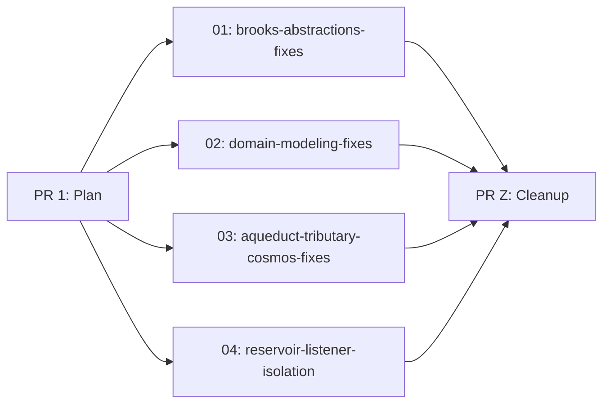

# Defensive Bugfixes — Master Plan

## Business Value

Seven latent bugs in the Mississippi framework cause incorrect behavior when structs are default-initialized, when duplicate type registrations conflict silently, when negative retry counts are accepted, or when a single subscriber failure breaks the entire notification chain. These bugs produce confusing runtime behavior — null `ToString()` results, false-failure `OperationResult` defaults, silent configuration conflicts, and cascading observer failures — that are difficult to diagnose and undermine trust in the framework.

This epic fixes all seven bugs with small, targeted edits: no new public APIs, no refactors, no feature gating needed. Every fix makes existing behavior safer and more predictable.

## Bug Summary

| # | Bug | Projects | Fix Category |
|---|-----|----------|--------------|
| 1 | Key struct string properties return null on `default` | Brooks.Abstractions, DomainModeling.Abstractions, Tributary.Abstractions, Aqueduct.Abstractions | Contract hardening |
| 2 | `Store.NotifyListeners` — one throwing listener breaks all | Reservoir.Core | Behavioral fix |
| 3 | `EventTypeRegistry`/`SnapshotTypeRegistry` — duplicate name silently ignored | DomainModeling.Runtime | Input validation |
| 4 | `OperationResult` — `default` represents failure instead of success | DomainModeling.Abstractions | Semantic fix |
| 5 | `BrookAsyncReaderKey.Parse(null)` — NRE on `key.AsSpan()` | Brooks.Abstractions | Input validation |
| 6 | `CosmosRetryPolicy` — accepts negative `maxRetries` | Common.Runtime.Storage.Cosmos | Input validation |
| 7 | `BrookPosition` — `default` produces `Value=0` (valid position) vs constructor `Value=-1` | Brooks.Abstractions | Documentation |

## Key Decisions

### D1: Key Struct Null-Safety — C# 14 `field` keyword

All 13 key structs get `field ?? string.Empty` on string properties:

```csharp
public string BrookName { get => field ?? string.Empty; }
```

This makes properties never-null regardless of how the struct is constructed (`default`, deserialization, etc.). Verified: `LangVersion=14.0` in `Directory.Build.props`.

**Scope**: 15 string properties across 8 files in 4 projects.

### D2: Registry — GetOrAdd + Conflict Detection

Same name + same type = idempotent skip. Same name + different type = `InvalidOperationException`.

Uses `ConcurrentDictionary.GetOrAdd` for atomic conflict detection:

```csharp
Type registeredType = nameToType.GetOrAdd(eventName, eventType);
if (registeredType != eventType)
    throw new InvalidOperationException(...);
typeToName.TryAdd(eventType, eventName);
```

Mirrors `IServiceCollection.TryAdd` composability (safe to call multiple times) while catching genuine config errors.

### D3: OperationResult — Non-Generic Only

`OperationResult.Success` becomes computed: `Success { get => ErrorCode is null; }`. This makes `default(OperationResult)` = success.

**`OperationResult<T>` is NOT changed.** The generic variant has `[MemberNotNullWhen(true, nameof(Value))]` — making `default` success would violate this NRT contract (`Value` is `null` on `default`). The generic variant keeps its stored `Success` bool. XML docs will warn that `default(OperationResult<T>)` is not a valid result.

### D4: BrookPosition — Documentation Only

XML docs warn that `default(BrookPosition)` produces `Value=0` (a valid position), not `Value=-1` (the "not set" sentinel). No code changes — fixing requires breaking persisted data semantics.

### D5: Store/Observer Isolation — Exception Swallowing

Wrap each listener/observer invocation in try-catch. For `StoreEventSubject`, call `observer.OnError(ex)` per Rx pattern. Silent catch without logging is acceptable — matches existing `Store.HandleEffectsAsync()` precedent at L430-437 and `Store` has no `ILogger` dependency.

## Dependency Graph

All sub-plans are independent — no cross-dependencies. They can be executed in parallel.



## Sub-Plans

| ID | Slug | Title | Depends On | Est. Lines |
|----|------|-------|------------|------------|
| 01 | brooks-abstractions-fixes | BrookKey/BrookRangeKey/BrookAsyncReaderKey null-safety + Parse guard + BrookPosition docs | none | ~150 |
| 02 | domain-modeling-fixes | AggregateKey + UxProjection keys null-safety + OperationResult default + Registry conflicts | none | ~300 |
| 03 | aqueduct-tributary-cosmos-fixes | SignalR/Snapshot key null-safety + CosmosRetryPolicy validation | none | ~200 |
| 04 | reservoir-listener-isolation | Store.NotifyListeners + StoreEventSubject.OnNext exception isolation | none | ~100 |

## Testing Strategy

Each sub-plan must:

1. Add regression tests proving the specific bug is fixed
2. Verify existing tests still pass
3. Build with zero warnings
4. Pass mutation testing for Mississippi projects

### Test patterns per bug type

| Bug Type | Test Pattern |
|----------|-------------|
| Key struct null-safety | `default(KeyStruct).Property` returns `string.Empty`; `default(KeyStruct).ToString()` returns non-null |
| Parse null guard | `Parse(null!)` throws `ArgumentNullException` |
| Registry duplicates | Same name+type = no throw; same name+different type = `InvalidOperationException` |
| OperationResult default | `default(OperationResult).Success == true`; `Ok().Success == true`; `Fail().Success == false` |
| OperationResult<T> unchanged | `default(OperationResult<int>).Success == false` (documented as invalid) |
| Store listener isolation | Throwing listener does NOT prevent subsequent listeners from executing |
| StoreEventSubject isolation | Throwing observer receives `OnError`; subsequent observers still receive `OnNext` |
| CosmosRetryPolicy negatives | Negative `maxRetries` throws `ArgumentOutOfRangeException` |
| BrookPosition docs | No test changes (documentation only) |

## Observability

No new telemetry. Existing logging in CosmosRetryPolicy and Store is sufficient. The fixes improve error surfaces (better exception types, fail-fast on config errors) which naturally improves debuggability.

## Rollout

All fixes are pre-1.0 bug fixes. No feature gating needed. Each sub-plan is independently deployable — merging any subset improves the codebase without risk.

## Review Resolutions

Two MUST-fix blockers were identified during 12-persona review and resolved:

1. **OperationResult<T> MemberNotNullWhen violation** — `default(OperationResult<T>).Success = true` would violate `[MemberNotNullWhen(true, nameof(Value))]` since `Value` is `null` on default. **Resolution**: Only fix non-generic `OperationResult`. Leave `OperationResult<T>` unchanged with XML doc warning.

2. **Registry concurrency regression** — proposed `TryGetValue + indexer` pattern is not atomic on ConcurrentDictionary (TOCTOU race). **Resolution**: Use `GetOrAdd(eventName, eventType)` which is atomic, then compare returned type with desired type.

## CoV Confidence Summary

| Claim | Confidence | Sources |
|-------|------------|---------|
| C# 14 `field` keyword available | High | Directory.Build.props L8, global.json SDK 10.0.102 |
| TryAdd semantics | High | .NET docs, BCL source |
| Pre-1.0 breaking freedom | High | GitVersion.yml `next-version: 0.0.1` |
| OperationResult convention | Medium | Mixed .NET precedent; ValueTask-like chosen per user intent |
| ConcurrentDictionary.GetOrAdd atomicity | High | .NET docs, BCL source |
