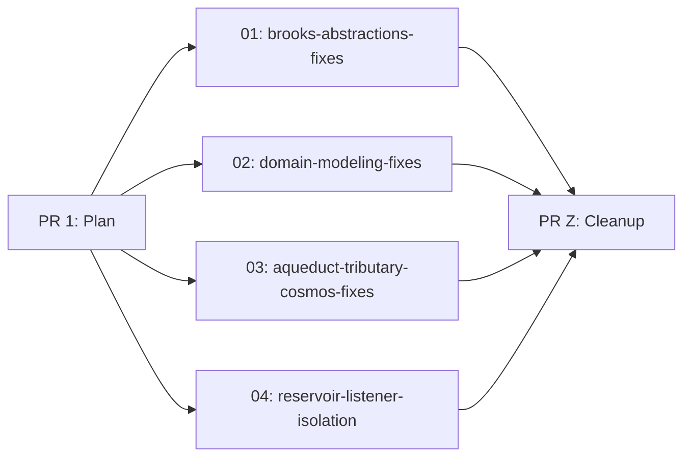

# 04 — Draft Plan: Defensive Bugfixes

## Architecture Overview

This epic fixes 7 bugs across 8 projects in the Mississippi framework. All fixes are small, targeted edits — no new public APIs, no refactors, no feature gating needed (all are bug fixes that make existing behavior safer).

### Bug-to-Project Matrix

| Bug | Projects Modified | Fix Category |
|-----|-------------------|--------------|
| 1. Key struct null-safety | Brooks.Abstractions, DomainModeling.Abstractions, Tributary.Abstractions, Aqueduct.Abstractions | Contract hardening |
| 2. Store listener isolation | Reservoir.Core | Behavioral fix |
| 3. Registry duplicates | DomainModeling.Runtime | Input validation |
| 4. OperationResult default | DomainModeling.Abstractions | Semantic fix |
| 5. BrookAsyncReaderKey.Parse null | Brooks.Abstractions | Input validation |
| 6. CosmosRetryPolicy negatives | Common.Runtime.Storage.Cosmos | Input validation |
| 7. BrookPosition docs | Brooks.Abstractions | Documentation |

### Dependency Graph

All sub-plans are independent — no cross-dependencies. They can be executed in parallel.

## Sub-Plan Decomposition

### 01: Brooks Abstractions Fixes
**Scope**: BrookKey, BrookRangeKey, BrookAsyncReaderKey null-safety + BrookAsyncReaderKey.Parse null guard + BrookPosition XML docs
**Projects**: Brooks.Abstractions + test project
**Est. changes**: ~150 lines

### 02: DomainModeling Fixes
**Scope**: AggregateKey + 5 UxProjection key structs null-safety + OperationResult default semantics + Registry duplicate detection
**Projects**: DomainModeling.Abstractions, DomainModeling.Runtime + test projects
**Est. changes**: ~300 lines

### 03: Aqueduct + Tributary + Cosmos Fixes
**Scope**: SignalR*Key + Snapshot*Key null-safety + CosmosRetryPolicy negative validation
**Projects**: Aqueduct.Abstractions, Tributary.Abstractions, Common.Runtime.Storage.Cosmos + test projects
**Est. changes**: ~200 lines

### 04: Reservoir Listener Isolation
**Scope**: Store.NotifyListeners + StoreEventSubject.OnNext try-catch isolation
**Projects**: Reservoir.Core + test project
**Est. changes**: ~100 lines

## Testing Strategy

Each sub-plan must:
1. Add tests for the specific bug (regression tests proving the fix).
2. Verify existing tests still pass (no behavioral regressions).
3. Build with zero warnings.
4. Pass mutation testing for Mississippi projects.

### Test patterns per bug type:

- **Key struct null-safety**: Test `default(KeyStruct)` property access returns `string.Empty`, `ToString()` returns non-null.
- **Parse null guard**: Test that `Parse(null)` throws `ArgumentNullException`.
- **Registry duplicates**: Test same name+type = no throw; same name+different type = throws `InvalidOperationException`.
- **OperationResult default**: Test `default(OperationResult).Success == true`, `Ok().Success == true`, `Fail().Success == false`.
- **Store listener isolation**: Test that one throwing listener doesn't prevent other listeners from being called.
- **StoreEventSubject isolation**: Test that one throwing observer doesn't prevent other observers from receiving values.
- **CosmosRetryPolicy negatives**: Test that negative maxRetries throws `ArgumentOutOfRangeException`.
- **BrookPosition docs**: No test changes (documentation only).

## Observability

No new telemetry. Existing logging in CosmosRetryPolicy and Store is sufficient. The fixes improve error surfaces (better exception types, fail-fast on config errors) which naturally improves debuggability.

## Rollout

All fixes are pre-1.0 bug fixes. No feature gating needed. Each sub-plan is independently deployable — merging any subset improves the codebase without risk.

## CoV Notes

- **C# 14 field keyword**: Verified available via LangVersion=14.0 (High confidence, 2 sources: Directory.Build.props + global.json SDK 10.0.102).
- **TryAdd semantics**: Verified via .NET docs and BCL source (High confidence).
- **OperationResult convention**: Mixed .NET precedent; chose ValueTask-like (default=success) based on user intent (Medium confidence — defensible either way).
- **Pre-1.0 breaking freedom**: Verified via GitVersion.yml next-version: 0.0.1 (High confidence).
