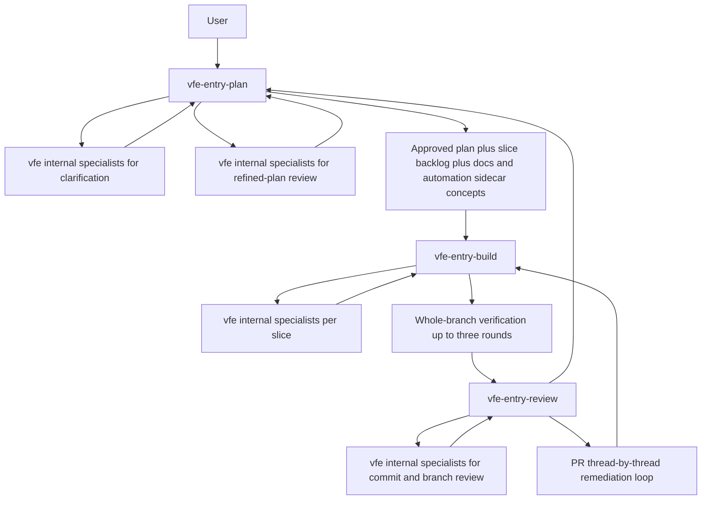

# Draft Plan

## Executive Summary

Create a new `vfe` agent family under `.github/agents/` using one shared `.agent.md` file per agent for both VS Code and GitHub.com. The family will expose exactly three human entry points, `vfe-entry-plan`, `vfe-entry-build`, and `vfe-entry-review`, while keeping all specialist agents hidden from normal picker use via `user-invocable: false`.

The design will optimize for VS Code by adding guided handoffs only on the three entry agents and by writing prompts that prefer structured clarification with the environment's question capability when available. The design will preserve GitHub.com compatibility by keeping `target` unset, avoiding unsupported fields for correctness, leaving most `tools` metadata unset, and using only prompt-body behavior that still works when GitHub.com ignores VS Code-only affordances.

The design must also require a durable working directory under `./plan/<work-id>/` so handoffs, reviews, comments, docs notes, and automation notes survive large workflows without relying on chat history.

## Current State

- The repo already contains multiple custom-agent families under `.github/agents/`, including `flow`, `epic`, `CoV`, and several standalone agents.
- There is no family manifest or index file today to help humans discover which agent should be the entry point for a workflow.
- Existing agent files use standard YAML frontmatter and Markdown bodies, with some local precedent for `handoffs` on orchestrator-style agents.
- Repo-local policy requires agents to honor repository instructions first.

## Target State

Add a complete `vfe` family in `.github/agents/` with:

- one manifest file
- three visible entry agents
- eighteen hidden internal specialist agents
- consistent frontmatter/body structure
- explicit cross-surface compatibility rules in the manifest
- explicit working-directory artifact rules in the manifest and entry-agent prompts
- explicit workflow coverage for planning, build orchestration, verification, docs tracking, automation conversion, and PR comment remediation

## Working Directory Contract

Every non-trivial `vfe` workflow should create or confirm a working directory under `./plan/<work-id>/`, with the repo-consistent default of `./plan/YYYY-MM-DD/<task-slug>/`.

The workflow should use a stable Markdown artifact set, including:

- `00-intake.md`
- `01-plan.md`
- `02-slice-backlog.md`
- `03-build-log.md`
- `04-review-summary.md`
- `05-comments-log.md`
- `06-docs-advice.md`
- `07-automation-advice.md`
- `08-decisions.md`
- `09-handoff.md`

Optional numbered files should capture specialist reviews, review rounds, PR-thread remediation, and operability notes when needed.

Every meaningful handoff should update `09-handoff.md` and reference the files the next phase must read first.

Subagent usage should also be restricted to the `vfe` family by default and recorded in the working directory.

Any material plan change during build should rerun the full review loop before implementation continues against the revised plan.

The final plan should also preserve the user's workflow diagrams as the canonical modeled process, especially the end-to-end workflow, the per-slice build loop, and the agent family structure.

## Key Design Decisions

- Shared files across VS Code and GitHub.com: see `03-decisions.md`, Decision 1.
- Unset `target` for all agents: see Decision 2.
- Prefix `vfe`: see Decision 3.
- Entry-agent visibility and protection: see Decision 4.
- Hidden internal specialists: see Decision 5.
- Model strategy `GPT-5.4 (copilot)`: see Decision 6.
- Minimal tool constraints: see Decision 7.
- Handoffs only on entry agents: see Decision 8.
- No `metadata`: see Decision 9.

## Public Contracts And File Inventory

### Manifest

- `.github/agents/vfe-family-manifest.md`

### Entry agents

- `.github/agents/vfe-entry-plan.agent.md`
- `.github/agents/vfe-entry-build.agent.md`
- `.github/agents/vfe-entry-review.agent.md`

### Internal specialists

- `.github/agents/vfe-planner-bsa.agent.md`
- `.github/agents/vfe-solution-architect.agent.md`
- `.github/agents/vfe-principal-software-engineer.agent.md`
- `.github/agents/vfe-platform-kubernetes.agent.md`
- `.github/agents/vfe-sre-reliability.agent.md`
- `.github/agents/vfe-performance-distributed-systems.agent.md`
- `.github/agents/vfe-qa-test-architect.agent.md`
- `.github/agents/vfe-security-engineer.agent.md`
- `.github/agents/vfe-compliance-governance.agent.md`
- `.github/agents/vfe-data-architect.agent.md`
- `.github/agents/vfe-api-integration-architect.agent.md`
- `.github/agents/vfe-ux-product-design.agent.md`
- `.github/agents/vfe-technical-writer.agent.md`
- `.github/agents/vfe-devops-ci-cd.agent.md`
- `.github/agents/vfe-observability-engineer.agent.md`
- `.github/agents/vfe-repo-policy-compliance.agent.md`
- `.github/agents/vfe-automation-enforcement.agent.md`
- `.github/agents/vfe-architecture-fitness.agent.md`

## Frontmatter Template

### Entry-agent template

Use this exact field set, in this order unless implementation constraints require a minor variation:

- `name`
- `description`
- `model: GPT-5.4 (copilot)`
- `user-invocable: true`
- `disable-model-invocation: true`
- `argument-hint` for VS Code usability where helpful
- `handoffs` only to the other entry agents with `send: false`

Do not set:

- `target`
- `metadata`
- `tools` unless implementation verification finds a documented need for a safe explicit override

### Internal-specialist template

Use this field set:

- `name`
- `description`
- `model: GPT-5.4 (copilot)`
- `user-invocable: false`
- `disable-model-invocation: false`

Do not set:

- `target`
- `metadata`
- `handoffs`
- `tools` unless a specific specialist truly needs restriction

## Prompt-Body Template

All agents should use a consistent body shape:

1. Mission
2. Read first
3. Scope
4. Out of scope
5. Workflow
6. Evidence to gather
7. Output contract
8. Guardrails

Each internal specialist body must also include:

- what it owns
- what it explicitly does not own
- how it contributes during plan, build, and review
- how to classify findings
- how to surface out-of-scope observations without taking over another remit

## Workflow Encoding

### Entry Plan

The plan entry agent prompt must explicitly encode this lifecycle:

1. Read repo instructions and repo agent manifest first.
2. Intake the request, business context, constraints, NFRs, and acceptance criteria.
3. Prefer the strongest in-scope enterprise design, not the cheapest implementation.
4. Ask clarifying questions until the work is implementation-grade.
5. Produce an initial Markdown plan.
6. Invoke relevant specialists for clarification questions and plan scrutiny.
7. Consolidate specialist feedback into a refined plan.
8. Run the second specialist review pass over the refined plan.
9. Adjudicate comments into accept, reject, defer, and needs-decision.
10. Produce an approved plan, a slice backlog, a rolling docs sidecar concept, and a rolling automation sidecar concept.
11. Cleanly reject out-of-scope suggestions.

The prompt must explicitly instruct the agent to prefer built-in structured questioning when the environment supports it instead of emitting long free-form question dumps.

### Entry Build

The build entry agent prompt must explicitly encode this lifecycle:

1. Read repo instructions, manifest, approved plan artifacts, affected code, workflows, tests, and docs context first.
2. Break or confirm the work into small slices.
3. Define a commit plan before editing.
4. For each slice, define:
   - slice goal
   - tests
   - docs impact
   - automation opportunities
   - commit plan
5. Implement one slice at a time.
6. Run build and tests repeatedly during the slice.
7. Invoke relevant specialists against the current delta.
8. Address accepted findings.
9. Continuously update docs-tracking and automation-tracking sidecars.
10. Shape commits for human review.
11. Commit only logical review units.
12. After slices are complete, run whole-branch specialist verification.
13. Repeat whole-branch verification up to three rounds, stopping early if only trivial or no findings remain.
14. Support PR comment remediation one thread at a time using the required micro-loop.

The commit-shaping section must explicitly state:

- a slice is the smallest meaningful delivery unit
- a commit is the smallest meaningful human review unit
- a slice may map to one or several commits
- commits must be understandable in isolation
- implementation, tests, generated files, dependency churn, and docs should often be separated when that improves reviewability

### Entry Review

The review entry agent prompt must explicitly encode this lifecycle:

1. Read repo instructions, manifest, plans, changed files, workflows, and commit history first.
2. Review commit by commit and branch wide.
3. Invoke relevant specialists for remit-specific findings.
4. Group findings into blocking, important, optional, and out-of-scope.
5. Cover repo policy, docs impact, automation gaps, architecture fitness, observability, ops, and security where relevant.
6. Support PR comment triage one thread at a time.
7. Output a concise, human-review-ready review that prioritizes actual findings.

## Internal Specialist Remit Design

The implementation should create exactly the required specialist set. Each prompt must remain in its lane and follow the shared output contract.

### Shared specialist output contract

All internal specialists must return:

- In-scope findings
- Out-of-scope observations
- Risks
- Recommendations
- Severity
- Evidence from the repository
- Decision proposal

They must also state:

- stay in remit
- do not take over adjacent domains
- log out-of-scope issues as observations, not directives
- be concise, direct, and evidence-based

### Specialist remit map

- `vfe-planner-bsa`: business framing, scope, assumptions, acceptance criteria, non-goals, requirement clarity
- `vfe-solution-architect`: boundaries, architectural coherence, major tradeoffs, system integration shape
- `vfe-principal-software-engineer`: code structure, modularity, maintainability, implementation quality, developer ergonomics
- `vfe-platform-kubernetes`: deployment topology, container/runtime configuration, Kubernetes fit
- `vfe-sre-reliability`: resilience, rollback, SLO and failure-mode thinking, operability
- `vfe-performance-distributed-systems`: latency, throughput, concurrency, consistency, scaling, backpressure, distributed-failure behavior
- `vfe-qa-test-architect`: test strategy, regression protection, edge cases, negative paths, verification depth
- `vfe-security-engineer`: auth, authz, secrets, threat modeling, abuse cases, hardening, supply chain
- `vfe-compliance-governance`: auditability, evidence trails, regulated constraints, change-control fit
- `vfe-data-architect`: data ownership, schema evolution, lifecycle, contract/store implications
- `vfe-api-integration-architect`: external contracts, versioning, compatibility, consumer impact, integration boundaries
- `vfe-ux-product-design`: workflows, usability, accessibility, loading/error/empty states, task completion
- `vfe-technical-writer`: docs placement, examples, how-to/reference/tutorial gaps, migration notes, docs questions
- `vfe-devops-ci-cd`: pipelines, artifact integrity, release automation, branch hygiene, reproducibility
- `vfe-observability-engineer`: logs, metrics, traces, dashboards, diagnosability, alert semantics
- `vfe-repo-policy-compliance`: repo instructions, local conventions, policy enforcement, enterprise fallback baseline when silent
- `vfe-automation-enforcement`: conversion of deterministic human review rules into analyzers, tests, CI checks, workflow gates, architecture tests, and docs linting
- `vfe-architecture-fitness`: layering, dependency direction, structural integrity, package and visibility boundaries, long-term codebase shape

## Manifest Content Plan

The manifest must include:

1. chosen prefix and why
2. all files created
3. the three entry points marked `Start here`
4. the internal specialists and their remit
5. visibility and invocation model
6. model strategy
7. tool strategy
8. cross-surface compatibility strategy
9. working directory contract
10. handoff strategy
11. default engineering baseline
12. a phase matrix across planning, build, and review
13. any deliberate compromises made for cross-surface compatibility

## Architecture And Flow

## Work Breakdown

### Phase 1. Verify and design

Outcome:
- final cross-surface frontmatter strategy
- final prefix
- final remit map
- final manifest structure

Tasks:
- verify GitHub Docs and VS Code Docs for supported fields and behavior
- inspect existing `.github/agents/` for naming collisions and local patterns
- confirm the final file inventory and visibility model

### Phase 2. Write manifest

Outcome:
- `vfe-family-manifest.md` fully documents the family, start points, compatibility strategy, and workflow matrix

Tasks:
- write manifest title and purpose
- list all planned files exactly
- explain prefix, model, tool, visibility, handoff, and compatibility choices
- mark the three entry agents as Start here

### Phase 3. Write entry agents

Outcome:
- three strong orchestrator prompts that encode the full enterprise workflow

Tasks:
- write `vfe-entry-plan.agent.md`
- write `vfe-entry-build.agent.md`
- write `vfe-entry-review.agent.md`
- add only entry-agent handoffs with `send: false`
- use clear descriptions and optional `argument-hint` values

### Phase 4. Write internal specialists

Outcome:
- eighteen hidden internal specialists with crisp, non-overlapping remits

Tasks:
- write each required specialist file
- keep a consistent structure and shared output contract
- ensure prompts explicitly avoid remit creep

### Phase 5. Verification pass

Outcome:
- all created files match the requested family and the documented schema

Tasks:
- verify all files are under `.github/agents/`
- verify every filename uses `vfe`
- verify only the three entry agents are human-visible
- verify handoffs exist only on entry agents
- verify model field is `GPT-5.4 (copilot)` everywhere
- verify tools are not over-constrained
- verify prompt coverage includes docs tracking, automation, repo policy, architecture fitness, and commit-by-commit review

## Testing Strategy

Because this task creates Markdown agent definitions rather than runtime code, verification should focus on schema correctness, consistency, and repo-fit:

- compare frontmatter against the current GitHub and VS Code docs
- verify filenames and names for collisions against `.github/agents/`
- verify the manifest file list exactly matches created files
- verify no extra visible human entry points were introduced
- verify internal specialists are hidden and entry agents are protected from programmatic invocation
- optionally run repo markdown validation if the builder judges it practical

## Observability And Operability

The new family itself should instruct future build and review workflows to care about operability. Prompts should explicitly require consideration of:

- logs
- metrics
- traces
- dashboards or alert semantics when relevant
- rollback and diagnostics paths
- documentation sidecar updates whenever behavior or operations change

## Rollout And Migration Plan

- Add the new `vfe` family without deleting or renaming existing agent files.
- Use the manifest to distinguish when a human should start with `vfe` versus an existing family.
- Keep the design additive to avoid disrupting current repo workflows.
- Do not merge or repurpose existing agents unless a later explicit migration is requested.

## Acceptance Criteria

- [ ] All created files are under `.github/agents/`
- [ ] Every new filename uses the `vfe` prefix
- [ ] A family manifest exists and matches the created files exactly
- [ ] The three entry agents are the only obvious human entry points
- [ ] All internal specialists are hidden from normal picker use
- [ ] Entry-agent prompts encode the full plan/build/review workflow from the user request
- [ ] Internal specialist prompts each define mission, owned remit, non-owned remit, evidence expectations, output contract, and guardrails
- [ ] `model: GPT-5.4 (copilot)` is applied consistently unless final implementation verification finds a specific documented exception
- [ ] `target` remains unset on all family files
- [ ] `tools` are not unnecessarily constrained
- [ ] `handoffs` exist only on the three entry agents and use `send: false`
- [ ] Docs tracking and automation-enforcement behavior are explicit in the prompts
- [ ] Commit-by-commit human review requirements are explicit in build and review prompts
- [ ] Cross-surface compatibility compromises are documented in the manifest

## Execution Handoff Contract

When `flow Builder` executes this plan, it should:

1. Re-verify the current official GitHub and VS Code custom-agent docs immediately before writing `.github/agents/` files.
2. Create only the planned `vfe` files under `.github/agents/`.
3. Preserve all existing agent files untouched unless a direct collision forces a change.
4. Validate the final file set against the acceptance checklist above.
5. Summarize the chosen prefix, created files, any deliberate omissions, and any cross-surface compromises.
6. Delete `/plan/2026-03-10/cross-surface-agent-family/` in the final commit.

## Mandatory Final Step For flow Builder

Delete `/plan/2026-03-10/cross-surface-agent-family/` in the final commit so the plan folder does not land in `main`.

## CoV

- Claim: a single shared-file family is feasible and preferable. Evidence: both official docs describe a common frontmatter subset and GitHub ignores certain unsupported VS Code fields. Confidence: High.
- Claim: `vfe` entry agents should carry the richer orchestration while specialists stay hidden. Evidence: user requirements plus official visibility controls support that split cleanly. Confidence: High.
- Claim: leaving `tools` mostly unset is the least risky default. Evidence: GitHub docs say omitted `tools` enables all tools; VS Code docs emphasize environment-provided tools. Confidence: Medium.
- Impact: implementation should focus on prompt quality, remit separation, and manifest clarity rather than complex frontmatter mechanics.