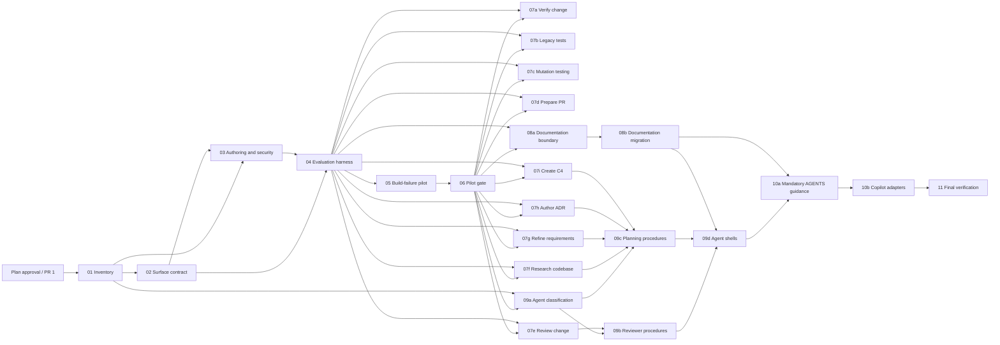

# Shared Copilot and Codex skills migration

## Outcome

Reduce duplicated Mississippi repository AI guidance into one portable,
outcome-oriented capability layer without losing mandatory engineering
invariants, deterministic quality gates, useful agent persona/context/tool
boundaries, or support for the named Copilot surfaces.

## Canonical architecture

| Content | Canonical owner |
| --- | --- |
| Mandatory invariant | Root or genuinely necessary nested `AGENTS.md` |
| Repeatable user-outcome workflow | `.agents/skills/<skill-id>/SKILL.md` |
| Persona, context isolation, delegation, tool boundary | Host-specific `.github/agents` shell |
| Mechanical requirement | CI, analyzer, hook, or canonical repository script |
| Detailed schema/example/reference | Skill `references/` or Docusaurus |
| Copilot-only routing/compatibility | Thin `.github` adapter |
| Inventory, validation, and maintenance | Versioned matrix, validator, CI, and CODEOWNERS |

The dependency direction is one-way: canonical content can be projected to an
adapter; an adapter cannot become a second normative source. Skills provide
bounded mechanics and proposed outputs. They cannot append
`.thinking/<task-folder>/workflow-audit.json`, advance a governed Clean Squad
phase, select an unapproved agent, or publish a governed artifact. `cs Product
Owner` remains the sole canonical workflow writer/orchestrator.

`.agents/skills/` is the proposed portable target and is finalized by the
surface-contract work. Before the pilot, all active `.github/skills` references
must be updated or explicitly classified as a non-duplicating adapter. There
must be exactly one owned skill root after cutover.

## Supported surfaces

Copilot CLI and OpenAI Codex are the primary independent conformance targets.
The plan preserves these additional surfaces with explicit, separately tested
guarantees rather than inferring parity from CLI behavior:

| Surface | Planned guarantee | Evidence required |
| --- | --- | --- |
| Copilot CLI | Full structural, explicit, implicit, output, negative, security, and rollback conformance | Runnable pinned CLI probe |
| OpenAI Codex | Full portable skill discovery and workflow conformance | Runnable pinned Codex probe and root/nesting fixtures |
| Copilot app | Shared-skill discovery/integration smoke test | Native smoke fixture |
| VS Code Copilot | Shared-skill discovery/integration smoke test | Native smoke fixture |
| VS Code Local | Contract-defined discovery/fallback; no unstated parity promise | Host probe or documented limitation |
| GitHub cloud agent | Contract-defined discovery/fallback; no unstated parity promise | Cloud-agent smoke evidence where available |
| GitHub code review | Contract-defined discovery/fallback; no unstated parity promise | PR-head/code-review smoke evidence |
| Visual Studio | Contract-defined discovery/fallback; no unstated parity promise | Native smoke evidence where available |
| JetBrains | Contract-defined discovery/fallback; no unstated parity promise | Native smoke evidence where available |

The support contract publishes discovery method, precedence, guarantee,
limitation, fallback, owner, evidence artifact, and release gate for every row.

## Baselines and evidence

| Snapshot | Instructions | Exact global | Instruction lines | Agents | Agent lines | Cursor mirrors | Skills |
| --- | ---: | ---: | ---: | ---: | ---: | ---: | ---: |
| Initial issue baseline | 52 | 16 | approximately 3,270 / 950 global | 85 | approximately 11,286 | 52 | 0 |
| `ba4d1b93` after #541/#563 | 51 | 15 | 3,231 / 913 global | 85 | 11,285 | 0 | 0 |

The first row is retained historical scope. The second is reproducible current
scope. #541 / PR #529 corrected discovery filenames; #563 / PR #530 removed
Cursor mirrors, synchronization policy, generator, and references.

Issue #539 creates `.github/agent-guidance/migration-matrix.json` as the
versioned machine-readable source of truth and a commit-anchored sorted
manifest. Every instruction, agent, hard-coded maintenance consumer, completed
retirement, and content unit gets exactly one row with source/target digests,
classification, owner, consumers, dependencies, collision risk, migration
issue, disposition, and evidence.

The protected runtime-contract register covers Orleans `[GenerateSerializer]`,
`[Alias]`, and `[Id]` wire contracts; event/snapshot storage identity;
command/event/integration-event boundaries; reducer and aggregate invariants;
snapshot version/reducer-hash behavior; registry collisions; and
operation-level retry/idempotency. This register preserves behavior; it does
not authorize unrelated runtime fixes. Computed
`[EventStorageName]`/`[SnapshotStorageName]` values and persisted identities
remain immutable even though the repository is pre-1.0.

## Candidate skill catalogue

The following IDs are proposed, not irrevocably accepted until activation and
collision evidence:

`repair-build-failures`, `verify-change`, `improve-legacy-tests`,
`run-mutation-testing`, `prepare-pull-request`, `review-change`,
`research-codebase`, `refine-requirements`, `author-adr`, `create-c4-diagram`,
and the documentation outcome set selected by #555.

Each ID is lowercase, hyphenated, stable, repository-local, and distinct from
`Mississippi.*` NuGet package names. A rename creates a new ID with
`supersedes`/deprecation metadata and a tested mapping; it is never an
unannounced in-place rename. The catalogue is generated or checked from skill
metadata and exposed through README/Docusaurus onboarding.

## Delivery strategy

Every content migration uses a shallow, independently reversible stack:

1. **Introduce:** add the shared skill/references, evaluation cases, and any
   validator support while the old guidance remains active.
2. **Redirect and reduce:** route consumers to the replacement and remove only
   verified duplicate procedure.
3. **Optional retirement:** delete residual obsolete content only after the
   compatibility/bake evidence, inbound-reference closure, and rollback drill.

The content-unit state machine is
`active-source -> shadow-replacement -> redirected -> retired`. Each transition
records commit/file-set digests, owner, inbound-reference result, and rollback
command. Parallel leaves have disjoint target ownership; shared catalogue,
harness, adapter, and workflow files are merge-serialized.

## Dependency graph

The #545 result is a dependency condition: `go` unlocks approved leaves,
`revise` invalidates affected plans until amended and re-reviewed, and `stop`
defers/closes the affected workstream. It cannot be bypassed by manual
handoff.

## Validation contract

Issue #543 delivers
`pwsh ./eng/src/agent-scripts/validate-agent-content.ps1`, Pester coverage,
and versioned machine-readable JSON diagnostics. Results are:

- `PASS`: required evidence is valid;
- `FAIL`: a checked rule is violated;
- `BLOCKED`: a required tool, host, evidence file, or authorization is
  unavailable.

`FAIL` and `BLOCKED` are nonzero and block redirect, retirement, and
publication. Structural checks use a real pinned YAML parser and golden
fixtures for malformed delimiters, duplicate/unknown fields, quoting,
multiline values, BOM/CRLF, and nested metadata. They validate exact casing,
case/Unicode collisions, Git-index paths, frontmatter, handoffs, allowlists,
cycles, references, anchors, symlink/traversal escapes, and approved external
URLs.

Hard gates are 100% matrix coverage; zero duplicate IDs/collisions; zero
unresolved, stale, or traversal references; zero secret-scan findings; zero
unauthorized capabilities; zero protected runtime/storage identity changes;
and exact expected outcomes for deterministic fixtures. Model sampling uses
five repeats per fixture, an initial 80% expected-route agreement threshold,
and 0% false-positive unrelated/incidental activation; #545 may tighten these
only with evidence and may not relax structural gates.

Discovery loads metadata only and skill bodies lazily. Metrics record actual
host-expanded tokens where available, otherwise labeled UTF-8/line proxies;
files loaded, candidates, body tokens, cache hits, p50/p95 cold/warm latency,
scan duration, retries, output size, review calls, and fixture/contract
fingerprints. Pull requests use deterministic offline/replay checks and
bounded model sampling; full live sampling is scheduled or explicitly
dispatched.

## Security and side effects

Authoritative control-plane inputs are approved `AGENTS.md`, approved
`.agents/skills`, approved adapters, and validator configuration. README,
source, generated output, issue/PR/review text, and build logs are untrusted
data and cannot authorize tools, override policy, or widen scope. Prompt
injection fixtures cover every untrusted input class.

Skills never grant permissions. Capability manifests are default-deny for
paths, commands, network endpoints, GitHub operations, and secrets. Network is
disabled unless explicitly allowlisted; private/link-local/metadata targets,
redirects, rebinding, and ambient authentication forwarding are rejected.
Executables are reviewed, pinned, deterministic, and not trusted merely
because they are repository-local. Raw prompts/output are not retained by
default; retained evidence is scrubbed and secret-scanned. Publication is
draft-only and requires explicit authorization for repository, target,
operation, and content digest. Retries use stable operation IDs, intent
digests, read-before-create/update, bounded attempts, and an ambiguous-outcome
stop state.

Live evaluation uses an isolated read-only fixture checkout and least
privilege. It never runs privileged `--allow-all-tools` or `--allow-all-paths`
against untrusted PR content. The scheduled `csharp-guideline-improver`
workflow is a privileged consumer and receives a separate generated-source,
permission, canary, and disable/revert check.

## CI, ownership, and communication

The validator is required for `pull_request`, `merge_group`, `push`, and
`workflow_dispatch`, on Windows and case-sensitive Linux, for changes under
`.agents/**`, `.github/agents/**`, `.github/instructions/**`, `AGENTS.md`,
validator/configuration files, relevant docs, and generated automation.
Actions/tools are pinned, permissions are least privilege, and redacted
versioned JSON plus step-summary/SARIF artifacts are retained.

CODEOWNERS entries cover canonical skills, agents, instructions, validators,
and documentation with primary/backup ownership and review cadence. Guidance
PR titles require `+semver: skip`; the validator rejects missing suffixes or
runtime/persisted-identity changes without an explicit exception.

README/Docusaurus onboarding includes a harmless sample, copy/paste invocation,
reload/cold-start behavior, evidence expectations, troubleshooting, surface
limitations, and old-agent/new-skill mappings. A migration note documents
before/after paths, root compatibility, skill-ID/version/deprecation rules,
rollback, and compatibility windows. Skill versioning is separate from
GitVersion/NuGet semver.

## Quality gates

Use the smallest canonical path-based gate:

- skill/instruction/agent content: structural validator and relevant Markdown;
- validator/PowerShell: targeted Pester and zero-warning affected-tool build;
- workflow/configuration: syntax, permissions, and generated-file checks;
- Docusaurus: applicable documentation checks;
- runtime/persisted-identity changes: Mississippi build, tests, cleanup, and
  mutation scripts.

`README.md` documents user-facing commands; `global.json` and scripts select
the executable SDK/tool versions. No runtime feature flag is needed: old
guidance remains until replacement evidence passes.

## Sub-plans

See `sub-plans/` for one self-contained implementation plan per open leaf:

| ID | Issue | Title | Depends on |
| --- | ---: | --- | --- |
| 01 | #539 | Inventory and classification | none |
| 02 | #540 | Surface contract and root cutover | 01 |
| 03 | #542 | Portable authoring and security standard | 01, 02 |
| 04 | #543 | Evaluation and validation harness | 02, 03 |
| 05 | #544 | Build-failure remediation pilot | 04 |
| 06 | #545 | Pilot evidence decision gate | 05 |
| 07a | #546 | Verify-change skill | 04, 06 |
| 07b | #547 | Improve-legacy-tests skill | 04, 06 |
| 07c | #548 | Run-mutation-testing skill | 04, 06 |
| 07d | #549 | Prepare-pull-request skill | 04, 06 |
| 07e | #550 | Review-change skill | 04, 06 |
| 07f | #551 | Research-codebase skill | 04, 06 |
| 07g | #552 | Refine-requirements skill | 04, 06 |
| 07h | #553 | Author-ADR skill | 04, 06 |
| 07i | #554 | Create-C4-diagram skill | 04, 06 |
| 08a | #555 | Documentation skill boundaries | 04, 06 |
| 08b | #556 | Approved documentation migration | 08a |
| 09a | #557 | Custom-agent classification | 01, 06 |
| 09b | #558 | Reviewer procedure extraction | 07e, 09a |
| 09c | #559 | Planning procedure extraction | 07f, 07g, 07h, 07i, 09a |
| 09d | #560 | Agent shell rationalization | 08b, 09b, 09c |
| 10a | #561 | Mandatory AGENTS guidance | 07a–07i, 08b, 09d |
| 10b | #562 | Thin Copilot adapters | 10a |
| 11 | #564 | Final verification and metrics | 01–10b |

## Definition of done

- All 12 master-plan persona reviews and synthesis are recorded in `audit/`.
- Every open leaf has one sub-plan, explicit dependencies, deployability,
  tests, acceptance criteria, and semver metadata.
- Foundation, pilot, migration, rationalization, consolidation, and final
  evidence gates are objective and reversible.
- The final implementation phase can close #532 using reproducible matrix,
  validator, support, security, rollback, and metric evidence.

## CoV

The plan was verified against issue #532 and #533–#564, current repository
counts and files at `ba4d1b93`, the root/host/skill guidance contracts,
canonical scripts, `GitVersion.yml`, completed #541/#563 history, official
GitHub Agent Skills guidance, official Codex discovery guidance, and twelve
independent persona reviews. Confidence is high for sequencing and ownership;
host-specific final discovery behavior remains intentionally evidence-gated in
#540.
