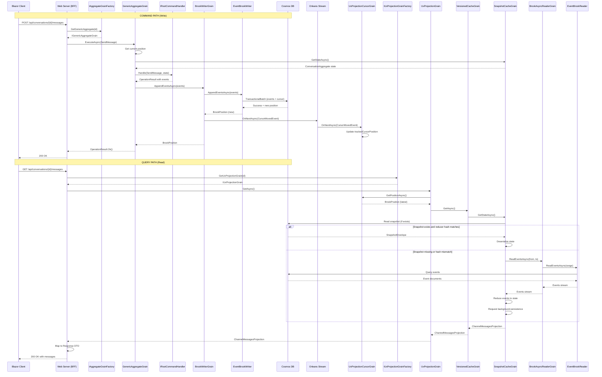

# Event Sourcing Data Flow: UX → Cosmos → UX

This document traces the complete data flow from the Blazor WebAssembly client through
Orleans grains to Cosmos DB and back, validated against the actual codebase.

## Overview Diagram



## Detailed Flow Analysis

### 1. Command Path: Sending a Message

#### Step 1: Client HTTP Request
**File**: [EventSourcing.razor](../Cascade.Web.Client/Pages/EventSourcing.razor#L118-L140)

```csharp
SendMessageRequest request = new() { Content = messageContent, SentBy = senderName };
HttpResponseMessage response = await Http.PostAsJsonAsync(
    $"/api/conversations/{Uri.EscapeDataString(conversationId)}/messages", request);
```

#### Step 2: BFF API Endpoint
**File**: [Program.cs](../Cascade.Web.Server/Program.cs#L230-L264)

```csharp
app.MapPost("/api/conversations/{conversationId}/messages", async (...) =>
{
    IGenericAggregateGrain<ConversationAggregate> grain =
        aggregateGrainFactory.GetGenericAggregate<ConversationAggregate>(conversationId);
    OperationResult result = await grain.ExecuteAsync(new SendMessage { ... });
    ...
});
```

Key points:
- `IAggregateGrainFactory` is injected via DI (registered by `AddAggregateSupport()`)
- `GetGenericAggregate<TAggregate>(entityId)` returns a grain reference keyed by entity ID
- The brook name comes from `[BrookName("CASCADE", "CHAT", "CONVERSATION")]` on `ConversationAggregate`

#### Step 3: GenericAggregateGrain.ExecuteAsync
**File**: [GenericAggregateGrain.cs](../../../src/EventSourcing.Aggregates/GenericAggregateGrain.cs#L118-L165)

1. Gets current brook position (from local cache or `BrookCursorGrain`)
2. Gets current aggregate state from `SnapshotCacheGrain`
3. Delegates to `IRootCommandHandler<TAggregate>.Handle(command, state)`
4. If handler returns events, appends them via `BrookWriterGrain`
5. Updates local position cache to avoid race conditions

#### Step 4: Command Handler Execution
**File**: [SendMessageHandler.cs](../Cascade.Domain/Conversation/Handlers/SendMessageHandler.cs)

The handler validates the command and produces a `MessageSent` event:

```csharp
internal sealed class SendMessageHandler : CommandHandlerBase<ConversationAggregate, SendMessage>
{
    protected override OperationResult<object> HandleCommand(SendMessage command, ConversationAggregate? state)
    {
        // Validation...
        return Success(new MessageSent { MessageId = command.MessageId, Content = command.Content, ... });
    }
}
```

#### Step 5: BrookWriterGrain.AppendEventsAsync
**File**: [BrookWriterGrain.cs](../../../src/EventSourcing.Brooks/Writer/BrookWriterGrain.cs#L68-L94)

1. Calls `IBrookStorageWriter.AppendEventsAsync(brookKey, events, expectedVersion)`
2. After successful write, publishes `BrookCursorMovedEvent` to Orleans stream

```csharp
IAsyncStream<BrookCursorMovedEvent> stream = this
    .GetStreamProvider(StreamProviderOptions.Value.OrleansStreamProviderName)
    .GetStream<BrookCursorMovedEvent>(StreamId.Create("brook-cursor-updates", brookKey));
await stream.OnNextAsync(new BrookCursorMovedEvent(brookKey, newPosition));
```

#### Step 6: EventBrookWriter → Cosmos DB
**File**: [EventBrookWriter.cs](../../../src/EventSourcing.Brooks.Cosmos/Brooks/EventBrookWriter.cs#L131-L160)

1. Acquires distributed lock via Azure Blob lease
2. Validates expected version (optimistic concurrency)
3. Uses Cosmos transactional batch to:
   - Upsert cursor document (partition key = brook key)
   - Insert event documents (sequenced by position)
4. Returns new position

**Cosmos Document Structure**:
- **Events Container**: `{ id, pk, position, eventType, payload, timestamp }`
- **Cursor**: Part of the transactional batch, tracks latest position

### 2. Query Path: Reading Messages

#### Step 1: Client HTTP Request
**File**: [EventSourcing.razor](../Cascade.Web.Client/Pages/EventSourcing.razor#L150-L171)

```csharp
HttpResponseMessage response = await Http.GetAsync(
    $"/api/conversations/{Uri.EscapeDataString(conversationId)}/messages");
messages = await response.Content.ReadFromJsonAsync<ConversationMessagesResponse>();
```

#### Step 2: BFF API Endpoint
**File**: [Program.cs](../Cascade.Web.Server/Program.cs#L266-L298)

```csharp
app.MapGet("/api/conversations/{conversationId}/messages", async (...) =>
{
    IUxProjectionGrain<ChannelMessagesProjection> grain =
        uxProjectionGrainFactory.GetUxProjectionGrain<ChannelMessagesProjection>(conversationId);
    ChannelMessagesProjection? projection = await grain.GetAsync();
    // Map to public DTO...
});
```

Key points:
- `IUxProjectionGrainFactory` is injected via DI (registered by `AddUxProjections()`)
- `GetUxProjectionGrain<TProjection>(entityId)` returns a grain reference
- The brook name comes from `[BrookName("CASCADE", "CHAT", "CONVERSATION")]` on `ChannelMessagesProjection`
- **Both aggregate and projection share the same brook** → same event stream!

#### Step 3: UxProjectionGrain.GetAsync
**File**: [UxProjectionGrain.cs](../../../src/EventSourcing.UxProjections/UxProjectionGrain.cs#L98-L116)

1. Gets latest brook position from `UxProjectionCursorGrain`
2. Delegates to `UxProjectionVersionedCacheGrain` for that specific version

```csharp
public async ValueTask<TProjection?> GetAsync(CancellationToken cancellationToken = default)
{
    BrookPosition latestVersion = await GetLatestVersionAsync(cancellationToken);
    if (latestVersion.NotSet) return default;
    return await GetAtVersionAsync(latestVersion, cancellationToken);
}
```

#### Step 4: UxProjectionCursorGrain
**File**: [UxProjectionCursorGrain.cs](../../../src/EventSourcing.UxProjections/UxProjectionCursorGrain.cs#L88-L115)

- Subscribes to `BrookCursorMovedEvent` stream on activation
- Tracks latest position in memory
- When write happens, stream update arrives and position is updated

```csharp
public Task OnNextAsync(BrookCursorMovedEvent item, StreamSequenceToken? token = null)
{
    if (item.NewPosition.IsNewerThan(trackedCursorPosition))
        trackedCursorPosition = item.NewPosition;
    return Task.CompletedTask;
}
```

#### Step 5: UxProjectionVersionedCacheGrain → SnapshotCacheGrain
**File**: [UxProjectionVersionedCacheGrain.cs](../../../src/EventSourcing.UxProjections/UxProjectionVersionedCacheGrain.cs#L95-L127)

On activation, loads projection from `SnapshotCacheGrain`:

```csharp
SnapshotKey snapshotKey = new(snapshotStreamKey, versionedKey.Version.Value);
ISnapshotCacheGrain<TProjection> snapshotCacheGrain =
    SnapshotGrainFactory.GetSnapshotCacheGrain<TProjection>(snapshotKey);
cachedProjection = await snapshotCacheGrain.GetStateAsync(token);
```

#### Step 6: SnapshotCacheGrain State Hydration
**File**: [SnapshotCacheGrain.cs](../../../src/EventSourcing.Snapshots/SnapshotCacheGrain.cs#L126-L168)

On activation:
1. Attempts to load snapshot from Cosmos
2. If found and reducer hash matches → use directly
3. If missing or hash mismatch → rebuild from events

```csharp
if (envelope is not null && envelope.ReducerHash == currentReducerHash)
{
    state = SnapshotStateConverter.FromEnvelope(envelope);
    return;
}
// Rebuild from events...
await RebuildStateFromStreamAsync(token);
RequestBackgroundPersistence(currentReducerHash);
```

#### Step 7: Event Replay (if needed)
**File**: [SnapshotCacheGrain.cs](../../../src/EventSourcing.Snapshots/SnapshotCacheGrain.cs#L175-L227)

Uses retention-based strategy for efficient replay:

```csharp
long baseVersion = RetentionOptions.GetBaseSnapshotVersion<TSnapshot>(targetVersion);
if (baseVersion > 0)
{
    // Get base snapshot, replay only delta events
    state = await baseSnapshotGrain.GetStateAsync(token);
    readFrom = new BrookPosition(baseVersion + 1);
}

await foreach (BrookEvent brookEvent in readerGrain.ReadEventsAsync(readFrom, readTo, token))
{
    object eventData = BrookEventConverter.ToDomainEvent(brookEvent);
    state = RootReducer.Reduce(state, eventData);
}
```

## Brook Name Matching

**Critical**: The aggregate and projection share the same brook name, meaning they
subscribe to the same event stream in Cosmos DB.

| Type | Brook Name | Location |
|------|------------|----------|
| `ConversationAggregate` | `CASCADE\|CHAT\|CONVERSATION` | [ConversationAggregate.cs](../Cascade.Domain/Conversation/ConversationAggregate.cs#L13) |
| `ChannelMessagesProjection` | `CASCADE\|CHAT\|CONVERSATION` | [ChannelMessagesProjection.cs](../Cascade.Domain/Projections/ChannelMessages/ChannelMessagesProjection.cs#L21) |

This is defined via `[BrookName("CASCADE", "CHAT", "CONVERSATION")]` attribute on both types.

## Reducers

Events are applied to state via the reducer chain:

**Aggregate Reducers** (apply to `ConversationAggregate`):
- `MessageSentReducer` → adds message to `Messages` list
- `MessageDeletedReducer` → marks message as deleted
- etc.

**Projection Reducers** (apply to `ChannelMessagesProjection`):
- `MessageSentProjectionReducer` → adds to projection's `Messages` list
- Same events, different state shape optimized for reading

## Key Components Summary

| Component | Purpose | File |
|-----------|---------|------|
| `IAggregateGrainFactory` | Creates aggregate grain references | Abstractions |
| `IGenericAggregateGrain<T>` | Processes commands, writes events | GenericAggregateGrain.cs |
| `IRootCommandHandler<T>` | Dispatches commands to handlers | RootCommandHandler.cs |
| `BrookWriterGrain` | Writes events to brook, publishes cursor | BrookWriterGrain.cs |
| `EventBrookWriter` | Cosmos transactional writes | EventBrookWriter.cs |
| `IUxProjectionGrainFactory` | Creates projection grain references | Abstractions |
| `IUxProjectionGrain<T>` | Entry point for projection reads | UxProjectionGrain.cs |
| `UxProjectionCursorGrain` | Tracks latest position via stream | UxProjectionCursorGrain.cs |
| `UxProjectionVersionedCacheGrain` | Caches specific version | UxProjectionVersionedCacheGrain.cs |
| `SnapshotCacheGrain<T>` | Hydrates state from snapshots/events | SnapshotCacheGrain.cs |
| `EventBrookReader` | Reads events from Cosmos | EventBrookReader.cs |

## Inlet Integration Status

Inlet is integrated for projection management:

- ✅ **Projection subscriptions** - `SubscribeToProjectionAction<T>` triggers SignalR subscription
- ✅ **Real-time updates** - Projection changes push to clients automatically via SignalR
- ✅ **HTTP fallback** - `MapUxProjections` provides REST endpoints for initial load and caching

Command dispatch uses HTTP endpoints:

- Commands are sent via HTTP POST to `/api/conversations/{id}/...` endpoints
- The server dispatches to aggregate grains via `IAggregateGrainFactory`
- Future Inlet versions may add SignalR-based command dispatch for reduced latency
