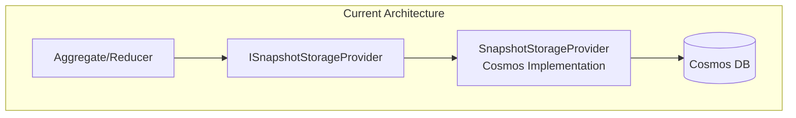
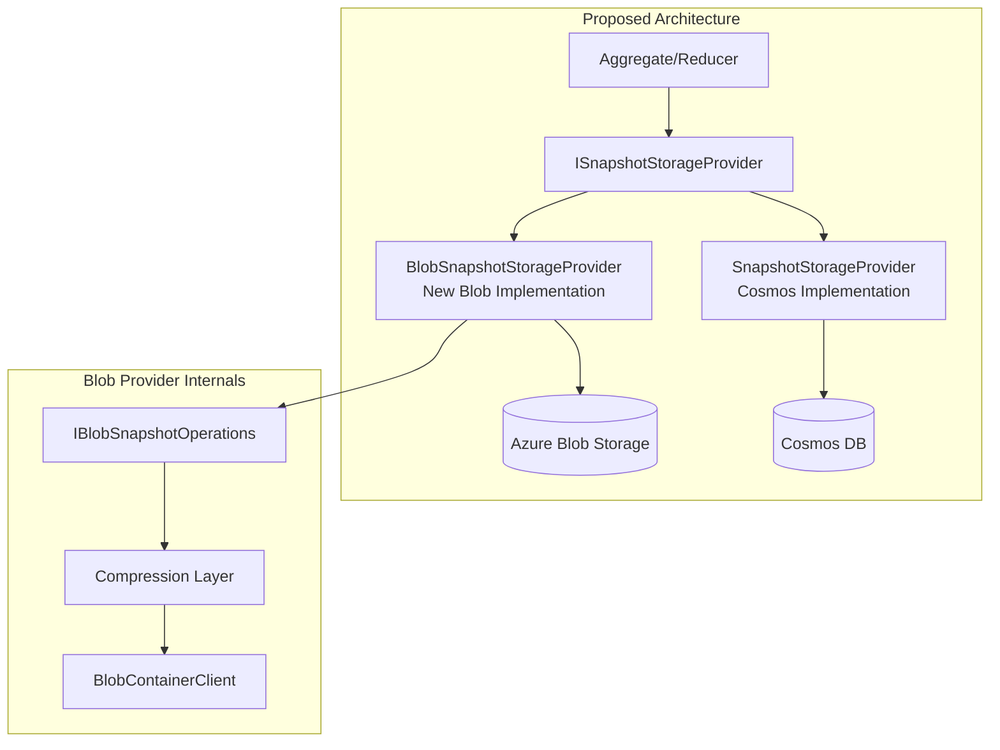
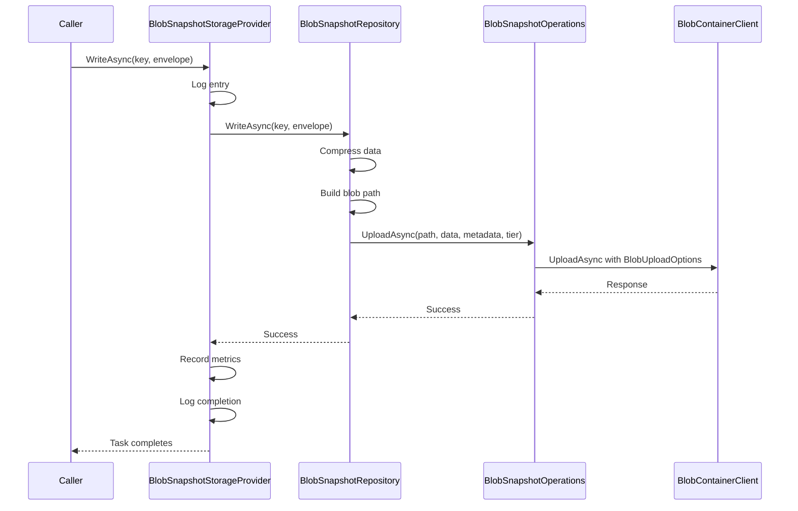

# RFC: Azure Blob Storage Snapshot Provider

## Problem Statement

The Mississippi framework currently only supports Cosmos DB for snapshot storage via `EventSourcing.Snapshots.Cosmos`. While Cosmos works well, some customers need:

1. **Lower storage costs** for large snapshots (Blob storage is cheaper per GB)
2. **Simpler pricing** without RU considerations for read-heavy workloads
3. **Access tier optimization** (Hot/Cool/Cold) based on snapshot age
4. **Alignment with existing Azure Blob infrastructure**

## Goals

- Implement `ISnapshotStorageProvider` using Azure Blob Storage
- Support configurable compression (None, GZip, Brotli) for write operations
- Auto-detect compression on read (backwards-compatible)
- Support Azure Blob access tiers (Hot, Cool, Cold)
- Follow established patterns from Cosmos provider
- Full OpenTelemetry instrumentation
- Comprehensive L0 test coverage (≥95%)

## Non-Goals

- Archive tier support (requires rehydration, incompatible with snapshot access patterns)
- Smart tier (still in preview, consider when GA)
- Migration tooling from Cosmos to Blob (out of scope for initial implementation)
- L2+ integration tests (may be added later)

## Current State



The `ISnapshotStorageProvider` interface is already abstracted, allowing multiple implementations to coexist.

## Proposed Design



### Blob Path Structure

```
{container}/{brookName}/{snapshotStorageName}/{entityId}/{reducersHash}/{version}.snapshot
```

Example:
```
snapshots/CRESCENT.NEWMODEL.CHAT/CRESCENT.CHAT.CHATSTATE.V1/chat-123/abc123hash/100.snapshot
```

This enables:
- Prefix-based listing for pruning: `{brookName}/{snapshotStorageName}/{entityId}/{reducersHash}/`
- Container-level lifecycle policies
- Version as blob name for simplicity

### Compression Handling

**Write Path:**
1. Serialize `SnapshotEnvelope.Data` 
2. Apply configured compression (default: Brotli)
3. Set blob metadata with compression type
4. Upload with access tier

**Read Path:**
1. Download blob with metadata
2. Detect compression from metadata (`x-snapshot-compression`)
3. Decompress if needed
4. Return `SnapshotEnvelope`



### Keyed Services Integration

New constants in `MississippiDefaults`:

```csharp
public static class ServiceKeys
{
    // Existing...
    public const string BlobSnapshots = "mississippi-blob-snapshots";
    public const string BlobSnapshotsClient = "mississippi-blob-snapshots-client";
}
```

### Configuration

```csharp
public sealed class BlobSnapshotStorageOptions
{
    public string ContainerName { get; set; } = MississippiDefaults.ContainerIds.Snapshots;
    public string BlobServiceClientKey { get; set; } = MississippiDefaults.ServiceKeys.BlobSnapshotsClient;
    public SnapshotCompression WriteCompression { get; set; } = SnapshotCompression.Brotli;
    public AccessTier DefaultAccessTier { get; set; } = AccessTier.Hot;
    public int MaxConcurrency { get; set; } = 10;
}

public enum SnapshotCompression
{
    None,
    GZip,
    Brotli
}
```

## Alternatives Considered

### 1. Hierarchical vs Flattened Blob Path

**Hierarchical (chosen):**
```
{container}/{brookName}/{snapshotStorageName}/{entityId}/{reducersHash}/{version}.snapshot
```
- Pros: Natural grouping, easy prefix listing, lifecycle policies per level
- Cons: Deep nesting

**Flattened:**
```
{container}/{snapshotStorageName}/{brookName}_{entityId}_{reducersHash}_{version}.snapshot
```
- Pros: Avoids hot partitions, simpler paths
- Cons: Harder to manage lifecycle per entity

Decision: Hierarchical is more intuitive and aligns with how snapshots are logically organized.

### 2. Compression in Provider vs Separate Layer

**In Repository (chosen):** Compression handled in `BlobSnapshotRepository` before upload
- Pros: Single responsibility, testable, consistent
- Cons: Slightly more classes

**In Operations:** Let `IBlobSnapshotOperations` handle compression
- Pros: Fewer layers
- Cons: Mixes SDK concerns with compression logic

Decision: Keep compression in repository for testability and separation.

## Architecture Decisions

### No Abstractions Project Needed

Unlike some Mississippi libraries, `EventSourcing.Snapshots.Blob` does **not** require a separate `*.Abstractions` project because:

1. **No cross-assembly contracts**: The options and compression enum are consumed only by hosts registering the provider
2. **Single implementation**: This is the only Blob snapshot implementation (unlike interfaces with multiple implementations)
3. **Internal types dominate**: Most types (`BlobSnapshotRepository`, `BlobSnapshotOperations`) are internal

The public API surface is minimal:
- `BlobSnapshotStorageOptions` (configuration)
- `SnapshotCompression` (enum)
- `AddBlobSnapshotStorageProvider()` extension methods

These can live in the main project without violating abstractions principles.

### No Mappers Needed (Unlike Cosmos)

The Cosmos provider uses `IMapper<TSource, TDest>` for document transformations because:
- Cosmos documents have SDK-specific structure (partition key, id, TTL, JSON format)
- Multiple transformation steps: Document → StorageModel → Envelope

Blob storage is simpler:
- Data is already raw bytes (`ImmutableArray<byte>`)
- Metadata stored separately in blob properties
- No intermediate "document" model needed

The repository directly handles: `SnapshotEnvelope` ↔ `(byte[] compressedData, Dictionary<string,string> metadata)`

## Error Handling Strategy

### Read Operations

| Exception | Handling |
|-----------|----------|
| `RequestFailedException` (404 NotFound) | Return `null` (snapshot doesn't exist) |
| `RequestFailedException` (other) | Log error, rethrow |
| `OperationCanceledException` | Rethrow (caller cancelled) |

### Write Operations

| Exception | Handling |
|-----------|----------|
| `RequestFailedException` (409 Conflict) | Log warning, rethrow (concurrent write) |
| `RequestFailedException` (other) | Log error, rethrow |
| Compression failure | Log error, rethrow |

### Retry Policy

Azure SDK handles transient retries internally via `BlobClientOptions.Retry`. No custom `IRetryPolicy` needed (unlike Cosmos which has more complex retry semantics).

### No Domain Exceptions

We do **not** introduce `BlobSnapshotStorageException` because:
- The interface contract uses nullable returns for "not found"
- Callers already handle `OperationCanceledException`
- SDK exceptions provide sufficient context for debugging

## Security Considerations

- Blob client uses keyed services; credentials are managed by host (Aspire/Azure.Identity)
- No secrets stored in configuration
- Snapshots may contain sensitive domain data; access control via Azure RBAC/SAS at container level

## Observability

### Metrics (following Cosmos pattern)

| Metric | Type | Tags |
|--------|------|------|
| `blob.snapshot.read.count` | Counter | snapshot.type, result |
| `blob.snapshot.read.duration` | Histogram | snapshot.type, result |
| `blob.snapshot.write.count` | Counter | snapshot.type, result, compression |
| `blob.snapshot.write.duration` | Histogram | snapshot.type, result, compression |
| `blob.snapshot.delete.count` | Counter | snapshot.type |
| `blob.snapshot.prune.count` | Counter | snapshot.type |
| `blob.snapshot.size` | Histogram | snapshot.type, compression |
| `blob.snapshot.compression.ratio` | Histogram | snapshot.type, compression |

### Logging

All operations logged via `[LoggerMessage]` partial methods:
- Entry/exit at Debug level
- Prune/DeleteAll at Information level
- Errors with full context at Error level

## Compatibility / Migrations

- **Additive change:** New project, no modifications to existing Cosmos provider
- **No breaking changes:** Existing `ISnapshotStorageProvider` implementations continue to work
- **Coexistence:** Both Cosmos and Blob providers can be registered simultaneously (different keyed services)

## Risks and Mitigations

| Risk | Mitigation |
|------|------------|
| Blob SDK API changes | Pin to stable `Azure.Storage.Blobs` version in CPM |
| Performance vs Cosmos | Document trade-offs; Cosmos is faster for small reads, Blob is cheaper for large storage |
| Compression overhead | Brotli default balances compression ratio and CPU; make configurable |
| Access tier early deletion fees | Document clearly; default to Hot tier |
