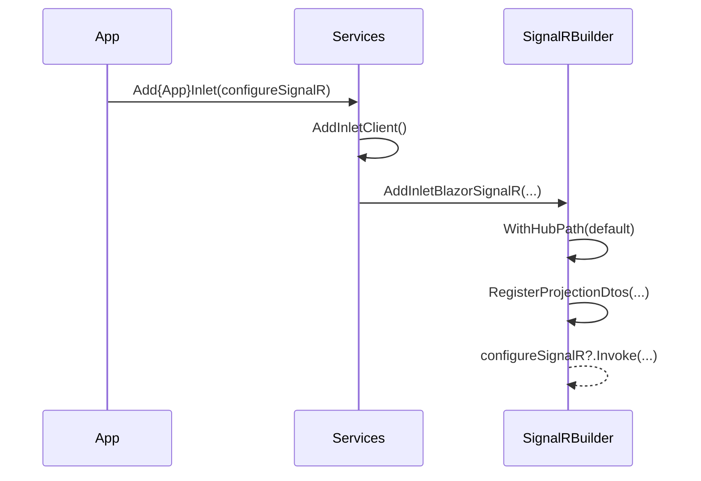

# RFC: Composite registration configuration hook

## Problem
The composite client registration (`Add{App}Inlet`) is the single entry point for Inlet setup, but callers need a configuration hook to customize SignalR settings without abandoning the composite method.

## Goals
- Keep one registration point (`Add{App}Inlet`) while enabling optional configuration.
- Preserve existing defaults and behavior.
- Keep generated API surface simple and discoverable.
- Provide a clear doc plan (no doc changes in this task).

## Non-goals
- No new options classes or runtime behavior changes.
- No documentation updates in this change set.

## Current state
- `Add{App}Inlet()` is generated and now forwards to an overload with optional SignalR configuration.
- SignalR configuration defaults to hub path + DTO registration; optional configuration runs after defaults.

## Proposed design
- Generate an overload: `Add{App}Inlet(this IServiceCollection services, Action<InletBlazorSignalRBuilder>? configureSignalR)`.
- Default `Add{App}Inlet()` forwards to the overload with `null`.
- The overload applies default hub path and DTO registration, then invokes `configureSignalR` if provided.

## Alternatives
- Introduce options classes in the generated method signature (more surface, more maintenance).
- Require manual wiring (breaks single-entry-point goal).

## Security
No new security surface; configuration is limited to existing builder APIs.

## Observability
No logging changes.

## Compatibility
Backwards compatible: existing calls to `Add{App}Inlet()` remain valid and preserve defaults.

## Risks
- If configuration is applied before defaults, it might be overridden. Mitigation: invoke configuration after defaults.

## Mermaid diagrams

### As-is vs to-be (flow)
```mermaid
flowchart TD
    A[App Startup] --> B[Add{App}Inlet()]
    B --> C[AddInletClient]
    C --> D[AddInletBlazorSignalR with defaults]
    D --> E[Register DTOs]

    A2[App Startup] --> B2[Add{App}Inlet(configure)]
    B2 --> C2[AddInletClient]
    C2 --> D2[AddInletBlazorSignalR defaults]
    D2 --> E2[Register DTOs]
    E2 --> F2[configureSignalR optional]
```

### Critical path sequence

