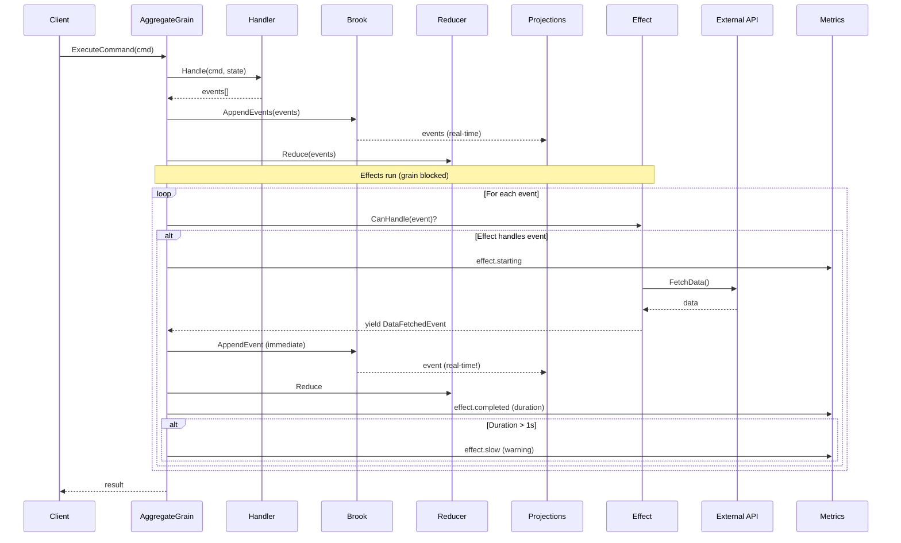

# Implementation Plan v3.1 - In-Grain Effects (Final)

**Updated with observability, concurrency reasoning, and aligned interface design (2026-01-24)**

## Executive Summary

Server-side event effects run **inside the aggregate grain**, **block until complete**, and **yield events** that are persisted in real-time. This enables data enrichment, LLM streaming, and multi-step API workflows where projections update progressively as events are yielded.

---

## Design Principles

### 1. Align with Client-Side Pattern

| Aspect | Client (IActionEffect) | Server (IEventEffect) |
|--------|----------------------|----------------------|
| Trigger | `IAction` | `object` (event) |
| Yields | `IAction` | `object` (events) |
| State access | ❌ No (inject IStore if needed) | ❌ No (read brook if needed) |
| Context | None | `EffectContext` (brook info) |
| Return type | `IAsyncEnumerable<IAction>` | `IAsyncEnumerable<object>` |

**Key Decision:** No state parameter. Effects are decoupled from state. If an effect needs state (edge case), it can read the event stream via the provided `EffectContext.BrookName`.

### 2. Concurrency Model Differs (Justified)

| Aspect | Client (WASM) | Server (Orleans) |
|--------|--------------|------------------|
| Execution | Fire-and-forget, concurrent | **Blocking, sequential** |
| Why | UI must stay responsive | Grain single-threaded model |
| New actions/events during effect | ✅ Yes, dispatched immediately | ❌ No, grain blocked |

**Rationale:** The difference is intentional:
- **Client:** Browser UI cannot block. Effects run concurrently while user continues interacting.
- **Server:** Orleans grains are single-threaded. Effects block to maintain consistency and enable transactional event chains.

### 3. Real-Time Projection Updates

Effects that yield events over time (e.g., LLM streaming) benefit from the decoupled projection model:

```
Command → Handler → Event1 (persisted) → Effect starts
                                              ↓
                                        yield TokenEvent1 → persisted → projection updates → UI sees it
                                              ↓
                                        yield TokenEvent2 → persisted → projection updates → UI sees it
                                              ↓
                                        yield CompletedEvent → persisted → projection updates
                                              ↓
                                        Effect ends → Command returns
```

Projections are decoupled, so events arrive at the UX in real-time, not batched at command completion.

---

## Interface Design

### EffectContext

```csharp
namespace Mississippi.EventSourcing.Aggregates.Abstractions;

/// <summary>
///     Context information provided to event effects.
/// </summary>
/// <param name="AggregateKey">The aggregate key (brook key).</param>
/// <param name="BrookName">The brook name where events are persisted.</param>
/// <param name="AggregateTypeName">The full type name of the aggregate.</param>
[GenerateSerializer]
[Immutable]
public sealed record EffectContext(
    string AggregateKey,
    string BrookName,
    string AggregateTypeName
);
```

### IEventEffect Interface

```csharp
namespace Mississippi.EventSourcing.Aggregates.Abstractions;

/// <summary>
///     Handles side effects triggered by domain events within the aggregate grain.
/// </summary>
/// <typeparam name="TAggregate">The aggregate state type.</typeparam>
/// <remarks>
///     <para>
///         Event effects run synchronously within the grain context after events are
///         persisted. They block the grain until complete, ensuring effects finish
///         before the next command is processed.
///     </para>
///     <para>
///         Effects can yield additional events via <see cref="IAsyncEnumerable{T}"/>,
///         enabling streaming scenarios (e.g., LLM token streaming, progressive data fetch).
///         Yielded events are persisted immediately, allowing projections to update in real-time.
///     </para>
///     <para>
///         <b>Performance guidance:</b> Effects should complete quickly (sub-second typical).
///         A warning is logged if an effect takes longer than 1 second. For long-running
///         background work, consider Orleans reminders or external workflow systems.
///     </para>
///     <para>
///         <b>State access:</b> Effects do not receive state directly (aligned with client-side
///         pattern). If state is needed, read the event stream via <see cref="EffectContext.BrookName"/>.
///     </para>
/// </remarks>
public interface IEventEffect<TAggregate>
{
    /// <summary>
    ///     Determines whether this effect can handle the given event.
    /// </summary>
    bool CanHandle(object eventData);

    /// <summary>
    ///     Handles the event and optionally yields additional events.
    /// </summary>
    /// <param name="eventData">The event that was persisted.</param>
    /// <param name="context">Context information about the aggregate and brook.</param>
    /// <param name="cancellationToken">Cancellation token.</param>
    /// <returns>
    ///     An async enumerable of additional events to persist.
    ///     Yielded events are persisted immediately, enabling real-time projection updates.
    /// </returns>
    IAsyncEnumerable<object> HandleAsync(
        object eventData,
        EffectContext context,
        CancellationToken cancellationToken
    );
}
```

### EventEffectBase

```csharp
namespace Mississippi.EventSourcing.Aggregates.Abstractions;

/// <summary>
///     Base class for event effects that handle a specific event type.
/// </summary>
public abstract class EventEffectBase<TEvent, TAggregate> : IEventEffect<TAggregate>
{
    /// <inheritdoc />
    public bool CanHandle(object eventData) => eventData is TEvent;

    /// <inheritdoc />
    public IAsyncEnumerable<object> HandleAsync(
        object eventData,
        EffectContext context,
        CancellationToken cancellationToken)
    {
        if (eventData is TEvent typedEvent)
        {
            return HandleAsync(typedEvent, context, cancellationToken);
        }
        return AsyncEnumerable.Empty<object>();
    }

    /// <summary>
    ///     Handles the event and optionally yields additional events.
    /// </summary>
    public abstract IAsyncEnumerable<object> HandleAsync(
        TEvent eventData,
        EffectContext context,
        CancellationToken cancellationToken
    );
}
```

### SimpleEventEffectBase (No Yielded Events)

```csharp
namespace Mississippi.EventSourcing.Aggregates.Abstractions;

/// <summary>
///     Base class for simple event effects that perform side operations without yielding events.
/// </summary>
/// <remarks>
///     Use when your effect performs a side operation (logging, notification, external API call)
///     but doesn't need to yield additional events.
/// </remarks>
public abstract class SimpleEventEffectBase<TEvent, TAggregate> : EventEffectBase<TEvent, TAggregate>
{
    /// <inheritdoc />
    public sealed override async IAsyncEnumerable<object> HandleAsync(
        TEvent eventData,
        EffectContext context,
        [EnumeratorCancellation] CancellationToken cancellationToken)
    {
        await HandleSimpleAsync(eventData, context, cancellationToken);
        yield break;
    }

    /// <summary>
    ///     Handles the event without yielding additional events.
    /// </summary>
    protected abstract Task HandleSimpleAsync(
        TEvent eventData,
        EffectContext context,
        CancellationToken cancellationToken
    );
}
```

---

## Observability (Required)

Effects must have comprehensive logging and metrics for production debugging and performance monitoring.

### Metrics (OpenTelemetry)

```csharp
namespace Mississippi.EventSourcing.Aggregates.Observability;

/// <summary>
///     Metrics for event effect execution.
/// </summary>
public sealed class EventEffectMetrics
{
    private readonly Counter<long> executionCounter;
    private readonly Counter<long> errorCounter;
    private readonly Histogram<double> durationHistogram;
    private readonly Counter<long> slowEffectCounter;

    public EventEffectMetrics(IMeterFactory meterFactory)
    {
        var meter = meterFactory.Create("Mississippi.EventSourcing.Aggregates.Effects");
        
        executionCounter = meter.CreateCounter<long>(
            "effect.execution.total",
            description: "Total number of effect executions");
        
        errorCounter = meter.CreateCounter<long>(
            "effect.execution.errors",
            description: "Total failed effect executions");
        
        durationHistogram = meter.CreateHistogram<double>(
            "effect.execution.duration",
            unit: "ms",
            description: "Effect execution duration in milliseconds");
        
        slowEffectCounter = meter.CreateCounter<long>(
            "effect.execution.slow",
            description: "Effects that took longer than 1 second");
    }

    public void RecordExecution(string effectType, string eventType, TimeSpan duration, bool success)
    {
        executionCounter.Add(1, 
            new("effect.type", effectType), 
            new("event.type", eventType),
            new("success", success));
        
        durationHistogram.Record(duration.TotalMilliseconds, 
            new("effect.type", effectType),
            new("event.type", eventType));
        
        if (!success)
        {
            errorCounter.Add(1, new("effect.type", effectType), new("event.type", eventType));
        }
        
        if (duration.TotalSeconds > 1.0)
        {
            slowEffectCounter.Add(1, new("effect.type", effectType), new("event.type", eventType));
        }
    }
}
```

### Logger Extensions

```csharp
namespace Mississippi.EventSourcing.Aggregates;

/// <summary>
///     Logger extensions for event effect observability.
/// </summary>
internal static partial class EventEffectLoggerExtensions
{
    [LoggerMessage(
        Level = LogLevel.Debug,
        Message = "Effect {EffectType} starting for event {EventType} on aggregate {AggregateKey}")]
    public static partial void EffectStarting(
        this ILogger logger,
        string effectType,
        string eventType,
        string aggregateKey);

    [LoggerMessage(
        Level = LogLevel.Debug,
        Message = "Effect {EffectType} yielded event {YieldedEventType} for aggregate {AggregateKey}")]
    public static partial void EffectYieldedEvent(
        this ILogger logger,
        string effectType,
        string yieldedEventType,
        string aggregateKey);

    [LoggerMessage(
        Level = LogLevel.Debug,
        Message = "Effect {EffectType} completed for event {EventType} on aggregate {AggregateKey} in {DurationMs}ms")]
    public static partial void EffectCompleted(
        this ILogger logger,
        string effectType,
        string eventType,
        string aggregateKey,
        long durationMs);

    [LoggerMessage(
        Level = LogLevel.Warning,
        Message = "Effect {EffectType} took {DurationMs}ms (>1000ms) for aggregate {AggregateKey}. Consider optimizing or using background processing.")]
    public static partial void EffectSlow(
        this ILogger logger,
        string effectType,
        long durationMs,
        string aggregateKey);

    [LoggerMessage(
        Level = LogLevel.Error,
        Message = "Effect {EffectType} failed for aggregate {AggregateKey}")]
    public static partial void EffectFailed(
        this ILogger logger,
        string effectType,
        string aggregateKey,
        Exception exception);
}
```

### Execution with Observability

```csharp
// In RootEventEffectDispatcher:

public async IAsyncEnumerable<object> DispatchAsync(
    IReadOnlyList<object> events,
    EffectContext context,
    [EnumeratorCancellation] CancellationToken cancellationToken)
{
    foreach (var eventData in events)
    {
        var eventTypeName = eventData.GetType().Name;

        foreach (var effect in Effects)
        {
            if (!effect.CanHandle(eventData))
            {
                continue;
            }

            var effectTypeName = effect.GetType().Name;
            var stopwatch = Stopwatch.StartNew();
            var success = true;

            Logger.EffectStarting(effectTypeName, eventTypeName, context.AggregateKey);

            try
            {
                await foreach (var resultEvent in effect.HandleAsync(
                    eventData, context, cancellationToken))
                {
                    Logger.EffectYieldedEvent(effectTypeName, resultEvent.GetType().Name, context.AggregateKey);
                    yield return resultEvent;
                }
            }
            catch (Exception ex)
            {
                success = false;
                Logger.EffectFailed(effectTypeName, context.AggregateKey, ex);
                throw; // Propagate to command
            }
            finally
            {
                stopwatch.Stop();
                var durationMs = stopwatch.ElapsedMilliseconds;
                
                Logger.EffectCompleted(effectTypeName, eventTypeName, context.AggregateKey, durationMs);
                Metrics.RecordExecution(effectTypeName, eventTypeName, stopwatch.Elapsed, success);
                
                if (stopwatch.Elapsed.TotalSeconds > 1.0)
                {
                    Logger.EffectSlow(effectTypeName, durationMs, context.AggregateKey);
                }
            }
        }
    }
}
```

---

## Implementation Phases

### Phase 1: Abstractions

**Files:**
- `src/EventSourcing.Aggregates.Abstractions/EffectContext.cs`
- `src/EventSourcing.Aggregates.Abstractions/IEventEffect.cs`
- `src/EventSourcing.Aggregates.Abstractions/EventEffectBase.cs`
- `src/EventSourcing.Aggregates.Abstractions/SimpleEventEffectBase.cs`
- `src/EventSourcing.Aggregates.Abstractions/IRootEventEffectDispatcher.cs`

### Phase 2: Implementation with Observability

**Files:**
- `src/EventSourcing.Aggregates/RootEventEffectDispatcher.cs`
- `src/EventSourcing.Aggregates/Observability/EventEffectMetrics.cs`
- `src/EventSourcing.Aggregates/EventEffectLoggerExtensions.cs`
- `src/EventSourcing.Aggregates/AggregateRegistrations.cs` (extend)

### Phase 3: Grain Integration

**File:** `src/EventSourcing.Aggregates/GenericAggregateGrain.cs`

Changes:
1. Inject `IRootEventEffectDispatcher<TAggregate>` (optional)
2. After events persisted, build `EffectContext`
3. Dispatch effects, collect yielded events
4. Persist and reduce yielded events
5. Loop until no more events (max 10 iterations)

```csharp
// After initial events persisted:
if (EffectDispatcher is not null && events.Count > 0)
{
    var context = new EffectContext(
        AggregateKey: this.GetPrimaryKeyString(),
        BrookName: brookName,
        AggregateTypeName: typeof(TAggregate).FullName!
    );
    
    var pendingEvents = events.ToList();
    int iteration = 0;
    const int maxIterations = 10;
    
    while (pendingEvents.Count > 0 && iteration < maxIterations)
    {
        iteration++;
        var effectEvents = new List<object>();
        
        await foreach (var resultEvent in EffectDispatcher.DispatchAsync(
            pendingEvents, context, cancellationToken))
        {
            effectEvents.Add(resultEvent);
            
            // Persist immediately for real-time projection updates
            await BrookWriter.AppendEventsAsync(brookName, [resultEvent], cancellationToken);
            State = RootReducer.Reduce([resultEvent], State);
        }
        
        pendingEvents = effectEvents;
    }
    
    if (iteration >= maxIterations)
    {
        Logger.EffectIterationLimitReached(this.GetPrimaryKeyString(), maxIterations);
    }
}
```

### Phase 4: Source Generator Updates

**File:** `src/Inlet.Silo.Generators/AggregateSiloRegistrationGenerator.cs`

- Add `FindEffectsForAggregate()` matching handlers/reducers pattern
- Discover effects in `{Namespace}.Effects`
- Emit `services.AddEventEffect<TEvent, TAggregate, TEffect>()`
- Emit `services.AddEventEffectDispatcher<TAggregate>()`

### Phase 5: Sample Implementation

**Files:**
- `samples/Spring/Spring.Domain/Aggregates/BankAccount/Effects/AccountOpenedEffect.cs`
- Optional: Streaming effect example

### Phase 6: Testing

- Unit tests for `EventEffectBase`, `SimpleEventEffectBase`
- Unit tests for `RootEventEffectDispatcher`
- Generator tests for effect discovery
- Integration tests for grain effect execution
- Observability tests (metrics recorded, slow warning logged)

### Phase 7: Documentation

- Effects guide (what, when, how)
- Performance guidance (sub-second, warning at 1s)
- Streaming effects for LLM/progressive scenarios
- Comparison with client-side effects

---

## Flow Diagram (Final)



---

## Validation Checklist

- [ ] All new code has XML documentation
- [ ] Unit tests pass with >80% coverage
- [ ] Mutation tests maintain or improve score
- [ ] Build completes with zero warnings
- [ ] Source generator produces valid code
- [ ] Sample project compiles and runs
- [ ] Effect is triggered when account opened
- [ ] Effect-yielded events are persisted immediately
- [ ] Projections update in real-time during effect streaming
- [ ] Metrics recorded for all effect executions
- [ ] Warning logged when effect > 1 second
- [ ] Error logged when effect fails
- [ ] Recursion limit prevents infinite loops

---

## Risks and Mitigations

| Risk | Mitigation |
|------|------------|
| Effect blocks grain too long | Warning at 1s, document performance guidance |
| Infinite effect loop | MaxIterations limit (10) |
| Effect failure breaks command | Expected - errors propagate, logged with full context |
| Debugging streaming effects | Real-time projection updates + metrics + logs |
| Generator breaks existing projects | Effects are opt-in; no effects = no change |

---

## Summary of Key Decisions

1. **No state parameter** - Aligned with client-side. Effects read brook if needed.
2. **EffectContext with brook info** - Enables state rehydration edge case.
3. **Blocking execution** - Grain model, transactional event chains.
4. **Immediate event persistence** - Real-time projection updates during streaming.
5. **Comprehensive observability** - Metrics + structured logs + slow warnings.
6. **Concurrency differs from client** - Justified by execution context (WASM vs Orleans).
