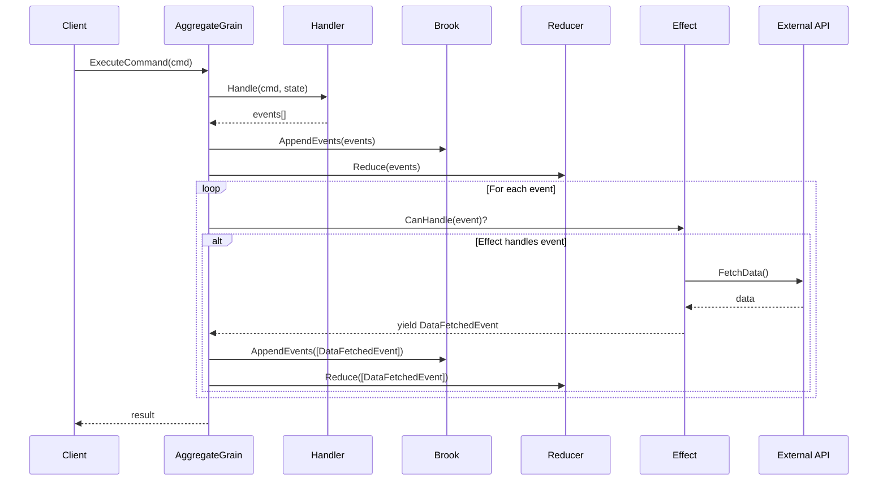

# Implementation Plan v3 - In-Grain Effects

**Updated based on design pivot (2026-01-24)**

## Design Pivot Summary

| Aspect | v2 (Fire-and-forget) | v3 (In-grain) |
|--------|---------------------|---------------|
| Execution context | Separate StatelessWorker grain | **Inside aggregate grain** |
| Blocking | Fire-and-forget (non-blocking) | **Blocks until complete** |
| State access | No (effects decoupled) | **Yes (grain context)** |
| Return type | `Task` (void) | **`IAsyncEnumerable<object>` (events)** |
| Error handling | Swallowed, logged | **Propagates to command** |
| Use case | High-throughput background work | **Low-throughput data fetch/enrichment** |
| Complexity | High (dispatcher, OneWay, etc.) | **Low (simple extension)** |

## Core Concept

Effects are **synchronous extensions to the event flow** that:
1. Run **after events are persisted** but **before command returns**
2. **Block the grain** from processing other commands
3. **Can access aggregate state** (they run in grain context)
4. **Can yield additional events** via `IAsyncEnumerable<object>`
5. Support **streaming scenarios** (LLM responses, progressive data fetch)

## Flow Diagram



## Example Use Cases

### 1. Data Enrichment
```csharp
// Command: EnrichCustomerData
// Handler yields: CustomerEnrichmentRequested
// Effect: Fetches data from external API, yields CustomerDataEnriched
```

### 2. LLM Streaming
```csharp
// Command: GenerateDescription
// Handler yields: DescriptionGenerationStarted
// Effect: Streams from LLM, yields DescriptionTokenReceived (multiple)
// Effect: Completes, yields DescriptionGenerationCompleted
```

### 3. Validation with External System
```csharp
// Command: SubmitOrder
// Handler yields: OrderSubmitted
// Effect: Validates with inventory API, yields InventoryValidated or InventoryValidationFailed
```

---

## Size Assessment: Medium

- New interfaces in abstractions
- Modification to GenericAggregateGrain
- Source generator updates (discover Effects/ namespace)
- Sample effect
- Tests

**Removed complexity from v2:**
- ~~EffectDispatcherGrain~~
- ~~OneWay/fire-and-forget~~
- ~~EffectContext (simplified - effect has grain access)~~
- ~~IdempotentEffectBase (not needed - effects are transactional)~~
- ~~Observability infrastructure (simpler logging)~~
- ~~Graceful shutdown handling~~

---

## Phase 1: Abstractions (EventSourcing.Aggregates.Abstractions)

### Step 1.1: Add IEventEffect Interface

**File:** `src/EventSourcing.Aggregates.Abstractions/IEventEffect.cs`

```csharp
namespace Mississippi.EventSourcing.Aggregates.Abstractions;

/// <summary>
///     Handles side effects triggered by domain events within the aggregate grain.
/// </summary>
/// <typeparam name="TAggregate">The aggregate state type.</typeparam>
/// <remarks>
///     <para>
///         Event effects run synchronously within the grain context after events are
///         persisted. They block the grain until complete, ensuring effects finish
///         before the next command is processed.
///     </para>
///     <para>
///         Effects can yield additional events via <see cref="IAsyncEnumerable{T}"/>,
///         enabling streaming scenarios (e.g., LLM token streaming, progressive data fetch).
///     </para>
///     <para>
///         <b>Design guidance:</b> Effects should be fast (sub-100ms typical) as they
///         block the grain. Use for data enrichment, validation calls, or streaming
///         responses. For long-running background work, consider Orleans reminders
///         or external workflow systems.
///     </para>
/// </remarks>
public interface IEventEffect<TAggregate>
{
    /// <summary>
    ///     Determines whether this effect can handle the given event.
    /// </summary>
    /// <param name="eventData">The event to check.</param>
    /// <returns><see langword="true"/> if this effect handles the event.</returns>
    bool CanHandle(object eventData);

    /// <summary>
    ///     Handles the event and optionally yields additional events.
    /// </summary>
    /// <param name="eventData">The event that was persisted.</param>
    /// <param name="state">The current aggregate state (after reduction).</param>
    /// <param name="aggregateKey">The aggregate key (brook key).</param>
    /// <param name="cancellationToken">Cancellation token.</param>
    /// <returns>
    ///     An async enumerable of additional events to persist and reduce.
    ///     Return an empty enumerable if no additional events are needed.
    /// </returns>
    IAsyncEnumerable<object> HandleAsync(
        object eventData,
        TAggregate state,
        string aggregateKey,
        CancellationToken cancellationToken
    );
}

/// <summary>
///     Strongly-typed event effect for a specific event type.
/// </summary>
/// <typeparam name="TEvent">The event type to handle.</typeparam>
/// <typeparam name="TAggregate">The aggregate state type.</typeparam>
public interface IEventEffect<in TEvent, TAggregate> : IEventEffect<TAggregate>
{
    /// <summary>
    ///     Handles the typed event and optionally yields additional events.
    /// </summary>
    IAsyncEnumerable<object> HandleAsync(
        TEvent eventData,
        TAggregate state,
        string aggregateKey,
        CancellationToken cancellationToken
    );
}
```

### Step 1.2: Add EventEffectBase

**File:** `src/EventSourcing.Aggregates.Abstractions/EventEffectBase.cs`

```csharp
using System.Runtime.CompilerServices;

namespace Mississippi.EventSourcing.Aggregates.Abstractions;

/// <summary>
///     Base class for event effects that handle a specific event type.
/// </summary>
/// <typeparam name="TEvent">The event type to handle.</typeparam>
/// <typeparam name="TAggregate">The aggregate state type.</typeparam>
public abstract class EventEffectBase<TEvent, TAggregate> : IEventEffect<TEvent, TAggregate>
{
    /// <inheritdoc />
    public bool CanHandle(object eventData) => eventData is TEvent;

    /// <inheritdoc />
    public IAsyncEnumerable<object> HandleAsync(
        object eventData,
        TAggregate state,
        string aggregateKey,
        CancellationToken cancellationToken)
    {
        if (eventData is TEvent typedEvent)
        {
            return HandleAsync(typedEvent, state, aggregateKey, cancellationToken);
        }
        return AsyncEnumerable.Empty<object>();
    }

    /// <summary>
    ///     Handles the event and optionally yields additional events.
    /// </summary>
    /// <param name="eventData">The typed event that was persisted.</param>
    /// <param name="state">The current aggregate state (after reduction).</param>
    /// <param name="aggregateKey">The aggregate key (brook key).</param>
    /// <param name="cancellationToken">Cancellation token.</param>
    /// <returns>
    ///     An async enumerable of additional events to persist and reduce.
    /// </returns>
    public abstract IAsyncEnumerable<object> HandleAsync(
        TEvent eventData,
        TAggregate state,
        string aggregateKey,
        CancellationToken cancellationToken
    );
}
```

### Step 1.3: Add SimpleEventEffectBase (No Return Events)

**File:** `src/EventSourcing.Aggregates.Abstractions/SimpleEventEffectBase.cs`

```csharp
using System.Runtime.CompilerServices;

namespace Mississippi.EventSourcing.Aggregates.Abstractions;

/// <summary>
///     Base class for simple event effects that don't yield additional events.
/// </summary>
/// <typeparam name="TEvent">The event type to handle.</typeparam>
/// <typeparam name="TAggregate">The aggregate state type.</typeparam>
/// <remarks>
///     Use this base class when your effect performs a side operation (logging,
///     notification, external API call) but doesn't need to yield additional events.
/// </remarks>
public abstract class SimpleEventEffectBase<TEvent, TAggregate> : EventEffectBase<TEvent, TAggregate>
{
    /// <inheritdoc />
    public sealed override async IAsyncEnumerable<object> HandleAsync(
        TEvent eventData,
        TAggregate state,
        string aggregateKey,
        [EnumeratorCancellation] CancellationToken cancellationToken)
    {
        await HandleSimpleAsync(eventData, state, aggregateKey, cancellationToken);
        yield break;
    }

    /// <summary>
    ///     Handles the event without yielding additional events.
    /// </summary>
    protected abstract Task HandleSimpleAsync(
        TEvent eventData,
        TAggregate state,
        string aggregateKey,
        CancellationToken cancellationToken
    );
}
```

---

## Phase 2: Implementation (EventSourcing.Aggregates)

### Step 2.1: Add IRootEventEffectDispatcher Interface

**File:** `src/EventSourcing.Aggregates.Abstractions/IRootEventEffectDispatcher.cs`

```csharp
namespace Mississippi.EventSourcing.Aggregates.Abstractions;

/// <summary>
///     Dispatches event effects for an aggregate and collects resulting events.
/// </summary>
/// <typeparam name="TAggregate">The aggregate state type.</typeparam>
public interface IRootEventEffectDispatcher<TAggregate>
{
    /// <summary>
    ///     Dispatches effects for the given events and collects any resulting events.
    /// </summary>
    /// <param name="events">The events that were persisted.</param>
    /// <param name="state">The current aggregate state.</param>
    /// <param name="aggregateKey">The aggregate key.</param>
    /// <param name="cancellationToken">Cancellation token.</param>
    /// <returns>Additional events yielded by effects.</returns>
    IAsyncEnumerable<object> DispatchAsync(
        IReadOnlyList<object> events,
        TAggregate state,
        string aggregateKey,
        CancellationToken cancellationToken
    );
}
```

### Step 2.2: Add RootEventEffectDispatcher Implementation

**File:** `src/EventSourcing.Aggregates/RootEventEffectDispatcher.cs`

```csharp
using System.Runtime.CompilerServices;

namespace Mississippi.EventSourcing.Aggregates;

/// <summary>
///     Default implementation of <see cref="IRootEventEffectDispatcher{TAggregate}"/>.
/// </summary>
public sealed class RootEventEffectDispatcher<TAggregate> : IRootEventEffectDispatcher<TAggregate>
{
    private IEnumerable<IEventEffect<TAggregate>> Effects { get; }
    private ILogger<RootEventEffectDispatcher<TAggregate>> Logger { get; }

    public RootEventEffectDispatcher(
        IEnumerable<IEventEffect<TAggregate>> effects,
        ILogger<RootEventEffectDispatcher<TAggregate>> logger)
    {
        Effects = effects;
        Logger = logger;
    }

    public async IAsyncEnumerable<object> DispatchAsync(
        IReadOnlyList<object> events,
        TAggregate state,
        string aggregateKey,
        [EnumeratorCancellation] CancellationToken cancellationToken)
    {
        foreach (var eventData in events)
        {
            var eventTypeName = eventData.GetType().Name;

            foreach (var effect in Effects)
            {
                if (!effect.CanHandle(eventData))
                {
                    continue;
                }

                var effectTypeName = effect.GetType().Name;
                Logger.EffectExecuting(effectTypeName, eventTypeName, aggregateKey);

                await foreach (var resultEvent in effect.HandleAsync(
                    eventData, state, aggregateKey, cancellationToken))
                {
                    Logger.EffectYieldedEvent(effectTypeName, resultEvent.GetType().Name, aggregateKey);
                    yield return resultEvent;
                }

                Logger.EffectCompleted(effectTypeName, eventTypeName, aggregateKey);
            }
        }
    }
}
```

### Step 2.3: Add Logger Extensions

**File:** `src/EventSourcing.Aggregates/EventEffectLoggerExtensions.cs`

```csharp
namespace Mississippi.EventSourcing.Aggregates;

/// <summary>
///     Logger extensions for event effects.
/// </summary>
internal static partial class EventEffectLoggerExtensions
{
    [LoggerMessage(
        Level = LogLevel.Debug,
        Message = "Executing effect {EffectType} for event {EventType} on aggregate {AggregateKey}")]
    public static partial void EffectExecuting(
        this ILogger logger,
        string effectType,
        string eventType,
        string aggregateKey);

    [LoggerMessage(
        Level = LogLevel.Debug,
        Message = "Effect {EffectType} yielded event {YieldedEventType} for aggregate {AggregateKey}")]
    public static partial void EffectYieldedEvent(
        this ILogger logger,
        string effectType,
        string yieldedEventType,
        string aggregateKey);

    [LoggerMessage(
        Level = LogLevel.Debug,
        Message = "Effect {EffectType} completed for event {EventType} on aggregate {AggregateKey}")]
    public static partial void EffectCompleted(
        this ILogger logger,
        string effectType,
        string eventType,
        string aggregateKey);

    [LoggerMessage(
        Level = LogLevel.Error,
        Message = "Effect {EffectType} failed for aggregate {AggregateKey}")]
    public static partial void EffectFailed(
        this ILogger logger,
        string effectType,
        string aggregateKey,
        Exception exception);
}
```

### Step 2.4: Add Effect Registration Methods

**File:** `src/EventSourcing.Aggregates/AggregateRegistrations.cs` (extend existing)

```csharp
/// <summary>
///     Registers an event effect for an aggregate.
/// </summary>
/// <remarks>
///     This method is called by the source generator. Do not call directly.
/// </remarks>
public static IServiceCollection AddEventEffect<TEvent, TAggregate, TEffect>(
    this IServiceCollection services
)
    where TEffect : class, IEventEffect<TEvent, TAggregate>
{
    services.AddTransient<IEventEffect<TAggregate>, TEffect>();
    return services;
}

/// <summary>
///     Adds the root event effect dispatcher for an aggregate.
/// </summary>
public static IServiceCollection AddEventEffectDispatcher<TAggregate>(
    this IServiceCollection services
)
{
    services.TryAddTransient<IRootEventEffectDispatcher<TAggregate>, RootEventEffectDispatcher<TAggregate>>();
    return services;
}
```

### Step 2.5: Modify GenericAggregateGrain

**File:** `src/EventSourcing.Aggregates/GenericAggregateGrain.cs`

Changes:
1. Inject `IRootEventEffectDispatcher<TAggregate>` (optional - may have no effects)
2. After events are persisted and reduced, dispatch effects
3. Collect yielded events, persist them, reduce them
4. Loop until no more events are yielded (effects can chain)

```csharp
// In the command execution flow, after initial events are persisted:

// Run effects and collect any resulting events
if (EffectDispatcher is not null && events.Count > 0)
{
    var pendingEvents = events.ToList();
    
    while (pendingEvents.Count > 0)
    {
        var effectEvents = new List<object>();
        
        await foreach (var resultEvent in EffectDispatcher.DispatchAsync(
            pendingEvents, State, this.GetPrimaryKeyString(), cancellationToken))
        {
            effectEvents.Add(resultEvent);
        }
        
        if (effectEvents.Count == 0)
        {
            break; // No more events, done
        }
        
        // Persist effect-yielded events
        await BrookWriter.AppendEventsAsync(brookName, effectEvents, cancellationToken);
        
        // Reduce effect-yielded events
        State = RootReducer.Reduce(effectEvents, State);
        
        // Loop: these events may trigger more effects
        pendingEvents = effectEvents;
    }
}
```

**Important:** Add recursion limit to prevent infinite loops:

```csharp
private const int MaxEffectIterations = 10;

// In command execution:
int iteration = 0;
while (pendingEvents.Count > 0 && iteration < MaxEffectIterations)
{
    iteration++;
    // ... dispatch, persist, reduce ...
}

if (iteration >= MaxEffectIterations)
{
    Logger.EffectIterationLimitReached(this.GetPrimaryKeyString(), MaxEffectIterations);
}
```

---

## Phase 3: Source Generator Updates

### Step 3.1: Update AggregateSiloRegistrationGenerator

**File:** `src/Inlet.Silo.Generators/AggregateSiloRegistrationGenerator.cs`

Changes:
1. Add `EventEffectBaseFullName` constant
2. Add `FindEffectsForAggregate()` method (same pattern as handlers/reducers)
3. Add `EffectInfo` record
4. Update `AggregateRegistrationInfo` to include effects list
5. Update `GenerateRegistration()` to emit effect registrations

### Step 3.2: Add EffectInfo Record

```csharp
private sealed record EffectInfo(
    string FullTypeName,
    string TypeName,
    string EventFullTypeName,
    string EventTypeName
);
```

### Step 3.3: Generator Emits Effect Registration

```csharp
// In GenerateRegistration method:

// Register effects for side operations
if (aggregate.Effects.Count > 0)
{
    sb.AppendLine();
    sb.AppendLine("// Register effects for side operations");
    foreach (EffectInfo effect in aggregate.Effects)
    {
        sb.AppendLine($"services.AddEventEffect<{effect.EventTypeName}, {aggregate.Model.TypeName}, {effect.TypeName}>();");
    }
    
    // Add effect dispatcher
    sb.AppendLine($"services.AddEventEffectDispatcher<{aggregate.Model.TypeName}>();");
}
```

---

## Phase 4: Sample Implementation

### Step 4.1: Add Effects Folder

**Folder:** `samples/Spring/Spring.Domain/Aggregates/BankAccount/Effects/`

### Step 4.2: Add Simple Sample Effect

**File:** `samples/Spring/Spring.Domain/Aggregates/BankAccount/Effects/AccountOpenedEffect.cs`

```csharp
namespace Spring.Domain.Aggregates.BankAccount.Effects;

/// <summary>
///     Simple effect that logs when an account is opened.
/// </summary>
internal sealed class AccountOpenedEffect : SimpleEventEffectBase<AccountOpened, BankAccountAggregate>
{
    private ILogger<AccountOpenedEffect> Logger { get; }

    public AccountOpenedEffect(ILogger<AccountOpenedEffect> logger)
    {
        Logger = logger;
    }

    protected override Task HandleSimpleAsync(
        AccountOpened eventData,
        BankAccountAggregate state,
        string aggregateKey,
        CancellationToken cancellationToken)
    {
        Logger.LogInformation(
            "Account opened for {HolderName}. Current balance: {Balance}",
            eventData.HolderName,
            state.Balance);

        return Task.CompletedTask;
    }
}
```

### Step 4.3: Add Streaming Effect Example (Optional Advanced Sample)

**File:** `samples/Spring/Spring.Domain/Aggregates/BankAccount/Effects/FraudCheckEffect.cs`

```csharp
namespace Spring.Domain.Aggregates.BankAccount.Effects;

/// <summary>
///     Effect that performs fraud check on large deposits and yields result event.
/// </summary>
internal sealed class FraudCheckEffect : EventEffectBase<Deposited, BankAccountAggregate>
{
    private const decimal FraudCheckThreshold = 10000m;
    
    private IFraudDetectionService FraudService { get; }
    private ILogger<FraudCheckEffect> Logger { get; }

    public FraudCheckEffect(
        IFraudDetectionService fraudService,
        ILogger<FraudCheckEffect> logger)
    {
        FraudService = fraudService;
        Logger = logger;
    }

    public override async IAsyncEnumerable<object> HandleAsync(
        Deposited eventData,
        BankAccountAggregate state,
        string aggregateKey,
        [EnumeratorCancellation] CancellationToken cancellationToken)
    {
        if (eventData.Amount < FraudCheckThreshold)
        {
            yield break; // No check needed
        }

        Logger.LogInformation(
            "Large deposit {Amount} on {AggregateKey}, running fraud check",
            eventData.Amount,
            aggregateKey);

        var result = await FraudService.CheckDepositAsync(
            aggregateKey,
            eventData.Amount,
            cancellationToken);

        yield return new FraudCheckCompleted(
            DepositAmount: eventData.Amount,
            IsSuspicious: result.IsSuspicious,
            RiskScore: result.RiskScore,
            CheckedAt: DateTimeOffset.UtcNow
        );
    }
}
```

---

## Phase 5: Testing

### Step 5.1: Unit Tests for EventEffectBase

**File:** `tests/EventSourcing.Aggregates.Abstractions.L0Tests/EventEffectBaseTests.cs`

- CanHandle returns true for matching event type
- CanHandle returns false for non-matching type
- HandleAsync routes to typed method
- HandleAsync returns empty for non-matching type

### Step 5.2: Unit Tests for RootEventEffectDispatcher

**File:** `tests/EventSourcing.Aggregates.L0Tests/RootEventEffectDispatcherTests.cs`

- Single effect handles single event
- Effect yields events are returned
- Multiple effects handle same event in order
- Effect that doesn't match is skipped
- Effect exception propagates (not swallowed)
- Empty effects list returns empty enumerable

### Step 5.3: Generator Tests

**File:** `tests/Inlet.Silo.Generators.L0Tests/AggregateSiloRegistrationGeneratorTests.cs`

- Generator discovers effects in Effects sub-namespace
- Generator emits AddEventEffect calls
- Generator emits AddEventEffectDispatcher when effects exist
- Generator handles aggregates without effects

### Step 5.4: Integration Tests

**File:** `tests/EventSourcing.Aggregates.L2Tests/EffectIntegrationTests.cs`

- Effect runs after command execution
- Effect receives correct state
- Effect-yielded events are persisted
- Effect-yielded events are reduced
- Effect chain terminates correctly
- Effect exception fails command

---

## Phase 6: Documentation

### Step 6.1: Effects Guide

**File:** `docs/Docusaurus/docs/guides/effects.md`

Contents:
- What are effects?
- In-grain vs fire-and-forget (why we chose in-grain)
- Creating an effect (step-by-step)
- SimpleEventEffectBase vs EventEffectBase
- Yielding events for streaming scenarios
- State access patterns
- Performance considerations (keep effects fast)

### Step 6.2: Streaming Effects Guide

**File:** `docs/Docusaurus/docs/guides/streaming-effects.md`

Contents:
- LLM integration pattern
- Progressive data fetch
- Real-time UX updates via projections
- Example: AI-generated content

---

## Validation Checklist

- [ ] All new code has XML documentation
- [ ] Unit tests pass with >80% coverage
- [ ] Mutation tests maintain or improve score
- [ ] Build completes with zero warnings
- [ ] Source generator produces valid code
- [ ] Sample project compiles and runs
- [ ] Effect is triggered in sample when account opened
- [ ] Effect-yielded events are persisted and reduced
- [ ] Recursion limit prevents infinite loops
- [ ] Documentation reviewed

---

## Rollout Plan

1. Implement abstractions (backwards compatible)
2. Implement dispatcher (backwards compatible)
3. Update source generator (backwards compatible, effects optional)
4. Update GenericAggregateGrain (backwards compatible, dispatcher optional)
5. Add sample (demonstrates feature)
6. Write documentation
7. Review and merge

---

## Risks and Mitigations

| Risk | Mitigation |
|------|------------|
| Effect blocks grain too long | Document performance guidance (sub-100ms) |
| Infinite effect loop | MaxEffectIterations limit (10) |
| Effect failure breaks command | Expected behavior - effect is part of command flow |
| Large state serialization | N/A - state is local, not serialized |
| Generator breaks existing projects | Effects are opt-in; no effects = no change |

---

## Comparison: v2 vs v3

| Aspect | v2 | v3 |
|--------|----|----|
| Complexity | High | **Low** |
| Lines of code | ~500+ | **~200** |
| New grains | 1 (EffectDispatcherGrain) | **0** |
| State access | No | **Yes** |
| Error propagation | Swallowed | **To command** |
| Streaming support | No | **Yes (IAsyncEnumerable)** |
| Throughput concern | None (async) | **Effects must be fast** |
| Use case fit | Background work | **Data enrichment, LLM** |

v3 is simpler, fits the described use cases, and aligns with the existing grain mental model.
