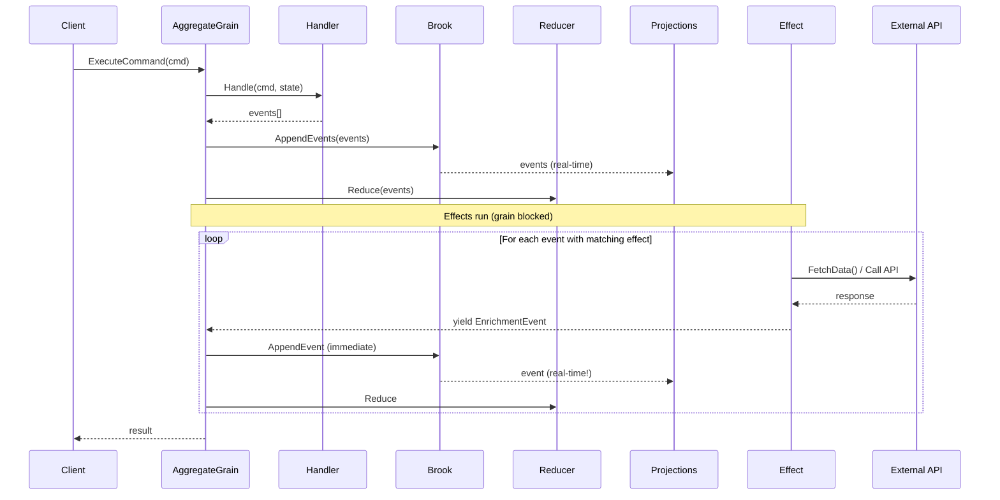

# RFC: Server-Side Event Effects (Final)

**Status:** Approved Design (v3.1)  
**Updated:** 2026-01-24

## Problem Statement

Currently, the aggregate system supports:
- **Commands** → Business logic that validates and produces events
- **Events** → Facts that are persisted to the event store
- **Reducers** → Pure functions that transform events into state

**Missing:** A mechanism for running side effects after events are persisted. Examples:
- Fetch external data to enrich state (API calls, LLM responses)
- Send notifications (email, SMS, push)
- Publish integration events to message buses
- Validate with external systems (fraud detection, compliance)

The client-side Reservoir store has this via `IActionEffect`. The server-side needs an aligned pattern.

## Goals

1. Allow users to define effects in aggregate domains (same pattern as handlers/reducers)
2. Effects run **inside the grain** after events are persisted
3. Effects can **yield additional events** via `IAsyncEnumerable<object>` for streaming
4. Support dependency injection (HTTP clients, loggers, external services)
5. Align with client-side `IActionEffect` pattern (no state parameter)
6. Provide comprehensive observability (metrics, logging, slow warnings)
7. Source generation for DI registration

## Non-Goals

1. Effects are NOT for long-running background work (use Orleans reminders/timers)
2. Effects do NOT receive aggregate state as parameter (read brook if needed)
3. We're NOT building a saga/workflow system (effects are simple callbacks)

## Design Decision: In-Grain Blocking Effects

### Options Considered

| Option | Description | Pros | Cons |
|--------|-------------|------|------|
| A. Fire-and-forget StatelessWorker | Effects run in separate grain | Throughput isolation | Complex, error handling difficult |
| B. In-grain blocking | Effects run inside aggregate grain | Simple, access to context | Blocks grain during execution |

**Decision: Option B (In-Grain Blocking)**

**Rationale:**
- Simple mental model - effects are just an extension of the command flow
- Errors propagate naturally to the command caller
- Orleans grains are single-threaded anyway - effects fit naturally
- Streaming via `IAsyncEnumerable` enables real-time projection updates
- Aligns with client-side pattern (though client is fire-and-forget due to UI constraints)

## Alignment with Client-Side IActionEffect

| Aspect | Client (IActionEffect) | Server (IEventEffect) |
|--------|----------------------|----------------------|
| Trigger | `IAction` | `object` (event) |
| Yields | `IAction` | `object` (events) |
| State access | ❌ No | ❌ No (aligned) |
| Context | None | `EffectContext` (brook info) |
| Return type | `IAsyncEnumerable<IAction>` | `IAsyncEnumerable<object>` |
| Execution | Fire-and-forget (UI stays responsive) | Blocking (grain model) |

The concurrency difference is intentional:
- **Client:** Browser UI cannot block. Effects run concurrently.
- **Server:** Orleans grains are single-threaded. Blocking maintains consistency.

## Final Interface Design

### EffectContext

```csharp
namespace Mississippi.EventSourcing.Aggregates.Abstractions;

/// <summary>
///     Context information provided to event effects.
/// </summary>
[GenerateSerializer]
[Immutable]
public sealed record EffectContext(
    string AggregateKey,
    string BrookName,
    string AggregateTypeName
);
```

### IEventEffect

```csharp
namespace Mississippi.EventSourcing.Aggregates.Abstractions;

/// <summary>
///     Handles side effects triggered by domain events within the aggregate grain.
/// </summary>
public interface IEventEffect<TAggregate>
{
    /// <summary>
    ///     Determines whether this effect can handle the given event.
    /// </summary>
    bool CanHandle(object eventData);

    /// <summary>
    ///     Handles the event and optionally yields additional events.
    /// </summary>
    IAsyncEnumerable<object> HandleAsync(
        object eventData,
        EffectContext context,
        CancellationToken cancellationToken
    );
}
```

### EventEffectBase

```csharp
public abstract class EventEffectBase<TEvent, TAggregate> : IEventEffect<TAggregate>
{
    public bool CanHandle(object eventData) => eventData is TEvent;

    public IAsyncEnumerable<object> HandleAsync(
        object eventData,
        EffectContext context,
        CancellationToken cancellationToken)
    {
        if (eventData is TEvent typedEvent)
        {
            return HandleAsync(typedEvent, context, cancellationToken);
        }
        return AsyncEnumerable.Empty<object>();
    }

    public abstract IAsyncEnumerable<object> HandleAsync(
        TEvent eventData,
        EffectContext context,
        CancellationToken cancellationToken
    );
}
```

### SimpleEventEffectBase (No Yielded Events)

```csharp
public abstract class SimpleEventEffectBase<TEvent, TAggregate> : EventEffectBase<TEvent, TAggregate>
{
    public sealed override async IAsyncEnumerable<object> HandleAsync(
        TEvent eventData,
        EffectContext context,
        [EnumeratorCancellation] CancellationToken cancellationToken)
    {
        await HandleSimpleAsync(eventData, context, cancellationToken);
        yield break;
    }

    protected abstract Task HandleSimpleAsync(
        TEvent eventData,
        EffectContext context,
        CancellationToken cancellationToken
    );
}
```

## Flow Diagram



## Observability Requirements

### Metrics (OpenTelemetry)

| Metric | Type | Description |
|--------|------|-------------|
| `effect.execution.total` | Counter | Total effect executions by type/event |
| `effect.execution.duration` | Histogram | Duration in milliseconds |
| `effect.execution.errors` | Counter | Failed executions |
| `effect.execution.slow` | Counter | Executions > 1 second |

### Logging

| Level | When |
|-------|------|
| Debug | Effect starting, yielded event, completed |
| Warning | Effect took > 1 second |
| Error | Effect failed with exception |

## Security Considerations

- Effects run with grain's service scope (same DI container)
- External API calls should use `IHttpClientFactory` with resilience policies
- Secrets should come from configuration, not hardcoded
- Effect failures propagate to caller - no silent data loss

## Backwards Compatibility

- **Fully backwards compatible** - Effects are opt-in
- Aggregates without effects work exactly as before
- Source generator only emits effect registration when effects are discovered

## Risks and Mitigations

| Risk | Mitigation |
|------|------------|
| Effect blocks grain too long | Warning at 1s, documentation guidance |
| Infinite effect loop | MaxIterations limit (10) |
| Effect failure breaks command | Expected behavior, logged with context |
| Generator breaks existing | Effects are opt-in; no effects = no change |

## References

- Implementation Plan: `implementation-plan.md`
- Client-side IActionEffect: `src/Reservoir.Abstractions/IActionEffect.cs`
- Sample aggregate: `samples/Spring/Spring.Domain/Aggregates/BankAccount/`
