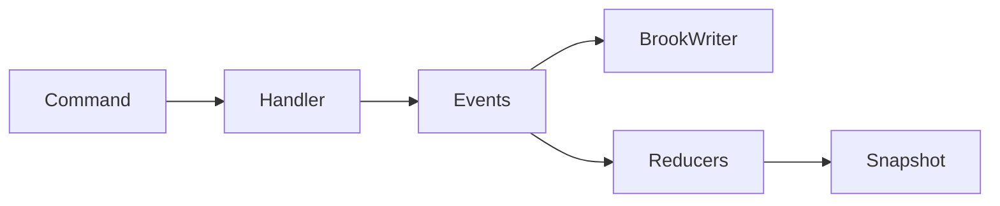
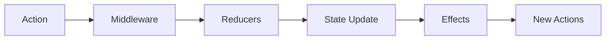
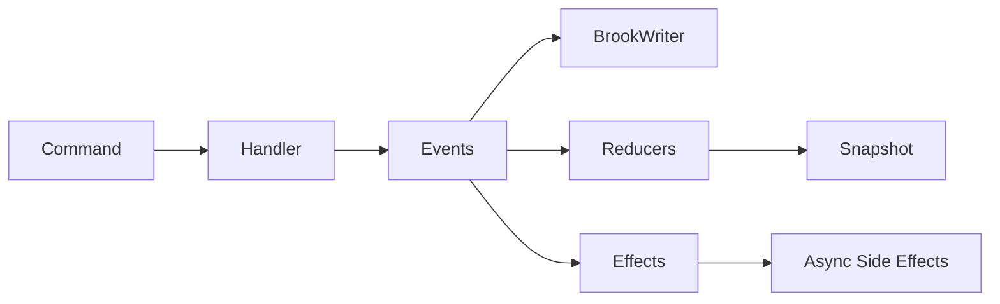

# RFC: Server-Side Event Effects

## Problem Statement

Currently, the aggregate system supports:
- **Commands** → Business logic that validates and produces events
- **Events** → Facts that are persisted to the event store
- **Reducers** → Pure functions that transform events into state

**Missing:** A mechanism for running asynchronous side effects after events are persisted. Examples:
- Send an email notification when an account is opened
- Publish an integration event to a message bus
- Call an external API (e.g., fraud detection)
- Start a saga/workflow
- Log to an audit service

The client-side Reservoir store already has this capability via `IEffect`, but the server-side aggregate system does not.

## Goals

1. Allow end users to define effects in aggregate domains (similar to handlers/reducers)
2. Follow consistent patterns with existing handler/reducer design
3. Support dependency injection for effects (HTTP clients, loggers, external services)
4. Run effects **after** events are persisted (transactional safety)
5. Provide source generation for DI registration (via AggregateSiloRegistrationGenerator)

## Non-Goals

1. Effects do NOT participate in the command transaction (fire-and-forget or background)
2. Effects do NOT modify aggregate state (that's the reducer's job)
3. Effects are NOT required for correctness (they're for side effects only)
4. We're NOT building a full saga/workflow orchestration system (effects are simple callbacks)

## Current State

### Server-Side Flow (As-Is)


### Client-Side Flow (Reference)


## Proposed Design

### To-Be Flow


### Key Decision: Event Effects (not Command Effects)

**Option A: Command Effects** - Effects triggered by commands before events are produced
- Pros: Access to command data
- Cons: Runs before persistence (what if effect succeeds but persistence fails?), violates CQRS

**Option B: Event Effects** - Effects triggered by events after persistence ✅ RECOMMENDED
- Pros: Transactionally safe (events already persisted), consistent with event sourcing philosophy
- Cons: No direct access to command (can include relevant data in event)

**Rationale:** Event effects align with event sourcing principles. The event IS the fact that happened. Side effects should react to facts, not intentions.

### Interface Design

```csharp
// New interface in EventSourcing.Aggregates.Abstractions
namespace Mississippi.EventSourcing.Aggregates.Abstractions;

/// <summary>
///     Handles asynchronous side effects triggered by domain events.
/// </summary>
/// <typeparam name="TAggregate">The aggregate state type.</typeparam>
public interface IEventEffect<TAggregate>
{
    /// <summary>
    ///     Determines whether this effect can handle the given event.
    /// </summary>
    bool CanHandle(object eventData);

    /// <summary>
    ///     Handles the event asynchronously.
    /// </summary>
    /// <param name="eventData">The event that was persisted.</param>
    /// <param name="aggregateKey">The aggregate key (brook key).</param>
    /// <param name="cancellationToken">Cancellation token.</param>
    Task HandleAsync(
        object eventData,
        string aggregateKey,
        CancellationToken cancellationToken
    );
}

/// <summary>
///     Strongly-typed event effect for a specific event type.
/// </summary>
public interface IEventEffect<in TEvent, TAggregate> : IEventEffect<TAggregate>
{
    Task HandleAsync(
        TEvent eventData,
        string aggregateKey,
        CancellationToken cancellationToken
    );
}
```

### Base Class

```csharp
namespace Mississippi.EventSourcing.Aggregates.Abstractions;

public abstract class EventEffectBase<TEvent, TAggregate> : IEventEffect<TEvent, TAggregate>
{
    public bool CanHandle(object eventData) => eventData is TEvent;

    public Task HandleAsync(
        object eventData,
        string aggregateKey,
        CancellationToken cancellationToken
    )
    {
        if (eventData is TEvent typedEvent)
        {
            return HandleAsync(typedEvent, aggregateKey, cancellationToken);
        }
        return Task.CompletedTask;
    }

    protected abstract Task HandleAsync(
        TEvent eventData,
        string aggregateKey,
        CancellationToken cancellationToken
    );
}
```

### Root Effect Dispatcher

```csharp
namespace Mississippi.EventSourcing.Aggregates;

public interface IRootEventEffectDispatcher<TAggregate>
{
    Task DispatchAsync(
        IReadOnlyList<object> events,
        string aggregateKey,
        CancellationToken cancellationToken
    );
}

public sealed class RootEventEffectDispatcher<TAggregate> : IRootEventEffectDispatcher<TAggregate>
{
    private readonly IEnumerable<IEventEffect<TAggregate>> effects;

    public RootEventEffectDispatcher(IEnumerable<IEventEffect<TAggregate>> effects)
    {
        this.effects = effects;
    }

    public async Task DispatchAsync(
        IReadOnlyList<object> events,
        string aggregateKey,
        CancellationToken cancellationToken
    )
    {
        foreach (var eventData in events)
        {
            foreach (var effect in effects)
            {
                if (effect.CanHandle(eventData))
                {
                    // Fire-and-forget or await based on configuration
                    await effect.HandleAsync(eventData, aggregateKey, cancellationToken);
                }
            }
        }
    }
}
```

### User-Defined Effect Example

```csharp
// Spring.Domain/Aggregates/BankAccount/Effects/AccountOpenedEffect.cs
namespace Spring.Domain.Aggregates.BankAccount.Effects;

internal sealed class AccountOpenedEffect : EventEffectBase<AccountOpened, BankAccountAggregate>
{
    private IEmailService EmailService { get; }
    private ILogger<AccountOpenedEffect> Logger { get; }

    public AccountOpenedEffect(
        IEmailService emailService,
        ILogger<AccountOpenedEffect> logger
    )
    {
        EmailService = emailService;
        Logger = logger;
    }

    protected override async Task HandleAsync(
        AccountOpened eventData,
        string aggregateKey,
        CancellationToken cancellationToken
    )
    {
        Logger.LogInformation("Sending welcome email for account {AggregateKey}", aggregateKey);
        await EmailService.SendWelcomeEmailAsync(eventData.HolderName, cancellationToken);
    }
}
```

### Folder Structure

```
Spring.Domain/
  Aggregates/
    BankAccount/
      BankAccountAggregate.cs
      Commands/
        OpenAccount.cs
      Events/
        AccountOpened.cs
      Handlers/
        OpenAccountHandler.cs
      Reducers/
        AccountOpenedReducer.cs
      Effects/               ← NEW
        AccountOpenedEffect.cs
```

## Naming Consistency

### Current State Analysis

| Component | Server-Side | Client-Side |
|-----------|------------|-------------|
| Trigger | Event | Action |
| State Transformer | `EventReducer` | `ActionReducer` |
| Side Effect | **N/A** | `IEffect` / `CommandEffectBase` |

### Proposal: Rename for Consistency

| Component | Server-Side | Client-Side |
|-----------|------------|-------------|
| Trigger | Event | Action |
| State Transformer | `EventReducer` | `ActionReducer` |
| Side Effect | **`EventEffect`** | **`ActionEffect`** (rename from IEffect) |

**Action Items:**
1. Keep existing `IEffect` for backwards compatibility, mark deprecated
2. Add `IActionEffect` as the new name (alias or wrapper)
3. New server-side: `IEventEffect`

**Defer decision:** This naming change could be a separate PR to avoid scope creep.

## Alternatives Considered

### Alternative 1: Orleans Streams
Use Orleans streams to publish events, then have separate grain/workers subscribe.
- Pros: Decoupled, Orleans-native
- Cons: More complex, requires stream infrastructure, harder for users to reason about

### Alternative 2: Outbox Pattern
Store effects in an outbox table, process with background worker.
- Pros: Reliable delivery, retries
- Cons: More infrastructure, adds latency, overkill for simple side effects

### Alternative 3: Saga Framework
Build a full saga/workflow orchestration system.
- Pros: Powerful, handles long-running processes
- Cons: Way out of scope, complex, not what users are asking for

## Security Considerations

- Effects receive the aggregate key and event data; ensure no PII leakage in logs
- Effects should handle their own authorization if calling external services
- Effects run in the grain context; be mindful of grain re-entrancy

## Observability

- Add metrics: `aggregate.effects.dispatched`, `aggregate.effects.duration`, `aggregate.effects.errors`
- Add structured logging with correlation IDs
- Consider adding activity spans for distributed tracing

## Compatibility / Migration

- **Backwards compatible:** No changes to existing aggregates required
- **Opt-in:** Only aggregates that define effects will use this feature
- **No data migration:** This is runtime-only behavior

## Risks and Mitigations

| Risk | Likelihood | Impact | Mitigation |
|------|------------|--------|------------|
| Effect failure breaks grain | Medium | High | Catch exceptions, log, don't throw |
| Slow effects block command | Medium | Medium | Consider fire-and-forget or timeout |
| Users expect transactional effects | Low | Medium | Document that effects are not transactional |

## Open Questions

1. **Should effects be fire-and-forget or awaited?**
   - Awaited: Caller knows effects completed, but slow effects delay response
   - Fire-and-forget: Fast response, but no guarantee effects ran
   - **Proposal:** Default to awaited with configurable timeout; log errors but don't fail command

2. **Should effects have access to pre/post state?**
   - Currently proposed: only event + aggregate key
   - Could add: pre-event state, post-event state
   - **Proposal:** Keep simple (event + key); users can query state if needed

3. **Should we support effect result actions (like client-side)?**
   - Client effects return `IAsyncEnumerable<IAction>` which get dispatched
   - Server equivalent: effects could return commands to execute
   - **Proposal:** Defer; adds complexity and potential infinite loops
