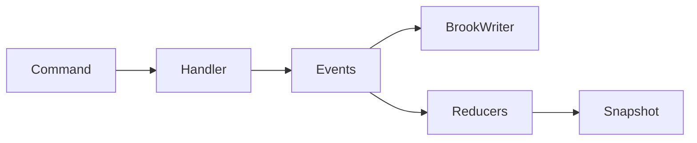
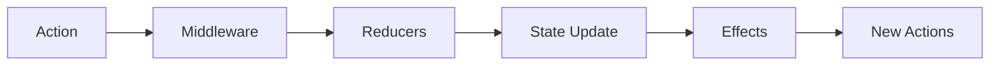
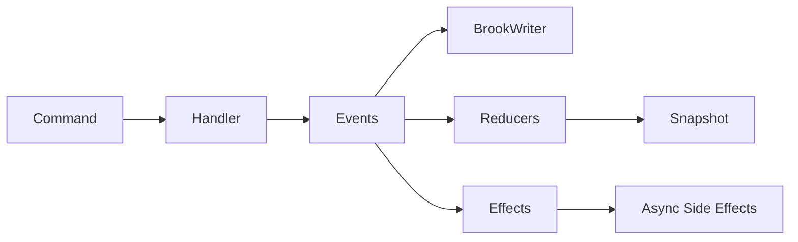
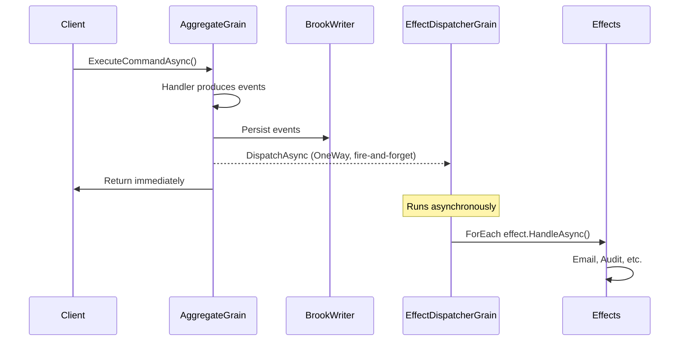
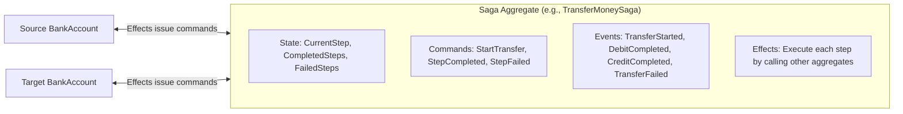
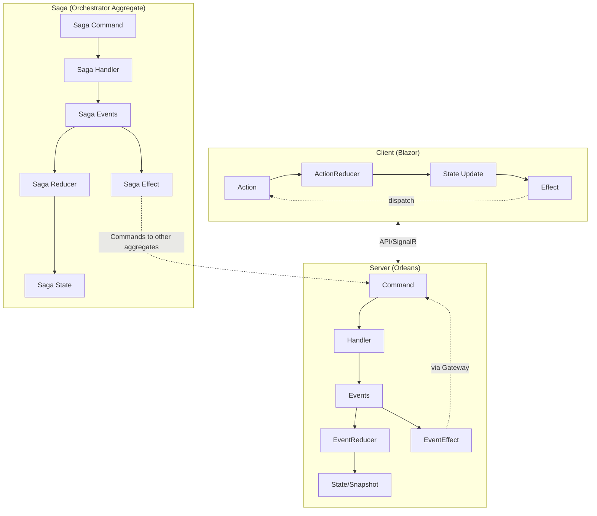

# RFC: Server-Side Event Effects

## Problem Statement

Currently, the aggregate system supports:
- **Commands** → Business logic that validates and produces events
- **Events** → Facts that are persisted to the event store
- **Reducers** → Pure functions that transform events into state

**Missing:** A mechanism for running asynchronous side effects after events are persisted. Examples:
- Send an email notification when an account is opened
- Publish an integration event to a message bus
- Call an external API (e.g., fraud detection)
- Start a saga/workflow
- Log to an audit service

The client-side Reservoir store already has this capability via `IEffect`, but the server-side aggregate system does not.

## Goals

1. Allow end users to define effects in aggregate domains (similar to handlers/reducers)
2. Follow consistent patterns with existing handler/reducer design
3. Support dependency injection for effects (HTTP clients, loggers, external services)
4. Run effects **after** events are persisted (transactional safety)
5. Provide source generation for DI registration (via AggregateSiloRegistrationGenerator)

## Non-Goals

1. Effects do NOT participate in the command transaction (fire-and-forget or background)
2. Effects do NOT modify aggregate state (that's the reducer's job)
3. Effects are NOT required for correctness (they're for side effects only)
4. We're NOT building a full saga/workflow orchestration system (effects are simple callbacks)

## Current State

### Server-Side Flow (As-Is)


### Client-Side Flow (Reference)


## Proposed Design

### To-Be Flow


### Key Decision: Event Effects (not Command Effects)

**Option A: Command Effects** - Effects triggered by commands before events are produced
- Pros: Access to command data
- Cons: Runs before persistence (what if effect succeeds but persistence fails?), violates CQRS

**Option B: Event Effects** - Effects triggered by events after persistence ✅ RECOMMENDED
- Pros: Transactionally safe (events already persisted), consistent with event sourcing philosophy
- Cons: No direct access to command (can include relevant data in event)

**Rationale:** Event effects align with event sourcing principles. The event IS the fact that happened. Side effects should react to facts, not intentions.

### Interface Design

```csharp
// New interface in EventSourcing.Aggregates.Abstractions
namespace Mississippi.EventSourcing.Aggregates.Abstractions;

/// <summary>
///     Handles asynchronous side effects triggered by domain events.
/// </summary>
/// <typeparam name="TAggregate">The aggregate state type.</typeparam>
public interface IEventEffect<TAggregate>
{
    /// <summary>
    ///     Determines whether this effect can handle the given event.
    /// </summary>
    bool CanHandle(object eventData);

    /// <summary>
    ///     Handles the event asynchronously.
    /// </summary>
    /// <param name="eventData">The event that was persisted.</param>
    /// <param name="aggregateKey">The aggregate key (brook key).</param>
    /// <param name="cancellationToken">Cancellation token.</param>
    Task HandleAsync(
        object eventData,
        string aggregateKey,
        CancellationToken cancellationToken
    );
}

/// <summary>
///     Strongly-typed event effect for a specific event type.
/// </summary>
public interface IEventEffect<in TEvent, TAggregate> : IEventEffect<TAggregate>
{
    Task HandleAsync(
        TEvent eventData,
        string aggregateKey,
        CancellationToken cancellationToken
    );
}
```

### Base Class

```csharp
namespace Mississippi.EventSourcing.Aggregates.Abstractions;

public abstract class EventEffectBase<TEvent, TAggregate> : IEventEffect<TEvent, TAggregate>
{
    public bool CanHandle(object eventData) => eventData is TEvent;

    public Task HandleAsync(
        object eventData,
        string aggregateKey,
        CancellationToken cancellationToken
    )
    {
        if (eventData is TEvent typedEvent)
        {
            return HandleAsync(typedEvent, aggregateKey, cancellationToken);
        }
        return Task.CompletedTask;
    }

    protected abstract Task HandleAsync(
        TEvent eventData,
        string aggregateKey,
        CancellationToken cancellationToken
    );
}
```

### Root Effect Dispatcher

```csharp
namespace Mississippi.EventSourcing.Aggregates;

public interface IRootEventEffectDispatcher<TAggregate>
{
    Task DispatchAsync(
        IReadOnlyList<object> events,
        string aggregateKey,
        CancellationToken cancellationToken
    );
}

public sealed class RootEventEffectDispatcher<TAggregate> : IRootEventEffectDispatcher<TAggregate>
{
    private readonly IEnumerable<IEventEffect<TAggregate>> effects;

    public RootEventEffectDispatcher(IEnumerable<IEventEffect<TAggregate>> effects)
    {
        this.effects = effects;
    }

    public async Task DispatchAsync(
        IReadOnlyList<object> events,
        string aggregateKey,
        CancellationToken cancellationToken
    )
    {
        foreach (var eventData in events)
        {
            foreach (var effect in effects)
            {
                if (effect.CanHandle(eventData))
                {
                    // Fire-and-forget or await based on configuration
                    await effect.HandleAsync(eventData, aggregateKey, cancellationToken);
                }
            }
        }
    }
}
```

### User-Defined Effect Example

```csharp
// Spring.Domain/Aggregates/BankAccount/Effects/AccountOpenedEffect.cs
namespace Spring.Domain.Aggregates.BankAccount.Effects;

internal sealed class AccountOpenedEffect : EventEffectBase<AccountOpened, BankAccountAggregate>
{
    private IEmailService EmailService { get; }
    private ILogger<AccountOpenedEffect> Logger { get; }

    public AccountOpenedEffect(
        IEmailService emailService,
        ILogger<AccountOpenedEffect> logger
    )
    {
        EmailService = emailService;
        Logger = logger;
    }

    protected override async Task HandleAsync(
        AccountOpened eventData,
        string aggregateKey,
        CancellationToken cancellationToken
    )
    {
        Logger.LogInformation("Sending welcome email for account {AggregateKey}", aggregateKey);
        await EmailService.SendWelcomeEmailAsync(eventData.HolderName, cancellationToken);
    }
}
```

### Folder Structure

```
Spring.Domain/
  Aggregates/
    BankAccount/
      BankAccountAggregate.cs
      Commands/
        OpenAccount.cs
      Events/
        AccountOpened.cs
      Handlers/
        OpenAccountHandler.cs
      Reducers/
        AccountOpenedReducer.cs
      Effects/               ← NEW
        AccountOpenedEffect.cs
```

## Naming Consistency

### Current State Analysis

| Component | Server-Side | Client-Side |
|-----------|------------|-------------|
| Trigger | Event | Action |
| State Transformer | `EventReducer` | `ActionReducer` |
| Side Effect | **N/A** | `IEffect` / `CommandEffectBase` |

### Proposal: Rename for Consistency

| Component | Server-Side | Client-Side |
|-----------|------------|-------------|
| Trigger | Event | Action |
| State Transformer | `EventReducer` | `ActionReducer` |
| Side Effect | **`EventEffect`** | **`ActionEffect`** (rename from IEffect) |

**Action Items:**
1. Keep existing `IEffect` for backwards compatibility, mark deprecated
2. Add `IActionEffect` as the new name (alias or wrapper)
3. New server-side: `IEventEffect`

**Defer decision:** This naming change could be a separate PR to avoid scope creep.

## Alternatives Considered

### Alternative 1: Orleans Streams
Use Orleans streams to publish events, then have separate grain/workers subscribe.
- Pros: Decoupled, Orleans-native
- Cons: More complex, requires stream infrastructure, harder for users to reason about

### Alternative 2: Outbox Pattern
Store effects in an outbox table, process with background worker.
- Pros: Reliable delivery, retries
- Cons: More infrastructure, adds latency, overkill for simple side effects

### Alternative 3: Saga Framework
Build a full saga/workflow orchestration system.
- Pros: Powerful, handles long-running processes
- Cons: Way out of scope, complex, not what users are asking for

## Security Considerations

- Effects receive the aggregate key and event data; ensure no PII leakage in logs
- Effects should handle their own authorization if calling external services
- Effects run in the grain context; be mindful of grain re-entrancy

## Observability

- Add metrics: `aggregate.effects.dispatched`, `aggregate.effects.duration`, `aggregate.effects.errors`
- Add structured logging with correlation IDs
- Consider adding activity spans for distributed tracing

## Compatibility / Migration

- **Backwards compatible:** No changes to existing aggregates required
- **Opt-in:** Only aggregates that define effects will use this feature
- **No data migration:** This is runtime-only behavior

## Risks and Mitigations

| Risk | Likelihood | Impact | Mitigation |
|------|------------|--------|------------|
| Effect failure breaks grain | Medium | High | Catch exceptions, log, don't throw |
| Slow effects block command | Medium | Medium | Consider fire-and-forget or timeout |
| Users expect transactional effects | Low | Medium | Document that effects are not transactional |

## Effect Execution Model (Throughput Design)

### The Throughput Problem

Orleans grains are **single-threaded** and **non-reentrant** by default. If an aggregate grain awaits effects inline:

```
Client → GenericAggregateGrain.ExecuteCommandAsync()
                    ↓
         HandleCommand → Persist Events → Await Effects (BLOCKS)
                                               ↓
                              Email API (500ms) + Audit (200ms) = 700ms blocked
```

While the grain awaits effects, it **cannot process other commands** for that aggregate. For high-throughput aggregates, this creates a bottleneck.

### Solution: Fire-and-Forget via EffectDispatcherGrain

The codebase already uses this pattern for snapshot persistence:
- `ISnapshotPersisterGrain` uses `[OneWay]` attribute
- `SnapshotCacheGrain` calls `_ = persisterGrain.PersistAsync(envelope)` (fire-and-forget)

We apply the same pattern to effects:



### EffectDispatcherGrain Design

```csharp
// EventSourcing.Aggregates.Abstractions/IEffectDispatcherGrain.cs
namespace Mississippi.EventSourcing.Aggregates.Abstractions;

/// <summary>
///     Stateless worker grain that dispatches event effects asynchronously.
/// </summary>
/// <remarks>
///     <para>
///         This grain receives fire-and-forget calls from <see cref="GenericAggregateGrain{TAggregate}"/>,
///         allowing the aggregate grain to return immediately while effects run in the background.
///     </para>
///     <para>
///         As a <see cref="StatelessWorkerAttribute"/> grain, Orleans will auto-scale instances
///         based on load, distributing effect execution across the cluster.
///     </para>
/// </remarks>
[StatelessWorker]
[Alias("Mississippi.EventSourcing.Aggregates.Abstractions.IEffectDispatcherGrain")]
public interface IEffectDispatcherGrain : IGrainWithStringKey
{
    /// <summary>
    ///     Dispatches effects for the given events asynchronously.
    /// </summary>
    [Alias("DispatchAsync")]
    [OneWay]
    Task DispatchAsync(
        string aggregateTypeName,
        string aggregateKey,
        IReadOnlyList<object> events,
        CancellationToken cancellationToken = default
    );
}
```

### Key Design Decisions

1. **StatelessWorker** - Auto-scales; no affinity to a specific silo; ideal for CPU/IO work
2. **[OneWay]** - Caller doesn't await; aggregate returns immediately
3. **Aggregate Type Name** - Used to resolve `IEnumerable<IEventEffect<TAggregate>>` from DI
4. **Error Handling** - Effects catch/log errors; failures don't propagate back to caller

### Flow in GenericAggregateGrain

```csharp
// After events are persisted and reduced
if (events.Count > 0)
{
    var dispatcher = GrainFactory.GetGrain<IEffectDispatcherGrain>(Guid.NewGuid().ToString());
    _ = dispatcher.DispatchAsync(
        typeof(TAggregate).FullName!,
        this.GetPrimaryKeyString(),
        events,
        cancellationToken
    );
}
```

### Alternative: Task.Run Escape

Orleans documentation suggests `Task.Run()` to escape the grain scheduler for CPU-bound work. However:
- Loses Orleans context (RequestContext, deadlock prevention)
- Doesn't scale across cluster
- Less observable

**Recommendation:** Use `[StatelessWorker]` grain with `[OneWay]` for effect dispatch.

---

## Saga Design Preview (Future PR)

### Effects as Building Blocks for Sagas

The user's insight is correct: **effects are the building block for sagas**. 

| Concept | Effect | Saga |
|---------|--------|------|
| **Trigger** | Single event | Initial command/event |
| **Scope** | One async operation | Multi-step workflow |
| **State** | Stateless | Tracks step progress |
| **Compensation** | N/A | Rollback on failure |
| **Output** | Optional (fire-and-forget) | Commands to other aggregates |

### Key Insight: Aggregate Grain as Saga Orchestrator

A saga IS an aggregate if you model it correctly:



### Saga Pattern: Orchestration via Effects

```csharp
// Future: Spring.Domain/Aggregates/TransferMoneySaga/Effects/TransferStartedEffect.cs
internal sealed class TransferStartedEffect : EventEffectBase<TransferStarted, TransferMoneySagaState>
{
    private IAggregateCommandGateway Gateway { get; }

    public TransferStartedEffect(IAggregateCommandGateway gateway)
    {
        Gateway = gateway;
    }

    protected override async Task HandleAsync(
        TransferStarted eventData,
        string sagaKey,
        CancellationToken cancellationToken
    )
    {
        // Step 1: Debit source account
        await Gateway.SendCommandAsync<BankAccountAggregate>(
            aggregateKey: eventData.SourceAccountId,
            command: new DebitAccount(eventData.Amount, CorrelationId: sagaKey),
            cancellationToken
        );
    }
}

internal sealed class DebitCompletedEffect : EventEffectBase<DebitCompleted, TransferMoneySagaState>
{
    private IAggregateCommandGateway Gateway { get; }

    protected override async Task HandleAsync(
        DebitCompleted eventData,
        string sagaKey,
        CancellationToken cancellationToken
    )
    {
        // Step 2: Credit target account
        await Gateway.SendCommandAsync<BankAccountAggregate>(
            aggregateKey: eventData.TargetAccountId,
            command: new CreditAccount(eventData.Amount, CorrelationId: sagaKey),
            cancellationToken
        );
    }
}
```

### Should Effects Return Commands?

**Option A: Effects return IAsyncEnumerable<TCommand>** (like client-side)
- Pros: Composable, testable, pure-ish
- Cons: Who executes the commands? Could create loops.

**Option B: Effects inject IAggregateCommandGateway** ✅ RECOMMENDED
- Pros: Explicit, injectable, testable, familiar DI pattern
- Cons: Slightly more wiring

**Option C: Effects only call back to originating aggregate**
- Pros: Prevents runaway effects
- Cons: Too limiting for saga patterns

**Recommendation:** Allow effects to call any aggregate via gateway, but provide guidance on saga patterns.

### IAggregateCommandGateway Interface

```csharp
// EventSourcing.Aggregates.Abstractions/IAggregateCommandGateway.cs
namespace Mississippi.EventSourcing.Aggregates.Abstractions;

/// <summary>
///     Gateway for sending commands to aggregates from within effects.
/// </summary>
public interface IAggregateCommandGateway
{
    /// <summary>
    ///     Sends a command to the specified aggregate.
    /// </summary>
    Task<TResult> SendCommandAsync<TAggregate, TResult>(
        string aggregateKey,
        ICommand<TAggregate, TResult> command,
        CancellationToken cancellationToken = default
    );

    /// <summary>
    ///     Sends a command to the specified aggregate (no result).
    /// </summary>
    Task SendCommandAsync<TAggregate>(
        string aggregateKey,
        ICommand<TAggregate, Unit> command,
        CancellationToken cancellationToken = default
    );
}
```

### Saga State Machine (Future PR Design)

```csharp
// Future: Saga state could be an aggregate state
[GenerateSerializer]
public sealed record TransferMoneySagaState
{
    public string TransferId { get; init; } = string.Empty;
    public string SourceAccountId { get; init; } = string.Empty;
    public string TargetAccountId { get; init; } = string.Empty;
    public decimal Amount { get; init; }
    public SagaStep CurrentStep { get; init; } = SagaStep.NotStarted;
    public ImmutableList<string> CompletedSteps { get; init; } = [];
    public string? FailureReason { get; init; }
}

public enum SagaStep
{
    NotStarted,
    DebitingSource,
    CreditingTarget,
    Completed,
    Failed,
    Compensating
}
```

---

## Unified Building Blocks Mental Model

### The Core Pattern

Both client-side (Reservoir) and server-side (Aggregates) follow the same pattern:

```
Trigger → State Transformer → Side Effect → (Optional) New Triggers
```

### Side-by-Side Comparison

| Layer | Trigger | Transformer | Side Effect | New Trigger |
|-------|---------|-------------|-------------|-------------|
| **Client (Reservoir)** | `IAction` | `IActionReducer<TState, TAction>` | `IEffect` → `IAsyncEnumerable<IAction>` | Dispatched actions |
| **Server (Aggregates)** | `ICommand` → `IEvent` | `IEventReducer<TState, TEvent>` | `IEventEffect<TAggregate>` → `Task` | Commands via Gateway |
| **Server (Saga)** | `ICommand` → `IEvent` | `IEventReducer<TSagaState, TEvent>` | `IEventEffect<TSagaState>` → Commands | Commands to other aggregates |

### Mermaid: Unified Mental Model



### Key Takeaway

> "An effect is a function that takes a trigger (event/action) and produces side effects, optionally triggering more operations."

This is true for:
- **Client effects:** `IAction → Task producing IAction*`
- **Server effects:** `IEvent → Task (optionally sends commands via gateway)`
- **Saga effects:** Same as server effects, but calling other aggregates

---

## Open Questions (Resolved)

### 1. Should effects be fire-and-forget or awaited?

**RESOLVED: Fire-and-forget via `[OneWay]` + `[StatelessWorker]` grain.**

The codebase already uses this pattern for snapshot persistence. Effects don't block the aggregate grain, preserving throughput.

### 2. Should effects have access to pre/post state?

**RESOLVED: Keep simple (event + aggregate key only).**

Effects can query state via the gateway if needed. Adding state access complicates the interface and creates coupling.

### 3. Should we support effect result actions?

**RESOLVED: Effects inject `IAggregateCommandGateway` for cross-aggregate communication.**

This enables saga patterns without the complexity of returning commands that need to be dispatched.

### 4. Should effects run in a separate grain context?

**RESOLVED: Yes, via `IEffectDispatcherGrain` with `[StatelessWorker]` + `[OneWay]`.**

This provides:
- Throughput: Aggregate returns immediately
- Scalability: Stateless workers auto-scale
- Isolation: Effect failures don't crash aggregate

### 5. How do sagas fit in?

**RESOLVED: Sagas are aggregates with effects that call other aggregates via gateway.**

No separate saga framework needed. The same building blocks (commands, events, reducers, effects) compose into saga patterns.
