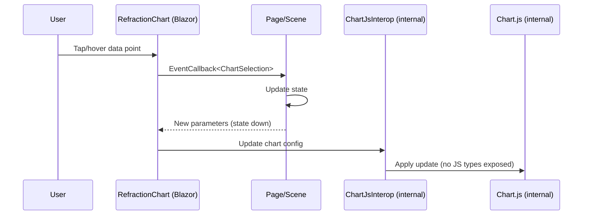

# RFC: Blazor Native UI Design System and Component Library

## Problem

The repository lacks a cohesive, enterprise-grade Blazor-native design system and component library aligned to the authoritative hologram design language brief.

## Goals

- Deliver a document-first design system with tokens, theming, and atomic-design-based component inventory.
- Implement a Blazor-native component library with strong DX and enterprise data-app capabilities.
- Integrate Chart.js behind Blazor-first components without leaking JS types.
- Provide built-in themes that express the hologram aesthetic.
- Ensure components honor state-down / events-up interaction contract.
- Ensure mobile-first behavior with explicit mobile modes for dense components.

## Non-goals

- Replacing existing applications or rewriting unrelated UI code.
- Introducing JS-first or consumer-authored JS dependencies.

## Current state

- There is no docs/Docusaurus/docs/refraction folder; Docusaurus uses an autogenerated sidebar.
- Refraction already includes Blazor components organized as Atoms, Molecules, and Organisms under src/Refraction/Components, but these are now considered untrusted legacy code and must be cleared.
- Refraction tokens are defined in src/Refraction/Themes/RefractionTokens.css; the token file should be re-authored to align with the new system.

## As-is vs to-be architecture

```mermaid
flowchart LR
	subgraph As-Is
		A[Docs: Docusaurus /docs] --> B[Autogenerated sidebar]
		C[Refraction Components] --> D[Atoms/Molecules/Organisms]
		C --> E[RefractionTokens.css]
	end

	subgraph To-Be
		F[Docs: /docs/refraction] --> G[Design language spec]
		F --> H[Token + theming spec]
		F --> I[Component inventory + examples]
		J[Refraction Components] --> K[Expanded atoms/molecules/organisms]
		J --> L[Templates/Pages compositions]
		J --> M[Chart components (Blazor-first)]
		M --> N[Internal JS interop wrapper]
	end
```

## Proposed design (initial)

- Author docs first under docs/Docusaurus/docs/refraction.
- Define tokens (Opacity, Stroke, Glow, Depth, Motion) and theme variants (Neon Blue, Water Blue).
- Implement core components and signature hologram components aligned to the design brief.
- Encapsulate Chart.js via .NET configuration models.
- Use atomic design as a structural taxonomy for docs and code.
- Remove or clear existing Refraction component content to start fresh.
- Adopt explicit z-layer model (Z0–Z6), palette hex values, typography (Space Grotesk/Inter/JetBrains Mono), motion primitives, and acceptance checklist from the latest handoff.

## Critical-path sequence (chart selection)



## Alternatives

- Adopt a third-party UI library: rejected due to hologram aesthetic and Blazor-native constraints.

## Security

- No new auth or secrets handling in this scope.

## Observability

- Ensure components provide accessible states and deterministic behaviors; add structured logging only if required by existing patterns.

## Compatibility and migrations

- Avoid breaking public APIs where possible; introduce new components in a parallel namespace if required.

## Risks

- Scope creep in component inventory.
- Incomplete mobile adaptations for data-dense controls.
