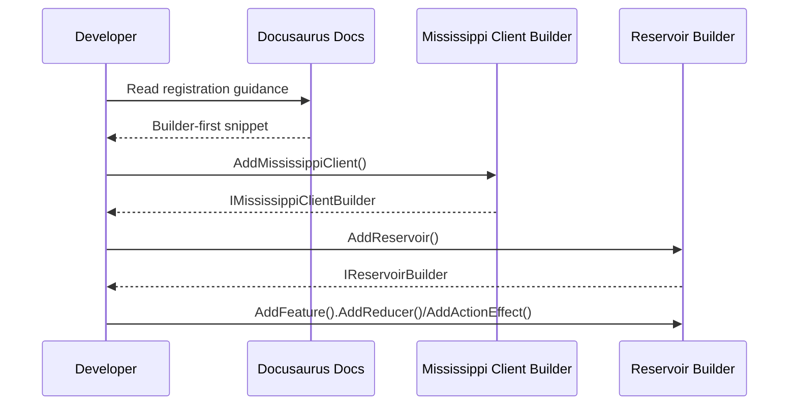

# RFC: Builder-First Docs Update

## Problem
Documentation still shows legacy IServiceCollection-based registration APIs for Reservoir, DevTools, reducers, effects, and Inlet saga registration. This conflicts with the builder-first surface and can mislead adopters.

## Goals
- Update Docusaurus docs to use builder-first registration APIs.
- Ensure code snippets and links point to current builder extension methods/classes.
- Keep guidance consistent across Reservoir, Store, Effects, Reducers, Feature State, DevTools, and Sagas docs.

## Non-Goals
- No production code changes or new APIs.
- No behavior changes to runtime registration logic.

## Current State (UNVERIFIED)
- Multiple docs reference `services.AddReservoir()`, `services.AddReducer(...)`, `services.AddActionEffect(...)`.
- Sagas documentation references `services.AddInletSilo()`.

## Proposed Design
- Replace IServiceCollection registration snippets with builder-first equivalents:
  - `IMississippiClientBuilder mississippi = builder.AddMississippiClient();`
  - `IReservoirBuilder reservoir = mississippi.AddReservoir();`
  - Use `reservoir.AddFeature<TState>()` for reducers/effects.
- Update links to current implementations:
  - Reservoir builder extensions and feature builder.
  - Reservoir DevTools builder extensions.
- Keep examples concise but consistent; avoid repeating setup when a context line suffices.

## Alternatives Considered
- Leave docs as-is and rely on migration notes (rejected: high confusion risk).
- Add compatibility shims (rejected: out of scope and contradicts builder-first direction).

## Security
No security changes. Docs may mention best practices for DevTools enablement as before.

## Observability
No new telemetry. Docs continue to describe existing logging behavior.

## Compatibility / Migration
Docs will reflect current builder-first APIs; no migration tooling required.

## Risks
- Missing a doc page could leave mixed guidance.
- Link targets could drift if line numbers change.

## Diagrams

### As-Is vs To-Be
```mermaid
flowchart LR
    subgraph As-Is
        A1[Docs show services.AddReservoir()] --> A2[User copies IServiceCollection pattern]
        A2 --> A3[Compile errors / wrong guidance]
    end

    subgraph To-Be
        B1[Docs show builder.AddMississippiClient()] --> B2[mississippi.AddReservoir()]
        B2 --> B3[Feature builder AddReducer/AddActionEffect]
    end
```

### Critical Path Sequence

