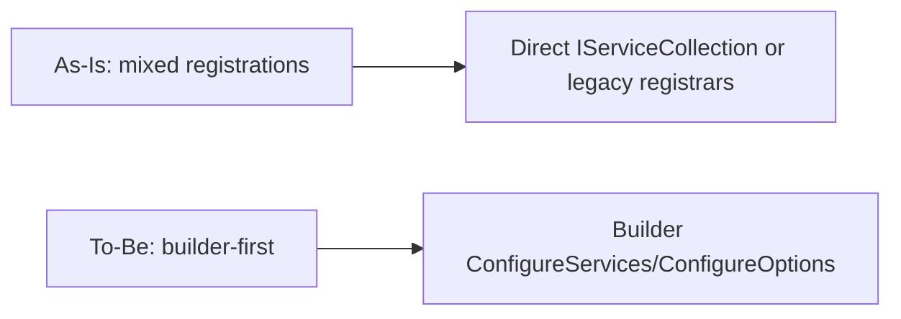
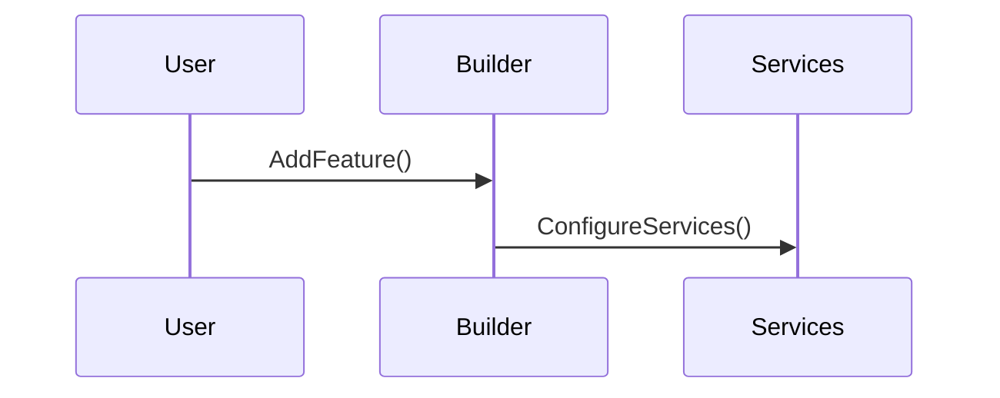

# RFC: Builder-First Registration

## Problem

Registration surfaces across the framework are inconsistent (builder vs direct IServiceCollection). This increases cognitive load, makes testing harder, and leaves legacy APIs in place after newer patterns exist.

## Goals

- Establish a builder-first registration model across Mississippi builder surfaces, native host builders (only for standalone-capable packages), and IServiceCollection as a documented fallback.
- Remove legacy registration entry points after builder-first replacements exist.
- Align Reservoir to a store/feature builder model that mirrors Redux concepts.
- Standardize options configuration via builder surface methods.
- Keep public contracts in Abstractions projects and implementations in main projects.
- Update documentation and tests to teach and validate the builder-first model and migration guidance.

## Non-Goals

- Rewriting unrelated domain or infrastructure behavior.
- Adding new feature capabilities beyond builder surfaces and consistent registration patterns.

## Current State

UNVERIFIED: Existing registration surfaces and builder patterns vary across packages.
UNVERIFIED: Legacy registration entry points may remain alongside newer builder APIs.

## Proposed Design

- Define a shared builder base interface with ConfigureServices and ConfigureOptions for Mississippi builders.
- Ensure Mississippi builder registration is the primary entry point for event-sourcing-related features.
- Provide native builder registration only for standalone-capable packages (Reservoir, Aqueduct, Refraction).
- Keep IServiceCollection registration as a documented fallback for advanced/test usage only.
- Align Reservoir registration around store and feature builders; store owns middleware and features; features own reducers and effects.
- Standardize options registration on builder surfaces with overloads for options delegates and configuration.
- Remove legacy registration classes and tests after builder-first replacements are in place.

## As-Is vs To-Be

## Critical Path Sequence

## Alternatives

- Keep existing registration paths and add more builder surfaces. Rejected because it preserves confusion and duplicates APIs.

## Security

No direct security feature changes expected. Ensure no exposure of new public APIs without intent.

## Observability

No new logging expected; registration surfaces should remain synchronous and log only if already standard.

## Compatibility and Migrations

Breaking changes are allowed (pre-V1) but must include migration guidance from IServiceCollection usage to builder APIs.

## Risks

- Broad refactor could impact multiple packages and tests.
- Documentation drift if legacy references remain.
