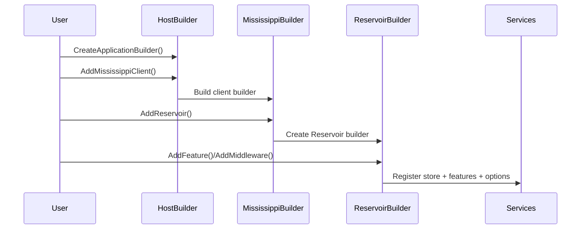

# RFC: Builder-First Registration

## Problem

Registration surfaces across the framework are inconsistent (builder vs direct IServiceCollection). This increases cognitive load, makes testing harder, and leaves legacy APIs in place after newer patterns exist.

## Goals

- Establish a builder-first registration model across Mississippi builder surfaces, native host builders (only for standalone-capable packages), and IServiceCollection as a documented fallback.
- Remove legacy registration entry points after builder-first replacements exist.
- Align Reservoir to a store/feature builder model that mirrors Redux concepts.
- Standardize options configuration via builder surface methods.
- Keep public contracts in Abstractions projects and implementations in main projects.
- Update documentation and tests to teach and validate the builder-first model and migration guidance.

## Non-Goals

- Rewriting unrelated domain or infrastructure behavior.
- Adding new feature capabilities beyond builder surfaces and consistent registration patterns.

## Current State

- Registration is dominated by `IServiceCollection` extension methods in Reservoir, Inlet, Aqueduct, EventSourcing, and supporting packages (examples in [src/Reservoir/ReservoirRegistrations.cs](src/Reservoir/ReservoirRegistrations.cs), [src/Inlet.Client/InletClientRegistrations.cs](src/Inlet.Client/InletClientRegistrations.cs), [src/Aqueduct/AqueductRegistrations.cs](src/Aqueduct/AqueductRegistrations.cs), [src/EventSourcing.Brooks/EventSourcingRegistrations.cs](src/EventSourcing.Brooks/EventSourcingRegistrations.cs)).
- Builder-style entry points exist only on Orleans/host builders (`UseAqueduct`, `AddEventSourcing`) and a local client builder (`InletBlazorSignalRBuilder`) ([src/Aqueduct.Grains/AqueductGrainsRegistrations.cs](src/Aqueduct.Grains/AqueductGrainsRegistrations.cs), [src/EventSourcing.Brooks/EventSourcingRegistrations.cs](src/EventSourcing.Brooks/EventSourcingRegistrations.cs), [src/Inlet.Client/InletBlazorSignalRBuilder.cs](src/Inlet.Client/InletBlazorSignalRBuilder.cs)).
- Docs and tests teach and validate the `builder.Services.Add*`/`services.Add*` patterns (examples in [docs/Docusaurus/docs/client-state-management/reservoir.md](docs/Docusaurus/docs/client-state-management/reservoir.md), [docs/Docusaurus/docs/client-state-management/store.md](docs/Docusaurus/docs/client-state-management/store.md), [docs/Docusaurus/docs/event-sourcing-sagas.md](docs/Docusaurus/docs/event-sourcing-sagas.md), [tests/Reservoir.L0Tests/ReservoirRegistrationsTests.cs](tests/Reservoir.L0Tests/ReservoirRegistrationsTests.cs), [tests/Inlet.Silo.L0Tests/InletSiloRegistrationsTests.cs](tests/Inlet.Silo.L0Tests/InletSiloRegistrationsTests.cs)).
- Samples use the direct ServiceCollection registration surface (examples in [samples/Spring/Spring.Client/Program.cs](samples/Spring/Spring.Client/Program.cs), [samples/Spring/Spring.Silo/Program.cs](samples/Spring/Spring.Silo/Program.cs), [samples/LightSpeed/LightSpeed.Client/Program.cs](samples/LightSpeed/LightSpeed.Client/Program.cs)).

## Proposed Design

- Introduce builder contracts in Abstractions and concrete builders in main projects (per abstractions rules). Proposed contracts: `IMississippiClientBuilder`, `IMississippiServerBuilder`, `IMississippiSiloBuilder` (UNVERIFIED names/placement) that expose `IServiceCollection Services` and options hooks without hard dependencies on implementations.
- Add builder entry points on `HostApplicationBuilder`/`ISiloBuilder` to create Mississippi builders and make builder-first registration the primary path for Inlet/EventSourcing/Aqueduct/Reservoir composition.
- Create package-specific builders for standalone-capable packages:
    - Reservoir: `ReservoirBuilder` + `ReservoirFeatureBuilder` to register store, middleware, reducers, effects, and feature state through a fluent API.
    - Aqueduct: server builder for ASP.NET-hosted backplane (`IAqueductServerBuilder`) plus existing `ISiloBuilder` usage for grains.
- Keep `IServiceCollection` registration as a documented fallback for tests/advanced scenarios, but remove or deprecate legacy entry points from primary docs/samples after builder-first replacements exist.
- Standardize options configuration: builder surface overloads accept `Action<TOptions>` and `IConfiguration` for consistent options wiring across packages.
- Fix abstraction leakage where concrete registrations live in Abstractions by moving those registrations to main projects or converting to pure contract-only helpers.


## As-Is vs To-Be

```mermaid
flowchart LR
    subgraph AsIs[As-Is: mixed registrations]
        A1[App Host] --> A2[IServiceCollection AddReservoir/AddInlet/AddAqueduct]
        A1 --> A3[ISiloBuilder UseAqueduct/AddEventSourcing]
        A2 --> A4[Direct DI registrations]
        A3 --> A4
    end
    subgraph ToBe[To-Be: builder-first]
        B1[App Host] --> B2[Mississippi Builder]
        B2 --> B3[Reservoir/Aqueduct/Inlet Builders]
        B3 --> B4[Services + Options]
        B4 -.-> B5[IServiceCollection Fallback (documented)]
    end
```

## Critical Path Sequence



## Alternatives

- Keep existing registration paths and add more builder surfaces. Rejected because it preserves confusion and duplicates APIs.

## Security

No direct security feature changes expected. Ensure no exposure of new public APIs without intent.

## Observability

No new logging expected; registration surfaces should remain synchronous and log only if already standard.

## Compatibility and Migrations

Breaking changes are allowed (pre-V1) but must include migration guidance from IServiceCollection usage to builder APIs.

## Risks

- Broad refactor could impact multiple packages and tests.
- Documentation drift if legacy references remain.
