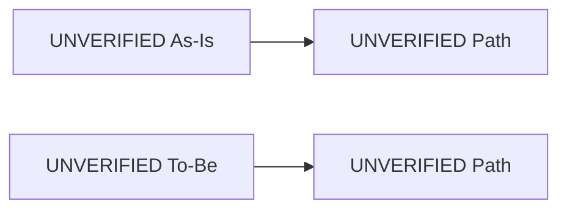
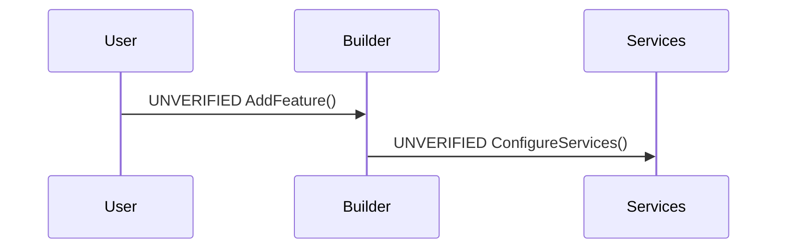

# RFC: Builder-First Registration

## Problem

UNVERIFIED

## Goals

- UNVERIFIED

## Non-Goals

- UNVERIFIED

## Current State

UNVERIFIED

## Proposed Design

UNVERIFIED

## As-Is vs To-Be

## Critical Path Sequence

## Alternatives

UNVERIFIED

## Security

UNVERIFIED

## Observability

UNVERIFIED

## Compatibility and Migrations

UNVERIFIED

## Risks

UNVERIFIED
