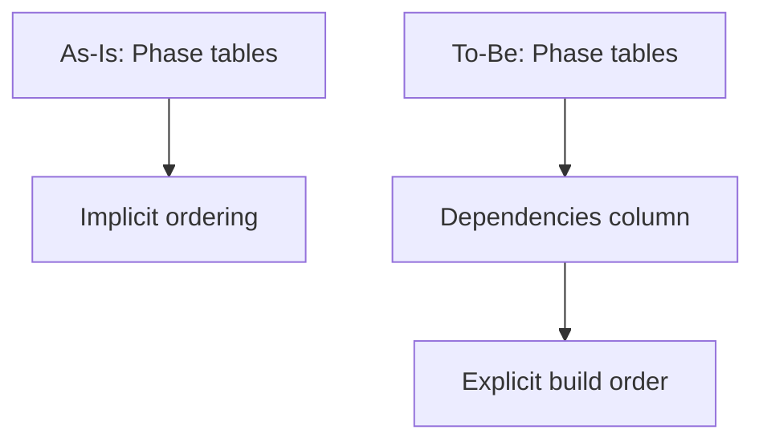
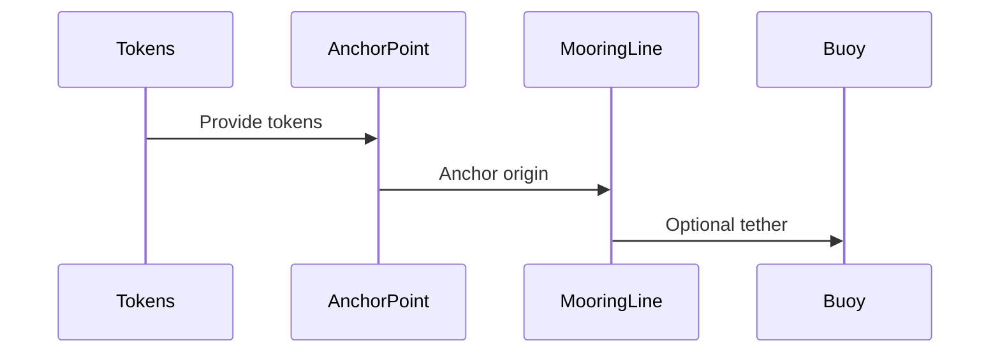

# RFC: Component Roadmap Dependency Order

## Problem Statement

The component roadmap does not explicitly capture dependency ordering, which can lead to building components before their prerequisites are available.

## Goals

- Make component dependencies explicit in the roadmap.
- Ensure phase order and intra-phase order respect dependencies.
- Flag cross-phase and external dependencies.

## Requirements and Constraints

- Update documentation only under docs/Docusaurus/docs/refraction/.
- Keep build order consistent with dependencies.
- Avoid introducing new component scope or renames.

## Non-Goals

- Implementing components.
- Changing component names or scope beyond dependency clarity.

## Assumptions

- Docusaurus build remains stable after adding columns to tables.

## Unknowns

- Whether any component dependency assumptions are incorrect.

## Current State

- Phase tables include Dependencies columns for each phase.
- Component catalog entries include Dependencies fields.
- Dependency Rules section documents build order and cross-phase dependencies.

## Proposed Design

- Add a Dependencies column to each phase table.
- Introduce a Dependency Rules section with build order and cross-phase dependencies.
- Update the component catalog with a Dependencies field per component.
- Adjust phase membership where dependency order is violated.

## Alternatives Considered

- Keep a separate dependency matrix page. Rejected: adds navigation overhead.
- Encode dependencies only in prose. Rejected: hard to scan.

## Security Considerations

No security impact; documentation-only change.

## Observability

Not applicable.

## Compatibility / Migration

No compatibility impact; documentation-only change.

## Risks

- Incorrect dependency assumptions could mislead implementation order.

## As-Is vs To-Be

## Critical Path Sequence

