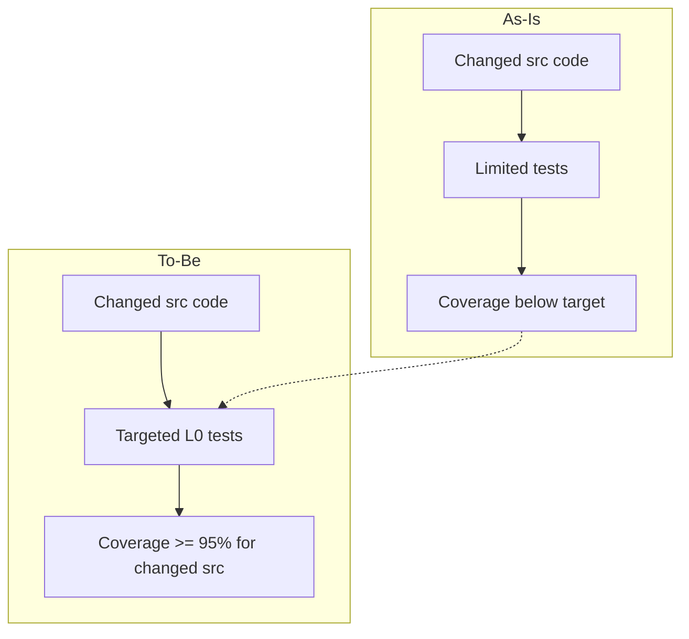

# RFC: 95% coverage for changed src code

## Problem
Coverage for new/changed code under src is below the 95% target required for this work.

## Goals
- Identify changed code under src for this task.
- Achieve >=95% coverage for changed src code (allow small exceptions if infeasible).
- Keep changes minimal and aligned with existing patterns.

## Non-goals
- Raising coverage for unrelated legacy code.
- Broad refactors or new features.

## Current state
- Changed src files include saga abstractions/runtime and new saga client/server/silo generators.
- Baseline coverage is below target for affected test projects (e.g., EventSourcing.Sagas.L0Tests 13.74%,
  Inlet.Client.Generators.L0Tests 69.64%, Inlet.Server.Generators.L0Tests 56.59%,
  Inlet.Silo.Generators.L0Tests 53.16%).

## Proposed design (UNVERIFIED)
- Identify changed src files via git diff.
- Map changed files to L0 test projects via project references.
- Add focused L0 tests to cover changed logic.
- Re-run coverage per affected test project(s) and confirm >=95% for changed src code.

## Alternatives
- Ignore coverage gaps (rejected).
- Broader refactoring to simplify testing (rejected).

## Security
- No security-sensitive changes expected.

## Observability
- No new telemetry expected.

## Compatibility
- No breaking changes expected.

## Risks
- Some generator/Orleans behaviors may be hard to test directly.

## Mermaid

