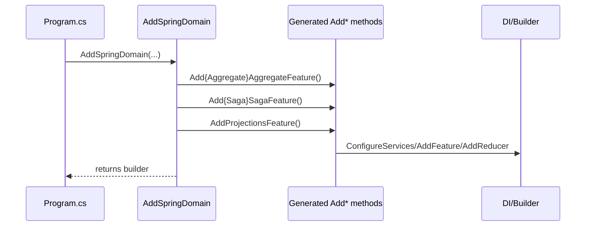

# RFC: Generate Spring Domain Registrations

## Problem
Spring uses manual registration wrappers for AddSpringDomain in client/server/silo. The generator implementation
should be generic (like other generators) and operate on the target project context rather than hardcoding Spring.

## Goals
- Generate Add{Product}Domain wrappers for client/server/silo using existing generator pipelines.
- Remove manual SpringDomain*Registrations classes.
- Keep Program.cs calls to AddSpringDomain unchanged.
- Ensure generated wrappers include all relevant generated registrations (aggregates, projections, sagas, mappers).
- Keep AddSpringDomain as the single entrypoint for Spring registration in each SDK type.

## Non-Goals
- Change runtime behavior beyond registration wiring.
- Introduce new public APIs outside Spring sample scope unless required for generator support.

## Current State
Spring has manual SpringDomain*Registrations wrappers in client/server/silo that aggregate generated
Add* registrations. Programs call AddSpringDomain already. Evidence: samples/Spring/Spring.Client/Registrations/
SpringDomainClientRegistrations.cs, samples/Spring/Spring.Server/Registrations/SpringDomainServerRegistrations.cs,
samples/Spring/Spring.Silo/Registrations/SpringDomainSiloRegistrations.cs, samples/Spring/Spring.*/*Program.cs.

## Proposed Design
Add generator outputs in each SDK generator to emit Add{Product}Domain wrappers for SDK projects.
Use target root namespace derived from RootNamespace/AssemblyName to scope generation to .Client/.Server/.Silo
projects and derive the product name from the root namespace.

## As-Is vs To-Be

```mermaid
flowchart LR
	subgraph AsIs[As-Is]
		ClientManual[Manual SpringDomainClientRegistrations.cs]
		ServerManual[Manual SpringDomainServerRegistrations.cs]
		SiloManual[Manual SpringDomainSiloRegistrations.cs]
	end
	subgraph ToBe[To-Be]
		ClientGen[Generator emits AddSpringDomain (client)]
		ServerGen[Generator emits AddSpringDomain (server)]
		SiloGen[Generator emits AddSpringDomain (silo)]
	end
	ClientManual --> ClientGen
	ServerManual --> ServerGen
	SiloManual --> SiloGen
```

## Runtime Registration Sequence



## Alternatives
- Keep manual registration wrappers (rejected by request).
- Use a shared handwritten library (rejected by request).

## Security
No auth changes expected.

## Observability
No new logs/metrics expected.

## Compatibility
Sample-only change; behavior should match existing manual wrappers.

## Risks
- Generator scoping could accidentally emit wrappers for non-Spring projects.
- Missing generated methods would break Spring builds.
