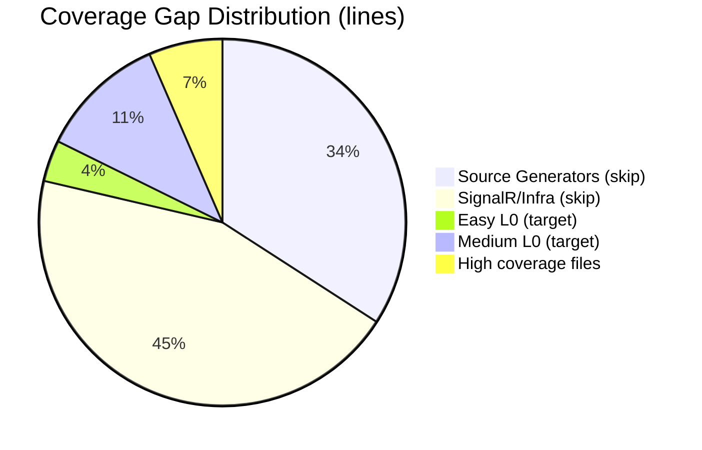
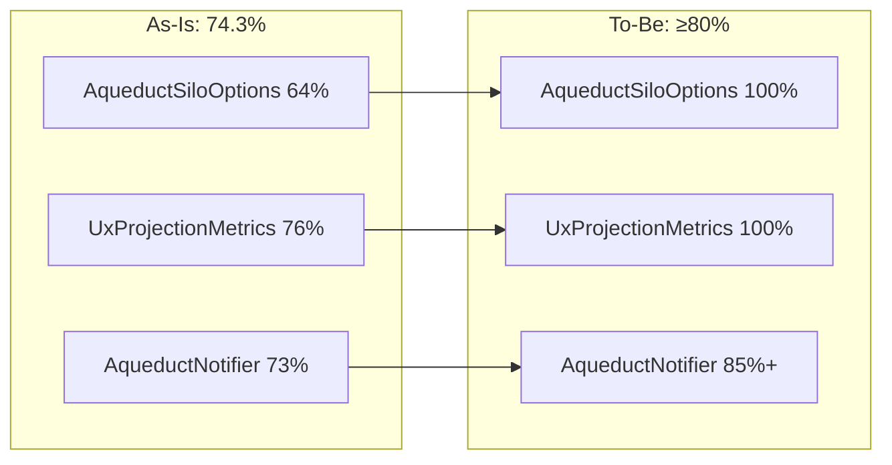

# RFC: Improve SonarCloud Coverage to 80%

## Problem Statement

SonarCloud quality gate is failing on PR #188 with 74.3% coverage on new code (requires 80%). Need to add ~200 lines of coverage to pass the gate.

## Goals
- Increase new code coverage from 74.3% to ≥80%
- Add only L0 tests (pure unit tests, no infrastructure)
- Focus on testable code (avoid source generators, SignalR infrastructure)
- Keep changes minimal and targeted

## Non-Goals
- Achieve 100% coverage on all files
- Test source generators or infrastructure code requiring L2 tests
- Refactor production code

## Current State

Coverage gaps by category:

## Proposed Design

Add targeted L0 tests for:

1. **AqueductSiloOptions.UseMemoryStreams()** - parameterless overload delegates to 2-param version
2. **UxProjectionMetrics static methods** - RecordNotificationSent, RecordQuery, RecordSubscription, RecordVersionCacheHit
3. **AqueductNotifier.SendToAllAsync** - needs Orleans stream mocking
4. **Record equality** - test record Equals/GetHashCode for edge cases

### As-Is vs To-Be

## Alternatives Considered

1. **Add L2 tests for SignalR code** - Too slow, would require container infrastructure
2. **Test source generators** - Requires special test harness, out of scope
3. **Suppress coverage on untestable code** - Violates zero-warnings policy

## Security Considerations
None - only adding tests

## Observability
None - only adding tests

## Backwards Compatibility
N/A - test code only

## Risks & Mitigations
| Risk | Likelihood | Impact | Mitigation |
|------|-----------|--------|------------|
| Tests don't increase coverage enough | Low | Medium | Target highest-gap easy files first |
| Orleans mock complexity | Medium | Low | Follow existing AqueductNotifierTests patterns |
