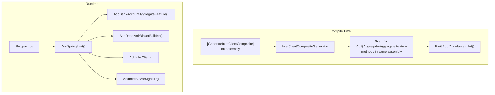

# RFC: Inlet Client Composite Registration Generator

## Problem

Spring.Client/Program.cs requires multiple registration calls that wire together source-generated artifacts:

```csharp
builder.Services.AddBankAccountAggregateFeature();  // Generated
builder.Services.AddReservoirBlazorBuiltIns();      // Framework
builder.Services.AddInletClient();                   // Framework
builder.Services.AddInletBlazorSignalR(...);        // Framework with scanning
```

New developers must understand what each call does and ensure they're called in the right order. As aggregates are added, more `Add{Aggregate}AggregateFeature()` calls accumulate.

## Goals

1. **Reduce boilerplate** - Single `AddSpringInlet()` call replaces 4+ lines
2. **Auto-discover aggregates** - No manual updates when adding aggregates
3. **Convention-based** - Use sensible defaults (hub path, assembly scanning)
4. **Escape hatch** - Allow manual registration if customization needed

## Non-Goals

- Application-specific features (e.g., `EntitySelection`) - remain hand-written
- Server/Silo registration - separate generators already exist
- Replacing existing generators - this composes them

## Current State

```
┌────────────────────────────────────────────────────────────────┐
│                    Spring.Client/Program.cs                     │
├────────────────────────────────────────────────────────────────┤
│  builder.Services.AddBankAccountAggregateFeature();            │
│  builder.Services.AddEntitySelectionFeature();      ← Manual   │
│  builder.Services.AddReservoirBlazorBuiltIns();                │
│  builder.Services.AddInletClient();                            │
│  builder.Services.AddInletBlazorSignalR(signalR => ...)        │
└────────────────────────────────────────────────────────────────┘
```

## Proposed Design

### New Generator: `InletClientCompositeGenerator`

Located in `src/Inlet.Client.Generators/InletClientCompositeGenerator.cs`

**Trigger**: Types with `[GenerateInletClientComposite]` attribute (new attribute in Inlet.Generators.Abstractions)

**Output**: Single registration class that calls all aggregate features + Inlet setup

### New Attribute

```csharp
namespace Mississippi.Inlet.Generators.Abstractions;

/// <summary>
///     Triggers generation of a composite Inlet client registration that
///     registers all aggregate features, Reservoir built-ins, and SignalR setup.
/// </summary>
[AttributeUsage(AttributeTargets.Assembly)]
public sealed class GenerateInletClientCompositeAttribute : Attribute
{
    /// <summary>
    ///     Gets or sets the app name used in method names (e.g., "Spring" → "AddSpringInlet").
    /// </summary>
    public required string AppName { get; init; }

    /// <summary>
    ///     Gets or sets the SignalR hub path. Defaults to "/hubs/inlet".
    /// </summary>
    public string HubPath { get; init; } = "/hubs/inlet";
}
```

### Generated Output

```csharp
// <auto-generated />
using Microsoft.Extensions.DependencyInjection;

using Mississippi.Inlet.Client;
using Mississippi.Reservoir.Blazor.BuiltIn;

using Spring.Client.Features.BankAccountAggregate;

namespace Spring.Client;

/// <summary>
///     Composite registration for all Inlet client features.
/// </summary>
[GeneratedCode("InletClientCompositeGenerator", "1.0.0")]
internal static class SpringInletRegistrations
{
    /// <summary>
    ///     Adds all Inlet client features for the Spring application.
    /// </summary>
    public static IServiceCollection AddSpringInlet(this IServiceCollection services)
    {
        // Aggregate features (auto-discovered)
        services.AddBankAccountAggregateFeature();

        // Built-in Reservoir features
        services.AddReservoirBlazorBuiltIns();

        // Inlet client + SignalR
        services.AddInletClient();
        services.AddInletBlazorSignalR(signalR => signalR
            .WithHubPath("/hubs/inlet")
            .ScanProjectionDtos(typeof(SpringInletRegistrations).Assembly));

        return services;
    }
}
```

### Usage in Program.cs

```csharp
// BEFORE (5 lines)
builder.Services.AddBankAccountAggregateFeature();
builder.Services.AddEntitySelectionFeature();
builder.Services.AddReservoirBlazorBuiltIns();
builder.Services.AddInletClient();
builder.Services.AddInletBlazorSignalR(signalR => signalR
    .WithHubPath("/hubs/inlet")
    .ScanProjectionDtos(typeof(BankAccountBalanceProjectionDto).Assembly));

// AFTER (2 lines)
builder.Services.AddSpringInlet();
builder.Services.AddEntitySelectionFeature();  // App-specific, stays manual
```

### Architecture Diagram



## Alternatives

### A. Marker Type Instead of Assembly Attribute

```csharp
[GenerateInletClientComposite(AppName = "Spring")]
internal static partial class SpringInletRegistrations { }
```

**Pros**: Familiar partial class pattern  
**Cons**: Requires creating empty class; assembly attribute is cleaner

### B. Convention-Based Name Detection

Derive app name from assembly name (e.g., `Spring.Client` → "Spring")

**Pros**: No attribute property needed  
**Cons**: Brittle if naming conventions vary

### C. Do Nothing - Keep Manual Registration

**Pros**: No new generator complexity  
**Cons**: Doesn't solve the user's request

## Security

No security implications - pure compile-time code generation affecting DI wiring.

## Observability

No runtime observability changes - logging is handled by existing components.

## Compatibility/Migrations

**Additive change** - Existing registrations continue to work. Teams opt in via attribute.

## Risks

| Risk | Mitigation |
|------|------------|
| Generator discovery fails | Clear error diagnostics when attribute present but no aggregates found |
| Ordering issues | Aggregate features registered first, then built-ins, then Inlet |
| Circular dependencies | Generator runs late, consuming output from other generators |
