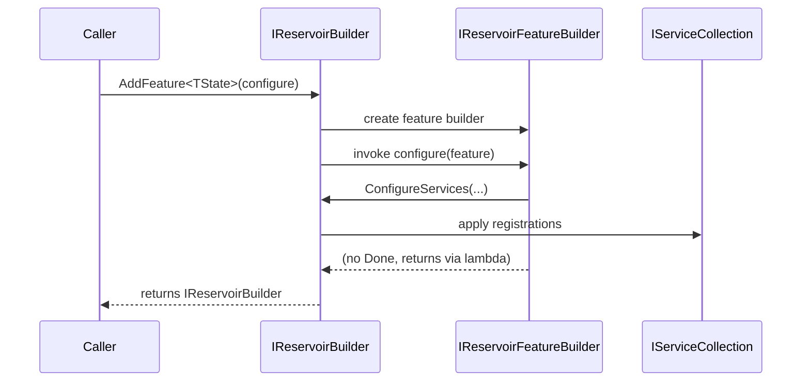

# RFC: Refactor Builder Patterns

## Problem
Builder chaining uses terminal methods (for example, `Done()`) that do not feel idiomatic in .NET. The user wants the pattern refactored to align with Microsoft .NET builder conventions.

## Goals
- Align builder APIs with common .NET builder patterns used in Microsoft libraries.
- Remove or replace non-idiomatic terminal methods.
- Update consumers (tests, samples) accordingly.
- Keep fluent usage ergonomic and consistent across client/server/silo/feature builders.

## Non-goals
- Add new features unrelated to builder flow.
- Introduce new external dependencies.
- Change behavior of registrations beyond the builder API surface.

## Current State
- `IReservoirFeatureBuilder<TState>` exposes `Done()` to return to the parent builder.
	- src/Reservoir.Abstractions/Builders/IReservoirFeatureBuilder.cs
- `ReservoirFeatureBuilder<TState>` implements `Done()` by returning its parent builder.
	- src/Reservoir/Builders/ReservoirFeatureBuilder.cs
- Extension methods and built-in feature registrations rely on `Done()` to return to `IReservoirBuilder`.
	- src/Inlet.Client/SignalRConnection/SignalRConnectionRegistrations.cs
	- src/Reservoir.Blazor/BuiltIn/Navigation/NavigationFeatureRegistration.cs
	- src/Reservoir.Blazor/BuiltIn/Lifecycle/LifecycleFeatureRegistration.cs
- Client generators emit `featureBuilder.Done()` in generated registrations.
	- src/Inlet.Client.Generators/CommandClientRegistrationGenerator.cs
	- src/Inlet.Client.Generators/ProjectionClientRegistrationGenerator.cs
	- src/Inlet.Client.Generators/SagaClientRegistrationGenerator.cs
- Tests and samples call `Done()` in builder chains.
	- tests/Reservoir.L0Tests/StoreTests.cs
	- tests/Reservoir.L0Tests/ReservoirRegistrationsTests.cs
	- tests/Reservoir.Blazor.L0Tests/StoreComponentTests.cs
	- tests/Inlet.Client.L0Tests/CompositeInletStoreTests.cs
	- samples/Spring/Spring.Client/Features/*.cs
- The codebase already uses configure-lambda patterns in some registrations.
	- src/Inlet.Client/InletBlazorRegistrations.cs

## Proposed Design
- Adopt a configure-lambda pattern for feature registration:
	- Replace `IReservoirBuilder.AddFeature<TState>()` with `IReservoirBuilder AddFeature<TState>(Action<IReservoirFeatureBuilder<TState>> configure)`.
	- Remove `IReservoirFeatureBuilder<TState>.Done()` and update implementations/usages.
	- Keep `IReservoirFeatureBuilder<TState>` as the fluent surface inside the lambda.
- Update built-in and generated registrations to pass lambdas instead of chaining `Done()`.
- Keep `InletBlazorSignalRBuilder` and other internal builders using configure-lambda or direct `AddFeature(..., configure)` calls so they do not require a terminal method.

## Alternatives
- Rename `Done()` to `Build()` or `Finish()` while keeping return-to-parent pattern.
- Keep current pattern and document it more clearly.
- Introduce a separate builder type with `Build()` that materializes a registry (requires larger changes).

## Security
No new security surface expected; public API changes must be validated.

## Observability
No new logging required.

## Compatibility / Migrations
- Public API changes will require downstream updates.
- Update tests and samples to new patterns.
- Update generator outputs to emit the new pattern.

## Risks
- Widespread API changes could introduce breaking compilation changes.
- Inconsistent patterns across builder types if refactor is partial.

## As-Is vs To-Be
```mermaid
flowchart TB
	subgraph AsIs[As-Is: Done-based chaining]
		A1[Caller] --> A2[IReservoirBuilder.AddFeature<TState>()]
		A2 --> A3[IReservoirFeatureBuilder.AddReducer/AddActionEffect]
		A3 --> A4[IReservoirFeatureBuilder.Done()]
		A4 --> A5[IReservoirBuilder]
	end
	subgraph ToBe[To-Be: Configure-lambda]
		B1[Caller] --> B2[IReservoirBuilder.AddFeature<TState>(configure)]
		B2 --> B3[configure lambda]
		B3 --> B4[IReservoirFeatureBuilder.AddReducer/AddActionEffect]
		B4 --> B5[IReservoirBuilder]
	end
```

## Critical Path Sequence

