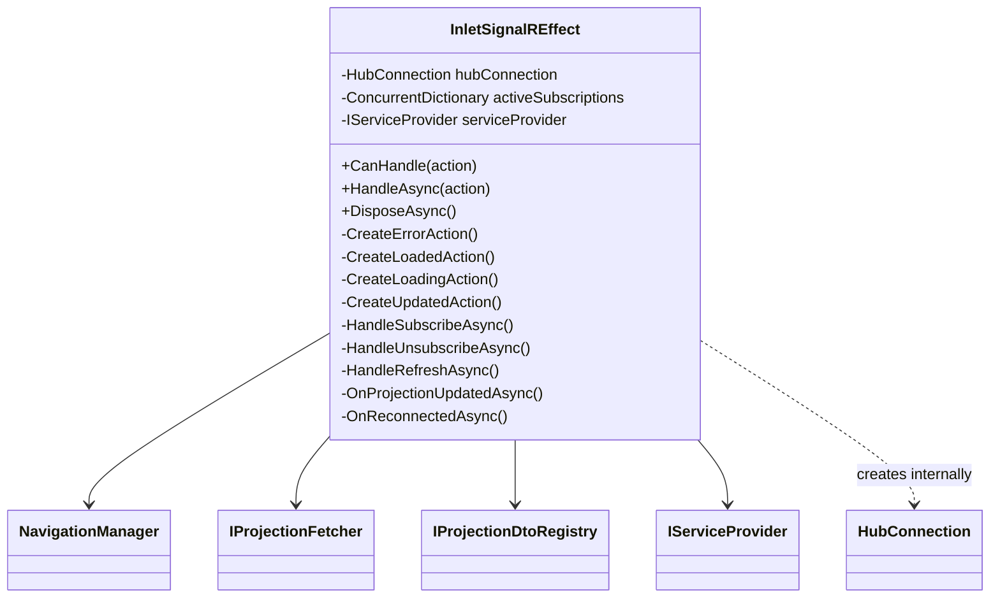
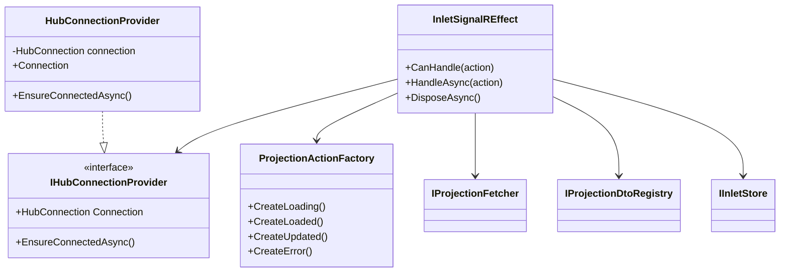

# RFC: Refactor InletSignalREffect

## Problem Statement

`InletSignalREffect` is a 486-line class that:
1. **Cannot be fully L0-tested** because it creates `HubConnection` internally via `new HubConnectionBuilder()`
2. **Violates DRY** with identical patterns repeated 3-4 times
3. **Violates SRP** by handling connection management, subscription tracking, action creation, and fetch orchestration
4. **Uses anti-pattern** for `IInletStore` resolution via `serviceProvider.GetRequiredService`

## Goals

1. Make all code paths L0-testable
2. Reduce duplication to single implementations
3. Keep each class focused on one responsibility
4. Maintain backward compatibility (no public API changes)
5. Follow KISS - only extract what's necessary

## Non-Goals

- Changing the public API
- Changing SignalR protocol/behavior
- Performance optimization

## Current State

## Proposed Design

## Design Decisions

### 1. Extract `IHubConnectionProvider` (not factory)

**Why provider over factory?**
- The effect needs a single long-lived connection, not multiple connections
- Provider can manage connection state and reconnection
- Easier to mock - just return a stub connection

### 2. Extract `ProjectionActionFactory` as concrete class

**Why not interface?**
- It's pure logic with no dependencies
- No need for multiple implementations
- Making it a class keeps it simple (KISS)
- Still testable in isolation

### 3. Keep fetch logic inline but reduce duplication via helper

**Why not extract `IProjectionFetchOrchestrator`?**
- Would add complexity without significant benefit
- The 3 usages have slightly different behaviors (loading vs updated actions)
- A private helper method is sufficient (KISS)

### 4. Inject `IInletStore` directly via `Lazy<T>`

**Why `Lazy<IInletStore>`?**
- Explicit dependency visible in constructor
- Defers resolution to avoid circular dependency
- Standard DI pattern

## Alternatives Considered

| Alternative | Rejected Because |
|-------------|------------------|
| Full strategy pattern for handlers | Over-engineering for 3 action types |
| Separate class per action handler | Too fragmented, harder to follow |
| Keep `HubConnection` internal | Blocks testability (the main goal) |

## Migration

No migration needed - this is an internal refactoring with no public API changes.

## Risks

| Risk | Mitigation |
|------|------------|
| Behavior regression | Comprehensive tests before/after each step |
| DI registration breaks | Verify registration after each extraction |
