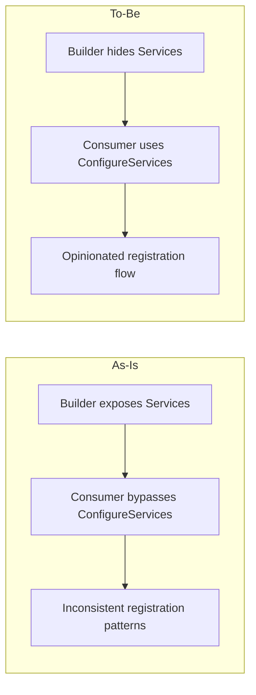
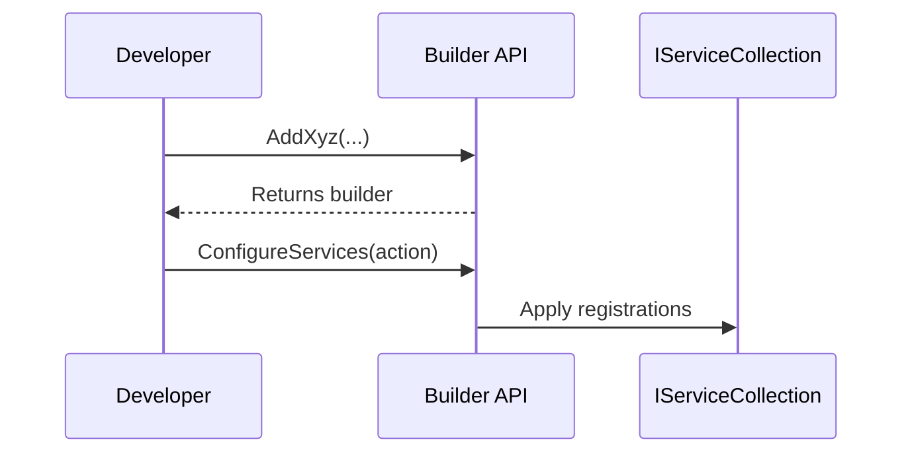

# RFC: Remove Public Services Property From Builders

## Problem
Public `IServiceCollection Services { get; }` properties on builder contracts allow direct service registration, bypassing the intended opinionated builder flow. The user wants a stricter, ConfigureServices-only pattern.

## Goals
- Remove public `Services` properties from builder interfaces and implementations.
- Ensure consumers use `ConfigureServices` for registration.
- Preserve builder functionality and supported extension methods.

## Non-Goals
- No new features beyond enforcing builder usage.
- No changes to unrelated APIs or unrelated DI conventions.

## Current State (UNVERIFIED)
- Builder interfaces include a public `Services` property with remarks suggesting advanced usage.
- Builder implementations expose the property and pass it to registration helpers.
- Some extension methods or registrations may use the property directly.

## Proposed Design
- Remove `Services` from builder interfaces (IMississippiBuilder, IReservoirBuilder, IAqueductServerBuilder).
- Update builder implementations to keep service collection private/internal.
- Update extension methods to use `ConfigureServices` instead of `.Services` access.
- Replace any direct `.Services` usage in code with `ConfigureServices` calls.

## Alternatives Considered
- Keep `Services` but mark obsolete (rejected: still exposes escape hatch).
- Keep `Services` but make it internal (rejected: interfaces are public; internal is not possible in contract).

## Security
No security impact beyond enforcing a more constrained pattern.

## Observability
No changes to logging or metrics.

## Compatibility / Migration
- This is a breaking change for any external consumers using `.Services` directly.
- Internal usage in this repo must be updated to `ConfigureServices`.

## Risks
- Breaks downstream code that used `Services`.
- May require updates to tests and generator outputs.

## Diagrams

### As-Is vs To-Be

### Critical Path Sequence

