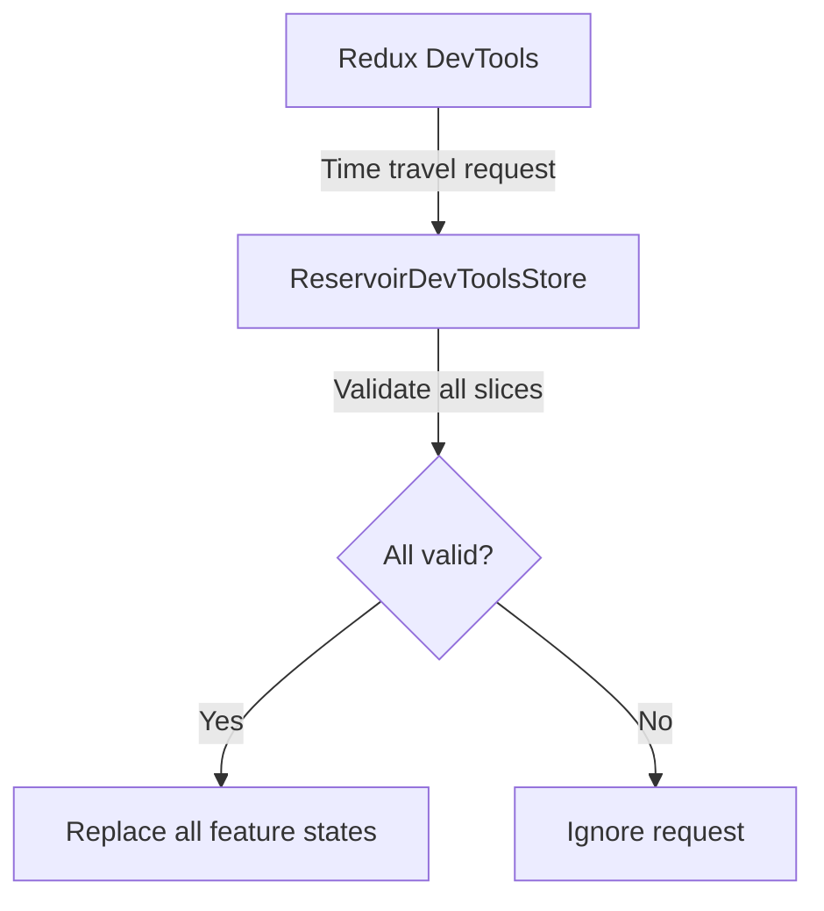
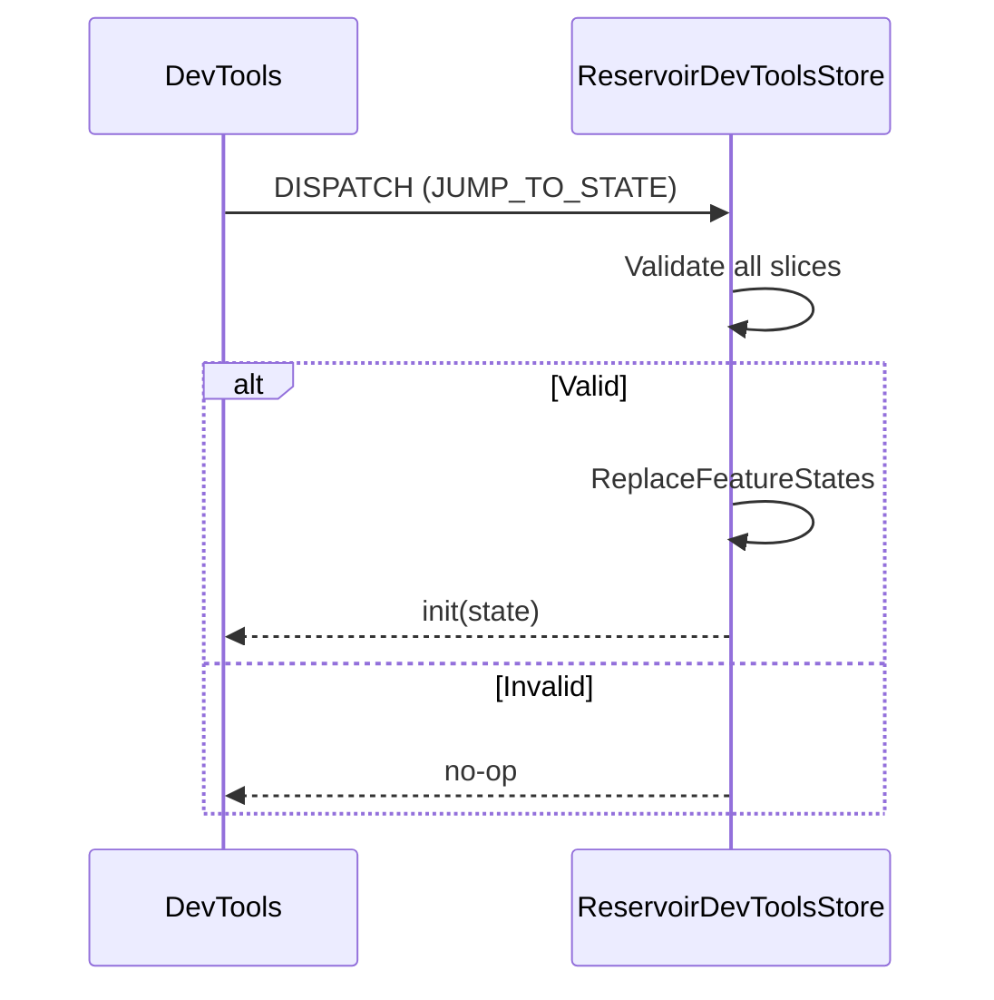

# RFC: Reservoir DevTools Strict Time Travel

## Problem

Current DevTools time-travel rehydration performs best-effort per-feature replacements. The user wants to only apply state changes when the payload is fully supported and valid to avoid invalid or partial data.

## Goals

- Add an opt-in strict mode that applies time-travel only when all feature states deserialize successfully.
- Default to current behavior unless strict mode is enabled.
- Keep implementation minimal and low-risk.

## Non-goals

- Implement action dispatch mapping from DevTools.
- Add new dependencies or change IStore interface.

## Current state

- ReservoirDevToolsStore replaces feature states per feature if JSON is valid.
- Invalid or missing feature states are ignored.
- JUMP_TO_STATE, JUMP_TO_ACTION, and IMPORT_STATE trigger JSON-based rehydration.

## Proposed design (initial)

- Add ReservoirDevToolsOptions.StrictStateRehydration (bool).
- When enabled, time-travel/import should only replace state if all feature slices are present and valid.
- If strict validation fails, ignore the entire time-travel request.

## Security

- Strict mode reduces risk of invalid or partial data being applied.

## Compatibility

- Additive change only; default behavior remains unchanged.

## Diagrams

