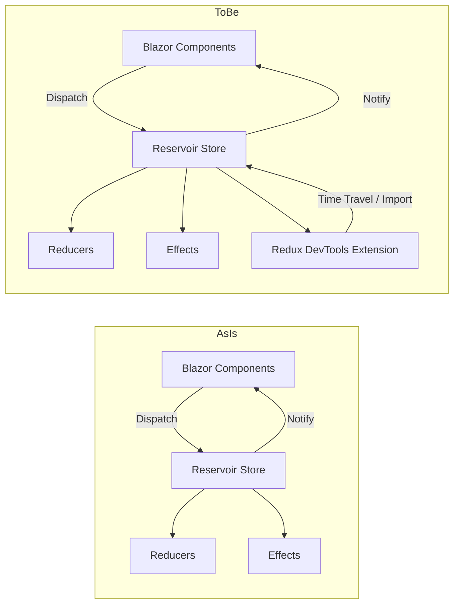
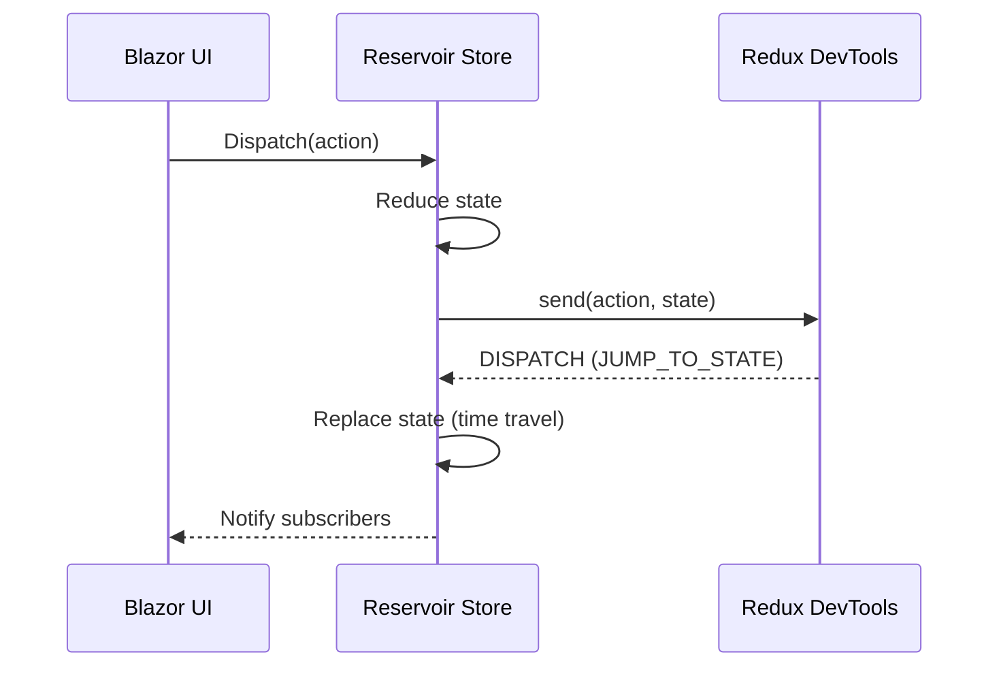

# RFC: Reservoir Redux DevTools Integration

## Problem

Reservoir provides Redux-style state management for Blazor, but lacks integration with Redux DevTools. Developers need time-travel debugging, action/state inspection, and a standard toolchain to inspect Reservoir state flows during development.

## Goals

- Add optional Redux DevTools integration for Reservoir-based Blazor apps.
- Provide a plug-in/plug-out experience so DevTools can be enabled only in development.
- Avoid production impact when disabled.
- Keep integration aligned with Reservoir store semantics (actions, reducers, effects).

## Non-goals

- Implement full Redux enhancer behavior (store replacement) unless required by DevTools commands.
- Ship a production-only diagnostics system.
- Add a dependency that forces DevTools usage in non-Blazor contexts without explicit opt-in.

## Current state (UNVERIFIED)

- Reservoir uses a Store with middleware pipeline, reducers, and async effects.
- Store exposes Dispatch, GetState, and Subscribe; no devtools-specific hooks exist.
- Reservoir.Blazor provides StoreComponent with subscription and rerender integration.

## Proposed design (initial)

- Add an opt-in DevTools bridge for Reservoir in Reservoir.Blazor.
- Use JS interop to connect to window.__REDUX_DEVTOOLS_EXTENSION__.connect and send init/send messages.
- Create a middleware that captures action + state and forwards to DevTools.
- Handle DevTools DISPATCH messages to support time-travel (jump/commit/import).
- Provide configuration options (name, maxAge, latency, features) and state/action sanitizers.
- Provide an explicit registration extension method to enable DevTools in DI.
- Ensure no runtime dependency when the extension is absent; integration should no-op.

## Alternatives

- Implement DevTools integration via a standalone JS file and manual app wiring (no DI). Rejected: inconsistent with DI patterns and hard to toggle.
- Implement integration in Reservoir core: rejected unless required; Blazor-specific and JS interop should remain in Reservoir.Blazor.

## Security

- DevTools is a development-only tool; integration must not expose sensitive state in production by default.
- Provide enablement gates and allow sanitization of state/action payloads.

## Observability

- Consider logging DevTools connection failures and messages (using LoggerExtensions) if needed.

## Compatibility / migrations

- Additive changes only; existing apps should continue to work without modification.

## Risks

- Large state objects could degrade performance when sent to DevTools.
- Time-travel (state replacement) may break invariants if actions are not replayed.

## Diagrams

