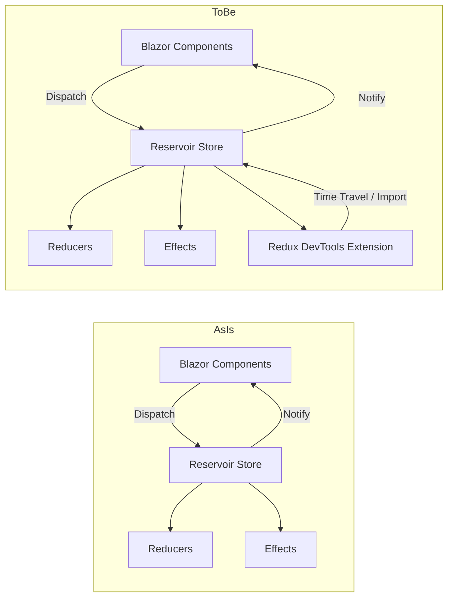
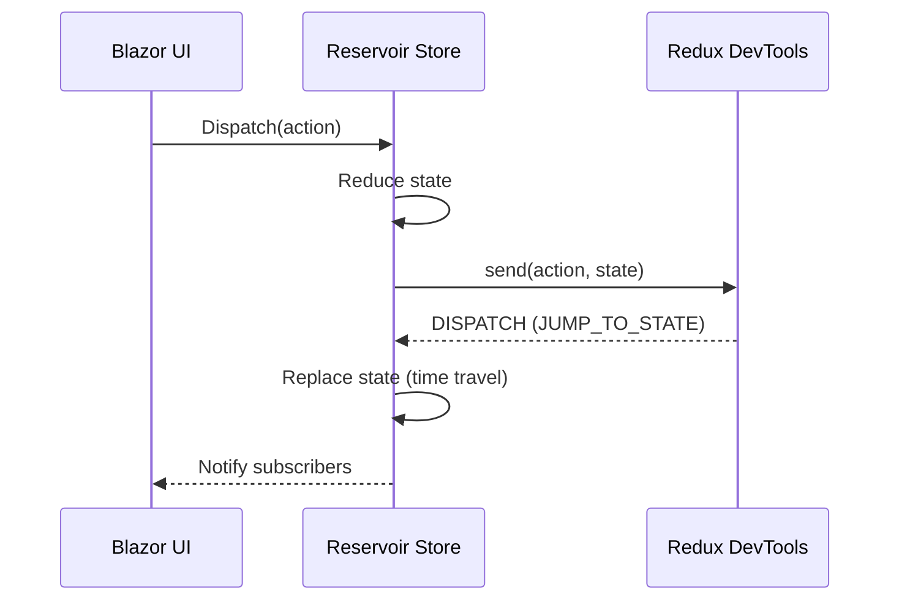

# RFC: Reservoir Redux DevTools Integration

## Problem

Reservoir provides Redux-style state management for Blazor, but lacks integration with Redux DevTools. Developers need time-travel debugging, action/state inspection, and a standard toolchain to inspect Reservoir state flows during development.

## Goals

- Add optional Redux DevTools integration for Reservoir-based Blazor apps.
- Provide a plug-in/plug-out experience so DevTools can be enabled only in development.
- Avoid production impact when disabled.
- Keep integration aligned with Reservoir store semantics (actions, reducers, effects).

## Non-goals

- Implement full Redux enhancer behavior (store replacement) unless required by DevTools commands.
- Ship a production-only diagnostics system.
- Add a dependency that forces DevTools usage in non-Blazor contexts without explicit opt-in.

## Current state

- Reservoir uses a Store with middleware pipeline, reducers, and async effects.
- Store exposes Dispatch, GetState, and Subscribe; no devtools-specific hooks exist.
- Store has a protected OnActionDispatched hook for derived classes.
- Reservoir.Blazor provides StoreComponent with subscription and rerender integration.
- Reservoir.Blazor has no JS interop usage or static web assets today.

## Proposed design (initial)

### Architecture

- Add a DevTools-aware Store subclass in Reservoir.Blazor that overrides OnActionDispatched to report actions/state to DevTools.
- Add protected snapshot/restore hooks in Reservoir.Store to enable state replacement without triggering effects.
- Add a JS interop bridge that connects to window.__REDUX_DEVTOOLS_EXTENSION__.connect, calls init/send, and receives messages.
- Add DI registration (AddReservoirDevTools) that replaces the scoped IStore with the DevTools store and wires options.

### DevTools protocol usage

- Use connect([options]) to obtain a DevTools connection and call init(state) once.
- After each dispatch, call send(action, state).
- Handle DISPATCH messages from DevTools (JUMP_TO_STATE, JUMP_TO_ACTION, RESET, COMMIT, ROLLBACK, IMPORT_STATE) by replacing state and notifying subscribers.
- Ignore DevTools messages that cannot be safely deserialized or mapped.

### Configuration

- ReservoirDevToolsOptions for enablement and options (name, maxAge, latency, features).
- Optional action/state sanitizers to avoid sending sensitive or large payloads.

### Production safety

- Integration is opt-in; disabled by default.
- JS bridge no-ops when DevTools extension is missing.

## Alternatives

- Implement DevTools integration via a standalone JS file and manual app wiring (no DI). Rejected: inconsistent with DI patterns and hard to toggle.
- Implement integration in Reservoir core: rejected unless required; Blazor-specific and JS interop should remain in Reservoir.Blazor.

## Security

- DevTools is a development-only tool; integration must not expose sensitive state in production by default.
- Provide enablement gates and allow sanitization of state/action payloads.

## Observability

- Consider logging DevTools connection failures and messages (using LoggerExtensions) if needed.

## Compatibility / migrations

- Additive changes only; existing apps should continue to work without modification.

## Risks

## Requirements and constraints

- DevTools integration MUST be opt-in and disableable for production.
- Integration SHOULD use existing middleware and subscription hooks where possible.
- New third-party dependencies require explicit approval; prefer no new dependencies.
- JS interop must live in Blazor-specific code (Reservoir.Blazor) rather than core Reservoir.

## Assumptions and unknowns

- Assumption: Reservoir.Blazor can host static JS assets using Razor class library conventions.
- Assumption: Reservoir actions can be represented by runtime type name for DevTools display.
- Unknown: Whether state replacement should be supported or restricted to time-travel only.

- Large state objects could degrade performance when sent to DevTools.
- Time-travel (state replacement) may break invariants if actions are not replayed.

## Diagrams

