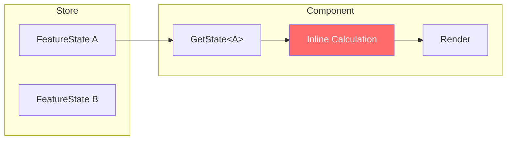
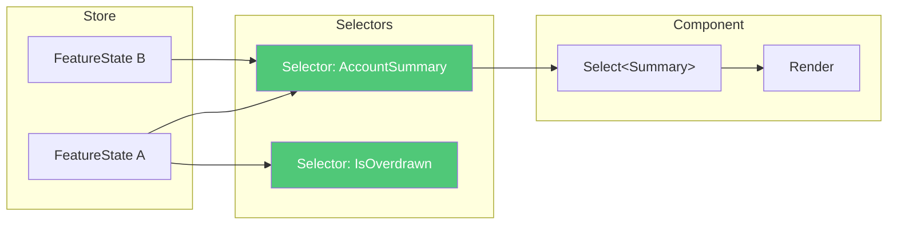
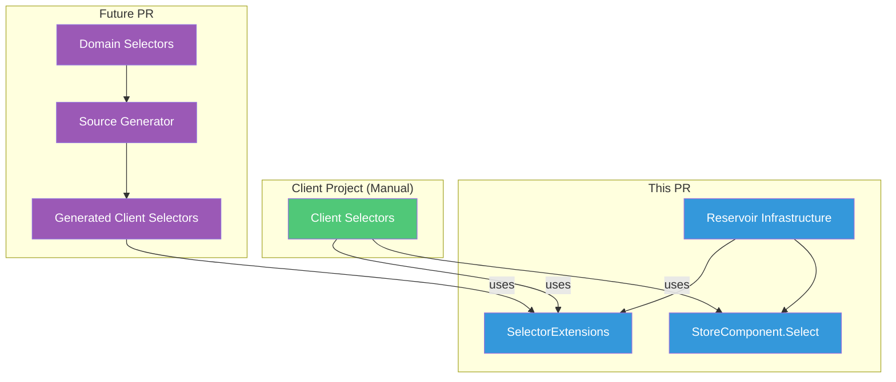

# RFC: Reservoir Selectors

## Problem Statement

Reservoir provides `GetState<TState>()` for accessing feature state, but lacks a pattern for **derived state**—computed values that combine or transform one or more feature states.

Without selectors, developers:

1. **Duplicate logic** — The same calculation appears in multiple components
2. **Couple components to state shape** — Components know too much about raw state structure
3. **Miss optimization opportunities** — No memoization; derived values recomputed every render
4. **Lack testability** — Business calculations embedded in render logic can't be unit tested easily

## Goals

1. **Developer experience first** — Selectors should be as easy to write as reducers
2. **Pure functions** — Selectors must be deterministic transforms with no side effects
3. **Composable** — Build complex selectors from simpler ones
4. **Memoization-ready** — Enable opt-in caching when performance requires it
5. **Familiar patterns** — Follow Redux/Reselect conventions developers already know
6. **Generation-ready** — Design supports future Domain→Client source generation

## Non-Goals

1. **Automatic memoization** — Start simple; add caching as an opt-in feature
2. **Selector-scoped subscriptions** — Keep current all-or-nothing re-render; optimize later if needed
3. **Server-side selectors** — Focus on client-side Reservoir; projections serve the server read model role

## Scope of This PR

This PR implements **client-side selector infrastructure only**:

- ✅ Reservoir extension methods (`Select<TState, TResult>`)
- ✅ StoreComponent integration
- ✅ Documentation and patterns
- ✅ Sample client-side selectors in Spring
- ⏳ Domain→Client source generation (future PR)
- ⏳ Memoization utilities (future PR)
- ⏳ Analyzer for purity enforcement (future PR)

The architecture is **designed to support both** manual client-side selectors and future generated selectors from Domain definitions.

## Current State



**Problem**: Calculation logic is embedded in components, duplicated, and untestable.

## Proposed Design



**Solution**: Selectors are pure functions that derive values; components consume derived values.

---

## Architecture: Two Selector Sources

The design supports **two ways to define selectors**, both using the same Reservoir infrastructure:



| Source | Location | Generated? | This PR? |
|--------|----------|------------|----------|
| **Manual client selectors** | `Client/Features/{Feature}/Selectors/` | No | ✅ Yes |
| **Domain→Client selectors** | Define in Domain, emit in Client | Yes | ⏳ Future |

### Why Both?

| Use Case | Which Source |
|----------|--------------|
| Client-only state (navigation, UI flags) | Manual client selectors |
| Business logic on projections | Domain selectors (future) |
| Cross-state composition | Manual client selectors |
| Generated scaffolding (`IsLoading`, `HasError`) | Domain→Client (future) |

---

## Developer Experience: This PR

### 1. Define Selectors in Client Project

For client-side state, selectors live in the Client project's Features folder:

```
Spring.Client/
└── Features/
    ├── EntitySelection/
    │   ├── EntitySelectionState.cs
    │   ├── EntitySelectionReducers.cs
    │   └── Selectors/                    ← NEW
    │       └── EntitySelectionSelectors.cs
    └── BankAccountBalance/
        └── Selectors/                    ← NEW (manual for now)
            └── BankAccountBalanceSelectors.cs
```

### 2. Write Selectors as Static Methods

```csharp
// Spring.Client/Features/EntitySelection/Selectors/EntitySelectionSelectors.cs
namespace Spring.Client.Features.EntitySelection.Selectors;

/// <summary>
///     Pure selector functions for entity selection state.
/// </summary>
public static class EntitySelectionSelectors
{
    /// <summary>
    ///     Gets whether an entity is currently selected.
    /// </summary>
    public static bool HasSelection(EntitySelectionState state)
        => !string.IsNullOrEmpty(state.EntityId);

    /// <summary>
    ///     Gets the selected entity ID or a default value.
    /// </summary>
    public static string GetEntityIdOrDefault(EntitySelectionState state, string defaultValue = "")
        => state.EntityId ?? defaultValue;
}
```

### 3. Use Selectors in Components

```csharp
@inherits StoreComponent

@if (Select(EntitySelectionSelectors.HasSelection))
{
    <AccountDetails EntityId="@Select(EntitySelectionSelectors.GetEntityIdOrDefault)" />
}
else
{
    <p>Select an account to view details.</p>
}
```

### 4. Compose Selectors (Cross-State)

```csharp
public static class DashboardSelectors
{
    /// <summary>
    ///     Combines account balance and selection state into a dashboard view model.
    /// </summary>
    public static DashboardViewModel GetDashboard(
        BankAccountBalanceProjection balance,
        EntitySelectionState selection)
        => new(
            EntityId: selection.EntityId,
            FormattedBalance: BankAccountSelectors.FormattedBalance(balance),
            Health: BankAccountSelectors.GetHealth(balance),
            IsOverdrawn: BankAccountSelectors.IsOverdrawn(balance));
}
```

### 5. Test Selectors Easily

```csharp
public sealed class BankAccountSelectorsTests
{
    [Theory]
    [InlineData(-50, true)]
    [InlineData(0, false)]
    [InlineData(100, false)]
    public void IsOverdrawn_ReturnsCorrectValue(decimal balance, bool expected)
    {
        // Arrange
        var projection = new BankAccountBalanceProjection
        {
            Balance = balance,
            IsOpen = true,
        };

        // Act
        bool result = BankAccountSelectors.IsOverdrawn(projection);

        // Assert
        result.Should().Be(expected);
    }
}
```

---

## Key Rules for Selectors

### MUST Rules

| Rule | Rationale |
|------|-----------|
| Selectors **MUST** be pure functions | Deterministic output from inputs; no side effects |
| Selectors **MUST** be static methods | Encourages purity; no instance state |
| Selectors **MUST NOT** call APIs, dispatch actions, or access services | Side effects belong in action effects |
| Selectors **MUST NOT** mutate inputs | Feature states are immutable; selectors must preserve this |
| Selectors **MUST** accept feature states or other selector results as inputs | Clear dependency graph |

### SHOULD Rules

| Rule | Rationale |
|------|-----------|
| Selectors **SHOULD** live in a `Selectors/` folder alongside their feature | Discoverable, follows reducer pattern |
| Selectors **SHOULD** be grouped by feature in static classes named `{Feature}Selectors` | Consistent naming |
| Selectors **SHOULD** have XML documentation | Clarifies intent and usage |
| Selectors **SHOULD** return value types or immutable reference types | Prevents accidental mutation |
| Complex selectors **SHOULD** compose simpler selectors | DRY and testable |

### MAY Rules

| Rule | Rationale |
|------|-----------|
| Selectors **MAY** use memoization when performance requires | Opt-in optimization |
| Selectors **MAY** be source-generated from projection attributes | Reduces boilerplate for common patterns |

---

## API Design

### Core Abstractions

```csharp
// In Reservoir.Abstractions
namespace Mississippi.Reservoir.Abstractions;

/// <summary>
///     Extension methods for selecting derived state from the store.
/// </summary>
public static class SelectorExtensions
{
    /// <summary>
    ///     Selects a derived value from a single feature state.
    /// </summary>
    public static TResult Select<TState, TResult>(
        this IStore store,
        Func<TState, TResult> selector)
        where TState : class, IFeatureState
        => selector(store.GetState<TState>());

    /// <summary>
    ///     Selects a derived value from two feature states.
    /// </summary>
    public static TResult Select<TState1, TState2, TResult>(
        this IStore store,
        Func<TState1, TState2, TResult> selector)
        where TState1 : class, IFeatureState
        where TState2 : class, IFeatureState
        => selector(store.GetState<TState1>(), store.GetState<TState2>());

    // Overloads for 3, 4, 5+ states as needed
}
```

### StoreComponent Integration

```csharp
// In Reservoir.Blazor
public abstract class StoreComponent : ComponentBase, IDisposable
{
    // Existing...
    protected TState GetState<TState>() where TState : class, IFeatureState
        => Store.GetState<TState>();

    // NEW: Selector convenience methods
    protected TResult Select<TState, TResult>(Func<TState, TResult> selector)
        where TState : class, IFeatureState
        => Store.Select(selector);

    protected TResult Select<TState1, TState2, TResult>(
        Func<TState1, TState2, TResult> selector)
        where TState1 : class, IFeatureState
        where TState2 : class, IFeatureState
        => Store.Select(selector);
}
```

---

## Source Generation (Phase 2)

For common patterns, generators can emit selector scaffolding.

### Attribute-Driven Generation

```csharp
// In Domain project
[GenerateProjectionEndpoints]
[GenerateSelectors]  // NEW attribute
public sealed record BankAccountBalanceProjection
{
    public decimal Balance { get; init; }
    public string HolderName { get; init; } = string.Empty;
    public bool IsOpen { get; init; }
}
```

### Generated Output

```csharp
// Generated in Client project
namespace Spring.Client.Features.BankAccountBalance.Selectors;

public static partial class BankAccountBalanceSelectors
{
    /// <summary>
    ///     Gets the current BankAccountBalance projection state.
    /// </summary>
    public static BankAccountBalanceDto GetProjection(BankAccountBalanceState state)
        => state.Projection;

    /// <summary>
    ///     Gets whether the projection is currently loading.
    /// </summary>
    public static bool IsLoading(BankAccountBalanceState state)
        => state.IsLoading;

    /// <summary>
    ///     Gets whether the projection has an error.
    /// </summary>
    public static bool HasError(BankAccountBalanceState state)
        => state.Error is not null;
}
```

Developers can extend with `partial class`:

```csharp
// In Client project (manual)
public static partial class BankAccountBalanceSelectors
{
    public static bool IsOverdrawn(BankAccountBalanceState state)
        => state.Projection?.Balance < 0 ?? false;
}
```

---

## Memoization (Phase 3)

For performance-critical selectors, provide opt-in memoization:

```csharp
// Memoized selector with custom equality
public static class MemoizedSelectors
{
    private static readonly Func<BankAccountBalanceProjection, DashboardViewModel> GetDashboard =
        Memoize.Create(
            (BankAccountBalanceProjection balance) => new DashboardViewModel(...),
            EqualityComparer<BankAccountBalanceProjection>.Default);
}
```

Or a simpler API:

```csharp
// Extension method approach
var selector = BankAccountSelectors.GetDashboard.Memoize();
```

---

## Comparison: Current vs Proposed

| Aspect | Current | With Selectors |
|--------|---------|----------------|
| Derived state location | Inline in components | Centralized in `Selectors/` classes |
| Testability | Requires component testing | Pure functions, trivial unit tests |
| Reusability | Copy-paste | Single source of truth |
| Composition | Ad-hoc | Explicit selector chains |
| Memoization | None | Opt-in via `Memoize` |
| Learning curve | None | Minimal (static methods) |

---

## Alternatives Considered

### 1. Computed Properties on Feature State

```csharp
public sealed record BankAccountBalanceState : IFeatureState
{
    public decimal Balance { get; init; }
    
    // Computed property
    public bool IsOverdrawn => Balance < 0;
}
```

**Rejected because**:
- Couples derived logic to state shape
- Cannot compose across multiple feature states
- Harder to test in isolation
- No memoization path

### 2. Selector Classes (Object-Oriented)

```csharp
public interface ISelector<TState, TResult>
{
    TResult Select(TState state);
}
```

**Rejected because**:
- More ceremony than static methods
- Requires DI registration
- Less familiar to Redux users
- Purity harder to enforce

### 3. Expression-Based Selectors

```csharp
store.Select<BalanceState, bool>(s => s.Balance < 0);
```

**Accepted as the API** but with a naming convention:
- Inline lambdas are fine for simple cases
- Named static methods (selector functions) are preferred for reuse and testing

---

## Security Considerations

- Selectors are pure client-side transforms; no direct security impact
- Selectors should not access sensitive data not already in feature state
- Generated selectors follow the same visibility as source projections

## Observability

- No new metrics or logs required
- Existing store dispatch tracing covers action flow
- Selector execution is synchronous and fast; no tracing needed

## Compatibility

- **Additive change** — New API surface, no breaking changes
- `GetState<TState>()` continues to work unchanged
- Existing components work without modification

## Migration

- No migration required; selectors are opt-in
- Existing inline calculations can be refactored to selectors gradually

---

## Risks and Mitigations

| Risk | Impact | Mitigation |
|------|--------|------------|
| Developers write impure selectors | Subtle bugs, unpredictable behavior | Documentation, analyzer rule, code review |
| Memoization cache grows unbounded | Memory pressure | Use weak references or size limits; start without memoization |
| Too many selector overloads | API bloat | Limit to 3-4 state inputs; use tuples for more |
| Generated selectors don't match expectations | Developer confusion | Start manual, add generation only for proven patterns |
