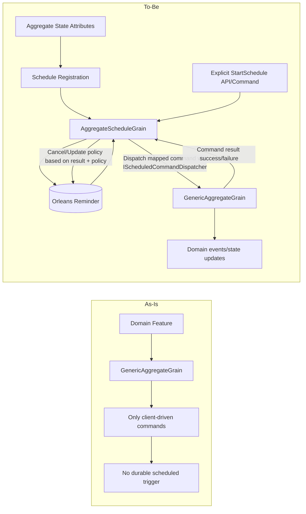
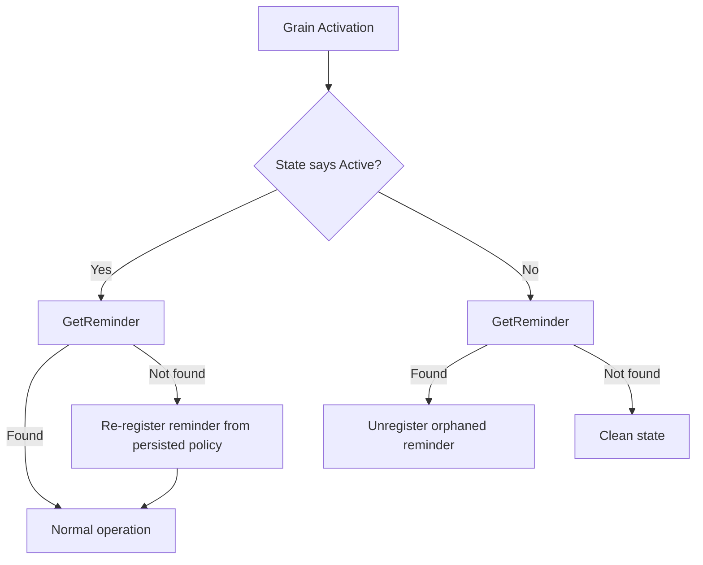

# RFC: Aggregate Scheduled Commands (Phase 1) + Saga Auto-Resume (Phase 2)

## Problem Statement

The framework lacks a first-class way for aggregates to schedule future command execution using durable reminders. Teams need this for periodic domain behavior (for example, game world ticks, cooldown expirations, billing cycles) and for reliability patterns like saga resume.

Without a general scheduling primitive, each feature must create custom reminder logic, increasing inconsistency and failure risk.

## Goals

- Provide a general aggregate-level scheduled command feature built on Orleans reminders.
- Deliver an attribute-first developer experience on aggregate state types.
- Support multiple independent reminders per aggregate instance.
- Require explicit schedule start (no auto-start by attribute registration alone).
- Keep scheduled command execution deterministic and idempotent under duplicate/delayed ticks.
- Provide explicit lifecycle control (register, update, cancel) with safe defaults.
- Add observability for schedule lifecycle and runtime outcomes.
- Reuse the phase 1 feature for saga auto-resume in phase 2.
- Preserve architectural rule: persisted state lives in aggregates, while infra execution can be split into separate grains.

## Non-Goals

- Replace command handling with a separate workflow engine.
- Add UI workflows for schedule management.
- Introduce non-Orleans schedulers as the primary reliability mechanism.

## Current State

- Aggregate command execution already exists in `GenericAggregateGrain<TAggregate>`.
- No generic aggregate scheduling abstraction exists today.
- No reminder ownership pattern exists in aggregate infrastructure.
- Saga auto-resume remains a specific feature built on top of aggregate behavior, not yet implemented.

## Proposed Design

### 1. Aggregate scheduling as a framework capability

Introduce a reusable scheduling subsystem for aggregates:

- schedule commands for a specific aggregate instance using Orleans reminders,
- resolve reminder ticks to command dispatch on the target aggregate grain,
- support register/update/cancel lifecycle,
- keep domain state in aggregate events/state (scheduler grain has infrastructure-only state).

### 2. Developer experience first (attribute-based)

Define attributes on aggregate state type to declare default schedule policy and command bindings.

Proposed shape:

```csharp
[AggregateScheduleDefaults(
  InitialDelaySeconds = 5,
  IntervalSeconds = 60,
  Backoff = ScheduleBackoff.Constant,
  MaxAttempts = 0,
  JitterPercent = 10)]
[ScheduledCommand(typeof(SpawnUnitsTickCommand), Name = "spawn-units", IntervalSeconds = 60)]
[ScheduledCommand(typeof(DecayTickCommand), Name = "decay", IntervalSeconds = 300)]
public sealed class WorldAggregate
{
}
```

Design intent:

- Attributes provide defaults and declarative mapping.
- Runtime API can override per-instance values when needed.
- Multiple `ScheduledCommand` attributes can be applied to one aggregate.
- Attributes never auto-start schedules; start is always explicit via API/command.

### 2.1 Explicit schedule lifecycle API

Provide explicit APIs/commands for lifecycle:

- `StartSchedule` (required to activate)
- `UpdateSchedule`
- `StopSchedule`

Example intent:

- aggregate or application logic decides when to start schedule `spawn-units`.
- startup scanning only registers metadata/bindings, not active reminders.

### 3. Runtime model

Add one scheduler grain per aggregate instance + schedule name key:

- grain key: `<AggregateType>|<AggregateId>|<ScheduleName>`
- reminder callback dispatches mapped command to the target aggregate grain via `IScheduledCommandDispatcher` (explicit dependency, not `IServiceProvider`)
- runtime applies backoff/jitter policy before next schedule update.

This key design enables multiple schedules for one aggregate instance.

**Command dispatch without service locator:** The scheduler grain receives an `IScheduledCommandDispatcher` via constructor injection. This dispatcher knows how to construct the command instance (using the `commandTypeName` string from `ScheduleRegistration` and the tick metadata) and forward it to the target aggregate grain's `ExecuteAsync` method. The dispatcher does not need `IServiceProvider` — it uses a pre-registered mapping of command type names to factory delegates, built during DI/startup scanning from `[ScheduledCommand]` attribute metadata. This satisfies the shared policy against `IServiceProvider` injection.

**Scheduler grain concurrency:** The scheduler grain relies on Orleans' single-threaded grain execution guarantee. All calls to `StartAsync`, `UpdateAsync`, `StopAsync`, and reminder tick callbacks are serialized by the Orleans runtime. No additional locking or concurrency control is needed within the grain.

### 4. Idempotency as a framework rule

Scheduled commands must be idempotent by design because duplicate/delayed ticks are normal.

Proposed enforcement options:

- marker interface on handlers (for example `IIdempotentScheduledCommandHandler<TCommand, TSnapshot>`), or
- attribute flag validated at registration/build-time.

> **Naming convention note:** The second type parameter follows the framework's `TSnapshot` naming (not `TAggregate`). `CommandHandlerBase<TCommand, TSnapshot>` uses `TSnapshot` because the parameter represents the aggregate's projected state/snapshot. Concrete types like `WorldAggregate` are valid `TSnapshot` values.

### 5. Phase 2: saga auto-resume

After phase 1 is stable, implement saga resume using scheduled commands:

- schedule `ContinueSagaCommand` on start/active saga phases,
- cancel on terminal phases,
- keep saga-specific progress logic in saga contracts/reducers.

**Interaction with existing `SagaOrchestrationEffect`:** Today, saga orchestration runs via `IEventEffect<TSaga>` (event effects), not via commands. `ContinueSagaCommand` is a *command* dispatched by the scheduler grain to the aggregate grain's command handler pipeline. It does **not** replace `SagaOrchestrationEffect` — the effect continues to handle forward-step orchestration in response to saga lifecycle events (`SagaStartedEvent`, `SagaStepCompleted`, etc.). Instead, `ContinueSagaCommand` serves as a *resume trigger*: when the scheduler grain fires a tick, it dispatches `ContinueSagaCommand` to the aggregate, which re-evaluates the saga's current phase and re-enters the orchestration pipeline if the saga is stalled. The command handler for `ContinueSagaCommand` should check the saga state and either no-op (if the saga has progressed) or emit a synthetic event that re-triggers the existing `SagaOrchestrationEffect`. This ensures the two mechanisms are complementary, not conflicting.

> **Design decision required:** Define the exact event that `ContinueSagaCommand` handler emits to re-trigger orchestration (e.g., `SagaResumeRequested`), and ensure `SagaOrchestrationEffect.CanHandle` recognizes it.

### 6. Storage and eventing model

Recommended architecture:

- Use a system-level scheduler grain (infrastructure concern) to own active reminders.
- Do not persist scheduler business state into domain aggregate streams by default.
- Keep domain business state in domain aggregate events/state.
- Persist durable scheduler/audit state in a dedicated system aggregate (`ScheduleAuditAggregate`) when audit mode is enabled.

Architecture rule:

- If state must be durable, store it in an aggregate event stream.
- It is valid to use different grains for business vs infrastructure concerns:
  - business aggregate grains for domain state and behavior,
  - infrastructure grains for reminder dispatch/execution plumbing.
  - system aggregates for durable infrastructure history/audit.

Event guidance:

- Default: structured logs + metrics for scheduler lifecycle.
- Optional (recommended for audit): write standardized lifecycle events to `ScheduleAuditAggregate` stream:
  - `ScheduleStarted`
  - `ScheduleUpdated`
  - `ScheduleStopped`
  - `TickTriggered`
  - `TickDispatched`
  - `TickFailed`
  - `ScheduleExhausted`

Suggested correlation fields:

- `AggregateType`
- `AggregateId`
- `ScheduleName`
- `CommandType`
- `TickToken`
- `Attempt`
- `DueAtUtc` / `ExecutedAtUtc`
- `ErrorCode` / `ErrorMessage`

### 7. Source generation stance

Use source generation for DX/registration only:

- generate schedule binding metadata and registration glue,
- validate command/aggregate binding at compile-time where possible.
- optionally generate `ScheduleAuditAggregate` contracts/registrations for consistent audit schema.

Do not generate business scheduler aggregates by default; runtime scheduler grain remains shared infrastructure. Audit aggregate generation is optional DX support.

### 8. `ScheduleStartOptions` → `ScheduleRegistration` mapping

`ScheduleStartOptions` is the user-facing API type (simple, optional overrides). `ScheduleRegistration` is the grain-facing type (fully resolved, all fields required). The `IAggregateScheduleManager` implementation merges:

1. **Attribute defaults** from `[AggregateScheduleDefaults]` and `[ScheduledCommand]` on the aggregate type.
2. **User overrides** from `ScheduleStartOptions` (any non-null field wins over attribute defaults).
3. **Framework defaults** for any field not set by attributes or user overrides.

The result is a fully-populated `ScheduleRegistration` passed to the scheduler grain.

| Field | Source priority (highest wins) |
|---|---|
| `InitialDelay` | `ScheduleStartOptions` > `[AggregateScheduleDefaults]` > framework default (5s) |
| `Interval` | `ScheduleStartOptions` > `[ScheduledCommand].IntervalSeconds` > `[AggregateScheduleDefaults].IntervalSeconds` > framework default (60s) |
| `Backoff` | `ScheduleStartOptions` > `[AggregateScheduleDefaults]` > `Constant` |
| `MaxAttempts` | `ScheduleStartOptions` > `[AggregateScheduleDefaults]` > `0` (unlimited) |
| `JitterPercent` | `ScheduleStartOptions` > `[AggregateScheduleDefaults]` > `0` |
| `MaxInterval` | `ScheduleStartOptions` > `[AggregateScheduleDefaults]` > `null` (no cap) |
| `AuditMode` | `ScheduleStartOptions` > `LogOnly` |
| `CommandTypeName` | Resolved from `[ScheduledCommand]` attribute by `scheduleName` match (not overridable) |

## Architecture Diagram (As-Is vs To-Be)



## Critical Runtime Path Sequence

```mermaid
sequenceDiagram
    participant App as App Startup
    participant Agg as Aggregate Grain
    participant Sched as AggregateScheduleGrain
    participant Rem as Orleans Reminder

    App->>App: DI/startup scanning discovers [ScheduledCommand] attributes (compile-time metadata)
    Note over App,Sched: Attributes are compile-time; scanning registers binding metadata in DI, not on grain instances

    App->>Sched: StartSchedule(scheduleName, aggregateId) via IAggregateScheduleManager
    Sched->>Rem: RegisterOrUpdateReminder

    Rem-->>Sched: Tick
    Sched->>Agg: Execute(scheduled command)
    Agg->>Agg: Handle command idempotently
    alt terminal/disabled
      Agg->>Sched: CancelSchedule
      Sched->>Rem: UnregisterReminder
    else keep running
      Sched->>Rem: Keep or update next cadence
    end
```

## Crash Survivability Summary

- Silo crash: scheduled command resumes on next reminder tick.
- Cluster outage: reminders resume when cluster/storage returns.
- Duplicate/delayed ticks: expected behavior, handled by command idempotency.
- Feature-specific recovery (for example saga compensation) remains phase 2 domain logic.

### Reconciliation Design

Reconciliation addresses the case where the scheduler grain's in-memory state indicates an active schedule, but the Orleans reminder was lost (e.g., storage transient failure during registration, or reminder storage compaction).

**Algorithm:**

1. On grain activation (`OnActivateAsync`), the scheduler grain reads its persisted state.
2. If state indicates `Active = true` and a registered reminder name, call `GetReminder(reminderName)`.
3. If the reminder does not exist (returns null / throws `ReminderException`), re-register via `RegisterOrUpdateReminder` using the persisted interval/policy.
4. If the reminder exists, no action needed — normal tick flow resumes.
5. If state indicates `Active = false`, ensure no orphaned reminder exists by calling `GetReminder` and unregistering if found.

This is safe because `RegisterOrUpdateReminder` is idempotent — calling it when the reminder already exists simply updates the schedule. The grain's persisted state is the source of truth for whether a schedule *should* be active.



## Alternatives Considered

1. Reminder logic directly inside generic aggregate grain — simpler but over-couples scheduling/runtime policy with every aggregate.

2. Orleans timers instead of reminders — not durable enough for crash/restart recovery.

3. Feature-specific scheduler per domain (for example saga-only) — solves one use case but duplicates infrastructure patterns.

4. External workflow orchestrator — higher complexity and additional infrastructure.

5. Auto-start all schedules from attributes — convenient but unsafe; causes unintended background behavior and weakens domain intent.

## Security and Reliability

- No secrets in reminder payloads.
- Scheduled dispatch must validate aggregate identity and command mapping.
- Retry storms mitigated with backoff + optional max attempts.

## Compatibility and Migration

- Backward-compatible defaults with opt-in attribute behavior.
- Existing aggregates are unchanged unless scheduling is configured.
- Sagas adopt the same mechanism in phase 2.
- Audit mode can be adopted independently by enabling `ScheduleAuditAggregate` emission.

## Risks

- Missing idempotency in scheduled command handlers can cause duplicate external side effects.
- Over-abstracting attributes may hide important runtime choices.
- Auto-start semantics can unintentionally activate expensive schedules.
- Excessive logging/noise if every tick emits high-cardinality logs.
- High-volume tick event auditing can increase event storage costs.

## Resolved Decisions

- **`MaxAttempts = 0` semantics:** `0` means "unlimited retries" (no cap). A value of `1` means "run once, no retries." This matches common retry-policy conventions (e.g., Polly, Azure SDK). Document this in attribute XML docs and validate that negative values are rejected at startup.
- **Concurrency model for scheduler grain:** The scheduler grain relies on Orleans' single-threaded grain execution guarantee. Concurrent calls to `StartAsync`, `UpdateAsync`, and `StopAsync` are serialized by the Orleans runtime. This is an explicit design assumption, not an accident. Document it in the grain implementation.
- **`StopAsync` must unregister the Orleans reminder** via `UnregisterReminder` to prevent resource leaks and storage cost accumulation. It must not merely mark the schedule as "disabled" in grain state.
- **Duplicate schedule name validation:** Multiple `[ScheduledCommand]` attributes on the same aggregate type with the same `Name` must cause a startup validation exception. This is checked during DI/startup scanning. Silent override is not permitted.
- **Audit mode "Log Only":** "Log Only" means emitting structured log entries via `LoggerExtensions` with well-defined EventIds and structured properties (`AggregateType`, `AggregateId`, `ScheduleName`, `CommandType`, `TickToken`, `Attempt`, etc.). It does **not** write to the `ScheduleAuditAggregate`. The specific EventIds and property schema must be defined in the observability section of the implementation plan.
- **`TickToken` generation strategy:** `TickToken` is derived deterministically as `$"{ScheduleName}:{AggregateId}:{TickDueTimeUtc.Ticks}"`. This ensures the same logical tick always produces the same token, even across retries. Orleans reminder tick times may have minor jitter, so `TickDueTimeUtc` should use the *scheduled* due time from the reminder registration, not the actual callback wall-clock time. The scheduler grain must persist the last registered due time in its state to generate stable tokens.
- **`TAggregate` type identity in grain key (`AggregateType`):** Derived from `BrookNameHelper.GetBrookName<TAggregate>()` which reads the `[BrookName]` attribute. If the type lacks `[BrookName]`, use `typeof(TAggregate).Name` as a fallback. This keeps grain keys stable across refactors.

## Open Decisions

- Exact idempotency enforcement mechanism (marker interface vs attribute flag).
- Attribute surface: one attribute with nested policy vs separate default + per-command attributes.
- Whether schedule lifecycle milestones should default to logs-only with opt-in events.
- Audit verbosity defaults: lifecycle-only vs full tick history.

## API Shape and Code Samples (Draft)

### 1. Aggregate attributes

```csharp
using Mississippi.EventSourcing.Aggregates.Abstractions;
using Mississippi.EventSourcing.Brooks.Abstractions;

[BrookName("world")]
[AggregateScheduleDefaults(
  InitialDelaySeconds = 5,
  IntervalSeconds = 60,
  Backoff = ScheduleBackoff.Exponential,
  MaxAttempts = 0,
  JitterPercent = 10,
  MaxIntervalSeconds = 300)]
[ScheduledCommand(typeof(SpawnUnitsTickCommand), Name = "spawn-units", IntervalSeconds = 60)]
[ScheduledCommand(typeof(DecayTickCommand), Name = "decay", IntervalSeconds = 300)]
public sealed class WorldAggregate
{
  public int Units { get; init; }

  public int TickVersion { get; init; }

  /// <summary>
  /// Last tick token successfully applied (idempotency guard).
  /// </summary>
  public string? LastAppliedTickToken { get; init; }
}
```

Notes:

- Attributes register metadata only.
- Schedules do not auto-start.
- Multiple `ScheduledCommand` attributes are allowed.

### 2. Runtime schedule API

```csharp
using Mississippi.EventSourcing.Aggregates.Abstractions;

public interface IAggregateScheduleManager
{
  Task StartScheduleAsync<TAggregate>(
    string aggregateId,
    string scheduleName,
    ScheduleStartOptions? options = null,
    CancellationToken cancellationToken = default)
    where TAggregate : class;

  Task UpdateScheduleAsync<TAggregate>(
    string aggregateId,
    string scheduleName,
    ScheduleUpdateOptions options,
    CancellationToken cancellationToken = default)
    where TAggregate : class;

  Task StopScheduleAsync<TAggregate>(
    string aggregateId,
    string scheduleName,
    CancellationToken cancellationToken = default)
    where TAggregate : class;
}
```

### 3. Scheduler grain contract

```csharp
public interface IAggregateScheduleGrain : IGrainWithStringKey
{
  Task StartAsync(ScheduleRegistration registration, CancellationToken cancellationToken = default);

  Task UpdateAsync(ScheduleUpdate update, CancellationToken cancellationToken = default);

  Task StopAsync(CancellationToken cancellationToken = default);
}

// Grain key format: <AggregateType>|<AggregateId>|<ScheduleName>
```

### 4. Scheduled command handler (idempotent)

> **Naming convention:** `CommandHandlerBase<TCommand, TSnapshot>` uses `TSnapshot` as the second type parameter. `WorldAggregate` is the concrete snapshot type.

```csharp
public sealed record SpawnUnitsTickCommand(
  string ScheduleName,
  DateTimeOffset TickAt,
  string TickToken);

public sealed class SpawnUnitsTickCommandHandler
  : CommandHandlerBase<SpawnUnitsTickCommand, WorldAggregate>,
    IIdempotentScheduledCommandHandler<SpawnUnitsTickCommand, WorldAggregate>
{
  protected override OperationResult<IReadOnlyList<object>> HandleCore(
    SpawnUnitsTickCommand command,
    WorldAggregate? state)
  {
    state ??= new WorldAggregate();

    // Idempotency: check if this tick token was already applied.
    // TickToken is derived deterministically as "{ScheduleName}:{AggregateId}:{TickDueTimeUtc.Ticks}".
    if (state.LastAppliedTickToken == command.TickToken)
    {
      return OperationResult.Ok<IReadOnlyList<object>>(Array.Empty<object>());
    }

    int spawned = ComputeSpawnCount(state.TickVersion, command.TickAt);
    if (spawned <= 0)
    {
      return OperationResult.Ok<IReadOnlyList<object>>(Array.Empty<object>());
    }

    return OperationResult.Ok<IReadOnlyList<object>>(
    [
      new UnitsSpawned
      {
        Count = spawned,
        TickToken = command.TickToken,
        SpawnedAt = command.TickAt,
      },
    ]);
  }

  private static int ComputeSpawnCount(int tickVersion, DateTimeOffset tickAt)
  {
    // Deterministic placeholder; production may use seeded pseudo-random logic.
    return (tickVersion + tickAt.Minute) % 3;
  }
}
```

### 5. App usage

```csharp
// Explicitly start schedules for one world aggregate instance
await scheduleManager.StartScheduleAsync<WorldAggregate>(
  aggregateId: "world-1",
  scheduleName: "spawn-units",
  options: new ScheduleStartOptions
  {
    InitialDelay = TimeSpan.FromSeconds(10),
  },
  cancellationToken);

await scheduleManager.StartScheduleAsync<WorldAggregate>(
  aggregateId: "world-1",
  scheduleName: "decay",
  cancellationToken: cancellationToken);

// Later
await scheduleManager.StopScheduleAsync<WorldAggregate>(
  aggregateId: "world-1",
  scheduleName: "decay",
  cancellationToken: cancellationToken);
```

### 6. Phase 2 saga usage (example)

```csharp
[AggregateScheduleDefaults(IntervalSeconds = 30, Backoff = ScheduleBackoff.Exponential)]
[ScheduledCommand(typeof(ContinueSagaCommand), Name = "saga-resume", IntervalSeconds = 30)]
public sealed class PaymentSagaState : ISagaState
{
  public Guid SagaId { get; init; }

  public SagaPhase Phase { get; init; }

  public int LastCompletedStepIndex { get; init; }

  public string? CorrelationId { get; init; }

  public DateTimeOffset? StartedAt { get; init; }

  public string? StepHash { get; init; }
}

// on saga start/active transition:
await scheduleManager.StartScheduleAsync<PaymentSagaState>(sagaId.ToString("N"), "saga-resume", cancellationToken: ct);

// on terminal transition:
await scheduleManager.StopScheduleAsync<PaymentSagaState>(sagaId.ToString("N"), "saga-resume", ct);
```
