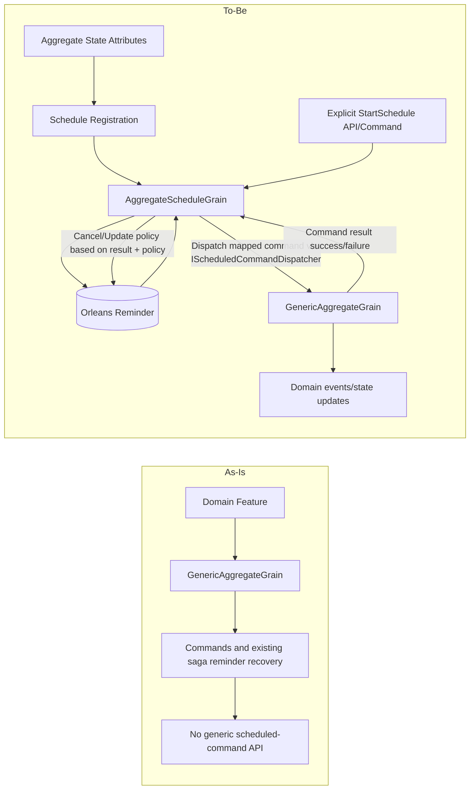

# RFC: Aggregate Scheduled Commands (Phase 1) + Saga Auto-Resume (Phase 2)

> Draft proposal only. Source facts were refreshed against main `c8da151e607bcc8f3b253519317a8e7418d26261` on 4 October 2026. Scheduling types shown here are proposed contracts. They are not implemented or validated by this PR. Recovery requirements remain tracked in [#404](https://github.com/Gibbs-Morris/mississippi/issues/404) and [#581](https://github.com/Gibbs-Morris/mississippi/issues/581).

## Problem Statement

The framework lacks a first-class way for aggregates to schedule future command execution using durable reminders. Teams need this for periodic domain behavior (for example, game world ticks, cooldown expirations, billing cycles) and for reliability patterns like saga resume.

Without a general scheduling primitive, each feature must create custom reminder logic, increasing inconsistency and failure risk.

## Goals

- Provide a general aggregate-level scheduled command feature built on Orleans reminders.
- Deliver an attribute-first developer experience on aggregate state types.
- Support multiple independent reminders per aggregate instance.
- Require explicit schedule start (no auto-start by attribute registration alone).
- Keep scheduled command execution deterministic and idempotent under duplicate/delayed ticks.
- Provide explicit lifecycle control (register, update, cancel) with safe defaults.
- Add observability for schedule lifecycle and runtime outcomes.
- Reuse the phase 1 feature for saga auto-resume in phase 2.
- Preserve architectural rule: persisted state lives in aggregates, while infra execution can be split into separate grains.

## Non-Goals

- Replace command handling with a separate workflow engine.
- Add UI workflows for schedule management.
- Introduce non-Orleans schedulers as the primary reliability mechanism.

## Current State

- Aggregate command execution lives in `src/DomainModeling.Runtime/GenericAggregateGrain.cs`.
- The inspected main already implements saga-specific Orleans reminder recovery. `OrleansSagaReminderRegistry` owns registration/unregistration calls, and `SagaLifecycleEventClassifier` defines recognized recovery boundaries.
- Generic aggregate scheduling attributes, manager, control aggregate and audit aggregate remain unimplemented proposals.
- This alternative design must reconcile with the existing saga reminder owner before adoption. It does not supply missing compensation progress or approve #361's recovery contract.

## Proposed Design

### 1. Aggregate scheduling as a framework capability

Introduce a reusable scheduling subsystem for aggregates:

- schedule commands for a specific aggregate instance using Orleans reminders,
- resolve reminder ticks to command dispatch on the target aggregate grain,
- support register/update/cancel lifecycle,
- keep domain state in aggregate events/state (scheduler grain has infrastructure-only state).

### 2. Developer experience first (attribute-based)

Define attributes on aggregate state type to declare default schedule policy and command bindings.

Proposed shape:

```csharp
[AggregateScheduleDefaults(
  InitialDelaySeconds = 5,
  IntervalSeconds = 60,
  Backoff = ScheduleBackoff.Constant,
  MaxAttempts = 5,
  JitterPercent = 10)]
[ScheduledCommand(typeof(SpawnUnitsTickCommand), Name = "spawn-units", IntervalSeconds = 60)]
[ScheduledCommand(typeof(DecayTickCommand), Name = "decay", IntervalSeconds = 300)]
public sealed record WorldAggregate
{
}
```

Design intent:

- Attributes provide defaults and declarative mapping.
- Runtime API can override per-instance values when needed.
- Multiple `ScheduledCommand` attributes can be applied to one aggregate.
- Attributes never auto-start schedules; start is always explicit via API/command.

### 2.1 Explicit schedule lifecycle API

Provide explicit APIs/commands for lifecycle:

- `StartSchedule` (required to activate)
- `UpdateSchedule`
- `StopSchedule`

Example intent:

- aggregate or application logic decides when to start schedule `spawn-units`.
- startup scanning only registers metadata/bindings, not active reminders.

### 3. Runtime model

Add one scheduler grain per aggregate instance + schedule name key:

- grain key: `<AggregateType>|<AggregateId>|<ScheduleName>`
- reminder callback dispatches mapped command to the target aggregate grain via `IScheduledCommandDispatcher` (explicit dependency, not `IServiceProvider`)
- runtime applies backoff/jitter policy before next schedule update.

This key design enables multiple schedules for one aggregate instance.

**Command dispatch without service locator:** The scheduler grain receives an `IScheduledCommandDispatcher` via constructor injection. This dispatcher knows how to construct the command instance (using the `commandTypeName` string from `ScheduleRegistration` and the tick metadata) and forward it to the target aggregate grain's `ExecuteAsync` method. The dispatcher does not need `IServiceProvider` — it uses a pre-registered mapping of command type names to factory delegates, built during DI/startup scanning from `[ScheduledCommand]` attribute metadata. This satisfies the shared policy against `IServiceProvider` injection.

**Scheduler concurrency:** Local grain serialization is only one part of the contract. Persist a schedule generation and expected checkpoint, reject stale callbacks after stop/update, and validate again at authoritative aggregate command execution. A previously dispatched plan can remain stale even when each grain serializes its own requests.

### 4. Idempotency as a framework rule

Scheduled commands must be idempotent by design because duplicate/delayed ticks are normal.

Proposed enforcement options:

- marker interface documenting an obligation on handlers (for example `IIdempotentScheduledCommandHandler<TCommand, TSnapshot>`), or
- attribute flag validated at registration/build-time. Neither option proves idempotency; durable replay decisions and executable duplicate/out-of-order/unknown-outcome tests are required.

> **Naming convention note:** The second type parameter follows the framework's `TSnapshot` naming (not `TAggregate`). `CommandHandlerBase<TCommand, TSnapshot>` uses `TSnapshot` because the parameter represents the aggregate's projected state/snapshot. Concrete types like `WorldAggregate` are valid `TSnapshot` values.

### 5. Proposed saga adoption prerequisites

Main already has saga-specific reminder recovery. A future generic scheduler would need an explicit ownership transition; adding a second recovery owner by attribute alone is unsafe.

Saga adoption depends on [#404](https://github.com/Gibbs-Morris/mississippi/issues/404) and [#581](https://github.com/Gibbs-Morris/mississippi/issues/581): durable direction and remaining compensation position, authoritative checkpoint/generation validation, workflow drift detection, bounded retries, unknown-effect handling, and the operator authorization/comment/audit contract.

`ContinueSagaCommand` and `SagaResumeRequested` in the sketches refer to separate unmerged [PR #361](https://github.com/Gibbs-Morris/mississippi/pull/361). They are not present in the inspected main and do not establish the broader recovery contract. A phase-only resume decision must be rejected when it cannot establish safe work. A scheduler must not infer that `Failed` means forward execution, or use the last completed forward step as the remaining compensation cursor.

### 6. Storage and eventing model

Recommended architecture:

- Use a system-level scheduler grain (infrastructure concern) to own active reminders.
- Do not persist scheduler business state into domain aggregate streams by default.
- Keep domain business state in domain aggregate events/state.
- Persist operational control state in a proposed `ScheduleControlAggregate` in every mode. It must retain active/disabled state, generation, binding, policy, due identity and progress. Optional `ScheduleAuditAggregate` stores additional historical observations; disabling audit must not disable restart recovery.

Architecture rule:

- If state must be durable, store it in an aggregate event stream.
- It is valid to use different grains for business vs infrastructure concerns:
  - business aggregate grains for domain state and behavior,
  - infrastructure grains for reminder dispatch/execution plumbing.
  - system aggregates for durable infrastructure history/audit.

Event guidance:

- Default: structured logs + metrics for scheduler lifecycle.
- Optional (recommended for audit): write standardized lifecycle events to `ScheduleAuditAggregate` stream:
  - `ScheduleStarted`
  - `ScheduleUpdated`
  - `ScheduleStopped`
  - `TickTriggered`
  - `TickDispatched`
  - `TickFailed`
  - `ScheduleExhausted`

Suggested correlation fields:

- `AggregateType`
- `AggregateId`
- `ScheduleName`
- `CommandType`
- `TickToken`
- `Attempt`
- `DueAtUtc` / `ExecutedAtUtc`
- `ErrorCode` / `ErrorMessage`

### 7. Source generation stance

Use source generation for DX/registration only:

- generate schedule binding metadata and registration glue,
- validate command/aggregate binding at compile-time where possible.
- optionally generate `ScheduleAuditAggregate` contracts/registrations for consistent audit schema.

Do not generate business scheduler aggregates by default; runtime scheduler grain remains shared infrastructure. Audit aggregate generation is optional DX support.

### 8. `ScheduleStartOptions` → `ScheduleRegistration` mapping

`ScheduleStartOptions` is the user-facing API type (simple, optional overrides). `ScheduleRegistration` is the grain-facing type (fully resolved, all fields required). The `IAggregateScheduleManager` implementation merges:

1. **Attribute defaults** from `[AggregateScheduleDefaults]` and `[ScheduledCommand]` on the aggregate type.
2. **User overrides** from `ScheduleStartOptions` (any non-null field wins over attribute defaults).
3. **Framework defaults** for any field not set by attributes or user overrides.

The result is a fully-populated `ScheduleRegistration` passed to the scheduler grain.

| Field | Source priority (highest wins) |
|---|---|
| `InitialDelay` | `ScheduleStartOptions` > `[AggregateScheduleDefaults]` > framework default (5s) |
| `Interval` | `ScheduleStartOptions` > `[ScheduledCommand].IntervalSeconds` > `[AggregateScheduleDefaults].IntervalSeconds` > framework default (60s) |
| `Backoff` | `ScheduleStartOptions` > `[AggregateScheduleDefaults]` > `Constant` |
| `MaxAttempts` | `ScheduleStartOptions` > `[AggregateScheduleDefaults]` > `0` (unlimited) |
| `JitterPercent` | `ScheduleStartOptions` > `[AggregateScheduleDefaults]` > `0` |
| `MaxInterval` | `ScheduleStartOptions` > `[AggregateScheduleDefaults]` > `null` (no cap) |
| `AuditMode` | `ScheduleStartOptions` > `LogOnly` |
| `CommandTypeName` | Resolved from `[ScheduledCommand]` attribute by `scheduleName` match (not overridable) |

## Architecture Diagram (As-Is vs To-Be)


```mermaid
flowchart LR
    subgraph AsIs[As-Is]
      D1[Domain Feature] --> G1[GenericAggregateGrain]
      G1 --> C1[Commands and existing saga reminder recovery]
      C1 --> F1[No generic scheduled-command API]
    end

    subgraph ToBe[To-Be]
      A1[Aggregate State Attributes] --> R1[Schedule Registration]
      R1 --> SG[AggregateScheduleGrain]
      SG --> OR[(Orleans Reminder)]
      OR --> SG
      U1[Explicit StartSchedule API/Command] --> SG
      SG -->|Dispatch mapped command via IScheduledCommandDispatcher| G2[GenericAggregateGrain]
      G2 --> E2[Domain events/state updates]
      G2 -->|Command result success/failure| SG
      SG -->|Cancel/Update policy based on result + policy| OR
    end
```

## Critical Runtime Path Sequence

```mermaid
sequenceDiagram
    participant App as App Startup
    participant Agg as Aggregate Grain
    participant Sched as AggregateScheduleGrain
    participant Rem as Orleans Reminder

    App->>App: DI/startup scanning discovers [ScheduledCommand] attributes (compile-time metadata)
    Note over App,Sched: Attributes are compile-time; scanning registers binding metadata in DI, not on grain instances

    App->>Sched: StartSchedule(scheduleName, aggregateId) via IAggregateScheduleManager
    Sched->>Rem: RegisterOrUpdateReminder

    Rem-->>Sched: Tick
    Sched->>Agg: Execute(scheduled command)
    Agg->>Agg: Handle command idempotently
    alt terminal/disabled
      Agg->>Sched: CancelSchedule
      Sched->>Rem: UnregisterReminder
    else keep running
      Sched->>Rem: Keep or update next cadence
    end
```

## Recovery Requirements and Limits

The proposed scheduler has no passing crash tests yet. The requirements below must be implemented and tested before claiming recovery:

- Persist control state independently of optional audit mode, then reconcile the confirmed active generation with the reminder service after activation.
- Distinguish proven absence from registration/append/lookup timeouts and unknown outcomes. Do not translate every reminder-service exception into permission to register again or discard protection.
- Generate one durable logical tick identity before dispatch and reuse it across retries. Retain sufficient per-schedule deduplication/order state to reject delayed older ticks.
- Stop/update must invalidate old generations at authoritative execution. A dispatched command or queued callback may still arrive after reminder unregistration.
- Preserve an unknown external-effect outcome. Resume only under downstream deduplication/reconciliation policy, otherwise expose intervention. This proposal does not promise exactly-once arbitrary side effects.

### Reconciliation Design Still Required

A proposed `ScheduleControlAggregate` is the durable source of intended active state, independently of audit verbosity. On activation, read its confirmed generation and progress, then inspect the reminder. Re-register only for proven absence of the intended reminder and reconcile conflicts/unknown writes explicitly. A disabled generation rejects stale tick dispatch even if a callback was already queued.

The control-append/reminder-registration ordering, compensation for partial registration, due-time identity, repeated requests, and concurrent stop/update operations need a defined protocol and fault-injection tests. Calling `RegisterOrUpdateReminder` again cannot alone prove that these cross-store boundaries are safe.

## Alternatives Considered

1. Reminder logic directly inside generic aggregate grain — simpler but over-couples scheduling/runtime policy with every aggregate.

2. Orleans timers instead of reminders — not durable enough for crash/restart recovery.

3. Feature-specific scheduler per domain (for example saga-only) — solves one use case but duplicates infrastructure patterns.

4. External workflow orchestrator — higher complexity and additional infrastructure.

5. Auto-start all schedules from attributes — convenient but unsafe; causes unintended background behavior and weakens domain intent.

## Security and Reliability

- No secrets in reminder payloads.
- Scheduled dispatch must validate aggregate identity and command mapping.
- Retry storms mitigated with backoff + optional max attempts.

## Compatibility and Migration

- Backward-compatible defaults with opt-in attribute behavior.
- Existing aggregates are unchanged unless scheduling is configured.
- Sagas adopt the same mechanism in phase 2.
- Audit mode can be adopted independently by enabling `ScheduleAuditAggregate` emission.

## Risks

- Missing idempotency in scheduled command handlers can cause duplicate external side effects.
- Over-abstracting attributes may hide important runtime choices.
- Auto-start semantics can unintentionally activate expensive schedules.
- Excessive logging/noise if every tick emits high-cardinality logs.
- High-volume tick event auditing can increase event storage costs.

## Proposed Choices Pending Approval

- **`MaxAttempts = 0` semantics:** `0` means "unlimited retries" (no cap). A value of `1` means "run once, no retries." This is a proposed convention for general schedules. Saga recovery must select a finite attempt bound under #404; unlimited generic scheduling must not become unlimited recovery retries. Document this in attribute XML docs and validate that negative values are rejected at startup.
- **Concurrency model:** Require non-reentrant local execution plus durable generation/checkpoint checks at the aggregate boundary. Local serialization alone is not stale-request protection.
- **`StopAsync` must unregister the Orleans reminder** via `UnregisterReminder` to prevent resource leaks and storage cost accumulation. It must not merely mark the schedule as "disabled" in grain state.
- **Duplicate schedule name validation:** Multiple `[ScheduledCommand]` attributes on the same aggregate type with the same `Name` must cause a startup validation exception. This is checked during DI/startup scanning. Silent override is not permitted.
- **Audit mode "Log Only":** "Log Only" means emitting structured log entries via `LoggerExtensions` with well-defined EventIds and structured properties (`AggregateType`, `AggregateId`, `ScheduleName`, `CommandType`, `TickToken`, `Attempt`, etc.). It does **not** write to the `ScheduleAuditAggregate`. The specific EventIds and property schema must be defined in the observability section of the implementation plan.
- **Tick identity:** Persist generation and logical tick sequence before dispatch; retries reuse the same identity. The encoding must include stable aggregate identity, entity and schedule components without delimiter collisions. Exact encoding and retention remain open. Callback wall-clock time must not generate a new identity on retry.
- **Aggregate identity:** Resolve the required `[BrookName]` storage identity. Reject missing identities; a CLR type name fallback is unstable across renames and may collide.

## Open Decisions

- Exact idempotency enforcement mechanism (marker interface vs attribute flag).
- Attribute surface: one attribute with nested policy vs separate default + per-command attributes.
- Whether schedule lifecycle milestones should default to logs-only with opt-in events.
- Audit verbosity defaults: lifecycle-only vs full tick history.

## API Shape and Code Samples (Draft)

### 1. Aggregate attributes

```csharp
using Mississippi.DomainModeling.Abstractions;
using Mississippi.Brooks.Abstractions.Attributes;

[BrookName("GAME", "WORLDS", "WORLD")]
[AggregateScheduleDefaults(
  InitialDelaySeconds = 5,
  IntervalSeconds = 60,
  Backoff = ScheduleBackoff.Exponential,
  MaxAttempts = 5,
  JitterPercent = 10,
  MaxIntervalSeconds = 300)]
[ScheduledCommand(typeof(SpawnUnitsTickCommand), Name = "spawn-units", IntervalSeconds = 60)]
[ScheduledCommand(typeof(DecayTickCommand), Name = "decay", IntervalSeconds = 300)]
public sealed record WorldAggregate
{
  public int Units { get; init; }

  public int TickVersion { get; init; }

  public IReadOnlyDictionary<string, ScheduleCheckpoint> Schedules { get; init; }
    = new Dictionary<string, ScheduleCheckpoint>();
}
```

Notes:

- Attributes register metadata only.
- Schedules do not auto-start.
- Multiple `ScheduledCommand` attributes are allowed.

### 2. Runtime schedule API

```csharp
using Mississippi.DomainModeling.Abstractions;

public interface IAggregateScheduleManager
{
  Task StartScheduleAsync<TAggregate>(
    string aggregateId,
    string scheduleName,
    ScheduleStartOptions? options = null,
    CancellationToken cancellationToken = default)
    where TAggregate : class;

  Task UpdateScheduleAsync<TAggregate>(
    string aggregateId,
    string scheduleName,
    ScheduleUpdateOptions options,
    CancellationToken cancellationToken = default)
    where TAggregate : class;

  Task StopScheduleAsync<TAggregate>(
    string aggregateId,
    string scheduleName,
    CancellationToken cancellationToken = default)
    where TAggregate : class;
}
```

### 3. Scheduler grain contract

```csharp
public interface IAggregateScheduleGrain : IGrainWithStringKey
{
  Task StartAsync(ScheduleRegistration registration, CancellationToken cancellationToken = default);

  Task UpdateAsync(ScheduleUpdate update, CancellationToken cancellationToken = default);

  Task StopAsync(CancellationToken cancellationToken = default);
}

// Grain key format: <AggregateType>|<AggregateId>|<ScheduleName>
```

### 4. Scheduled command handler (partial sketch)

This example requires an active generation and contiguous per-schedule logical sequence. A reducer must persist the checkpoint and domain change together, even for zero-unit ticks. The durable generation handshake and out-of-order reconciliation protocol still need implementation and tests. See [code-samples.md](code-samples.md) for these limits.

```csharp
public sealed record ScheduleCheckpoint(
    long Generation,
    bool Active,
    long LastAppliedSequence);

public sealed record SpawnUnitsTickCommand(
    string ScheduleName,
    long Generation,
    long TickSequence,
    DateTimeOffset TickAt,
    string TickToken);

public sealed record UnitsTickApplied(
    string ScheduleName,
    long Generation,
    long TickSequence,
    string TickToken,
    int Count,
    DateTimeOffset TickAt);

public sealed class SpawnUnitsTickCommandHandler
    : CommandHandlerBase<SpawnUnitsTickCommand, WorldAggregate>,
      IIdempotentScheduledCommandHandler<SpawnUnitsTickCommand, WorldAggregate>
{
    protected override OperationResult<IReadOnlyList<object>> HandleCore(
        SpawnUnitsTickCommand command,
        WorldAggregate? state)
    {
        if (state is null ||
            !state.Schedules.TryGetValue(command.ScheduleName, out var checkpoint) ||
            !checkpoint.Active ||
            checkpoint.Generation != command.Generation)
        {
            return OperationResult.Fail<IReadOnlyList<object>>(
                AggregateErrorCodes.InvalidState,
                "The schedule generation is inactive or obsolete.");
        }

        if (command.TickSequence <= checkpoint.LastAppliedSequence)
        {
            return OperationResult.Ok<IReadOnlyList<object>>(Array.Empty<object>());
        }

        if (command.TickSequence != checkpoint.LastAppliedSequence + 1)
        {
            return OperationResult.Fail<IReadOnlyList<object>>(
                AggregateErrorCodes.InvalidCommand,
                "A prior logical tick must be reconciled first.");
        }

        int spawned = (state.TickVersion + command.TickAt.Minute) % 3;
        return OperationResult.Ok<IReadOnlyList<object>>(
        [
            new UnitsTickApplied(
                command.ScheduleName,
                command.Generation,
                command.TickSequence,
                command.TickToken,
                spawned,
                command.TickAt),
        ]);
    }
}
```

### 5. App usage

```csharp
// Explicitly start schedules for one world aggregate instance
await scheduleManager.StartScheduleAsync<WorldAggregate>(
  aggregateId: "world-1",
  scheduleName: "spawn-units",
  options: new ScheduleStartOptions
  {
    InitialDelay = TimeSpan.FromSeconds(10),
  },
  cancellationToken);

await scheduleManager.StartScheduleAsync<WorldAggregate>(
  aggregateId: "world-1",
  scheduleName: "decay",
  cancellationToken: cancellationToken);

// Later
await scheduleManager.StopScheduleAsync<WorldAggregate>(
  aggregateId: "world-1",
  scheduleName: "decay",
  cancellationToken: cancellationToken);
```

### 6. Phase 2 saga usage (example)

```csharp
[AggregateScheduleDefaults(IntervalSeconds = 60, Backoff = ScheduleBackoff.Exponential)]
[ScheduledCommand(typeof(ContinueSagaCommand), Name = "saga-resume", IntervalSeconds = 60)]
public sealed record PaymentSagaState : ISagaState
{
  public Guid SagaId { get; init; }

  public SagaPhase Phase { get; init; }

  public int LastCompletedStepIndex { get; init; }

  public string? CorrelationId { get; init; }

  public DateTimeOffset? StartedAt { get; init; }

  public string? StepHash { get; init; }
}

// on saga start/active transition:
await scheduleManager.StartScheduleAsync<PaymentSagaState>(sagaId.ToString("N"), "saga-resume", cancellationToken: ct);

// on terminal transition:
await scheduleManager.StopScheduleAsync<PaymentSagaState>(sagaId.ToString("N"), "saga-resume", ct);
```
