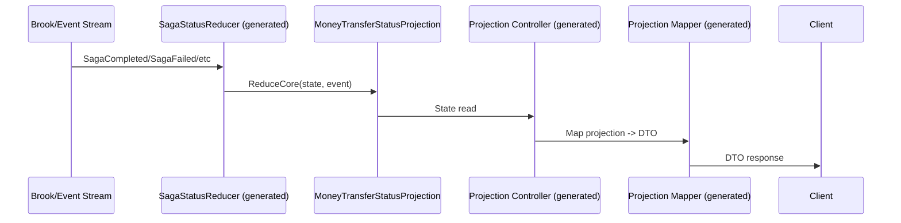

# RFC: Saga source generation alignment

## Problem
Saga DTOs, mappers, and reducers do not follow the same source-generated patterns as aggregates and projections. This can lead to duplicated manual code and inconsistent patterns.

## Requirements (from request)
- `SagaPhaseDto` should be source-generated.
- Research generic attribute support and consider usage for saga endpoint generation.
- Saga reducer patterns that would be duplicated should be source-generated.
- `SagaPhaseDtoMapper` should follow a source-generated pattern.

## Constraints
- Follow existing aggregate/projection generation patterns in this repo.
- Avoid breaking public APIs unless explicitly approved.
- Keep changes minimal and aligned with current generator conventions.

## Goals
- Align saga DTOs, mappers, and reducers with aggregate/projection source generation patterns.
- Generate `SagaPhaseDto` and `SagaPhaseDtoMapper`.
- Evaluate generic attribute support and apply if viable for saga endpoint generation.

## Non-goals
- Refactor unrelated sample code.
- Change runtime behavior beyond generation parity.

## Current state
- `SagaPhaseDto` and `SagaPhaseDtoMapper` are hand-authored in Spring samples:
	- samples/Spring/Spring.Server/Controllers/Projections/SagaPhaseDto.cs
	- samples/Spring/Spring.Server/Controllers/Projections/Mappers/SagaPhaseDtoMapper.cs
	- samples/Spring/Spring.Client/Features/MoneyTransferStatus/Dtos/SagaPhaseDto.cs
- Saga status reducers are hand-authored in Spring projection reducers:
	- samples/Spring/Spring.Domain/Projections/MoneyTransferStatus/Reducers/Saga*StatusReducer.cs
- Projection generator patterns already exist:
	- Server DTO/mapper/controller/registrations: src/Inlet.Server.Generators/ProjectionEndpointsGenerator.cs
	- Client DTO generation: src/Inlet.Client.Generators/ProjectionClientDtoGenerator.cs
	- Silo registration (reducers + snapshots): src/Inlet.Silo.Generators/ProjectionSiloRegistrationGenerator.cs

## Proposed design (initial)
- Add source generator(s) for saga DTOs, saga phase mapping, and standard saga reducers, mirroring aggregate/projection patterns.
- If generic attributes are supported by current target framework, evaluate introducing generic attribute usage for saga endpoint generation, or keep existing attribute shape but document rationale.

## Assumptions
- Existing aggregate/projection generators provide a reusable pattern for saga generation.
- Saga DTOs/mappers can be generated without altering runtime behavior.

## Unknowns
- Where the authoritative aggregate/projection generator patterns live in the repo.
- Whether the current C# language version/tooling enables generic attributes.
- Exact list of saga reducers that should be generated.

## Alternatives
- Keep manual saga DTOs/mappers/reducers.
- Use shared helper libraries instead of source generators.

## As-is vs to-be (architecture)
```mermaid
flowchart TD
	subgraph AS_IS[As-is]
		A1[Domain projection
		MoneyTransferStatusProjection] --> A2[Manual saga status reducers
		(Saga*StatusReducer)]
		A2 --> A3[Projection state]
		A3 --> A4[Server projection endpoint
		generated controller]
		A4 --> A5[Manual SagaPhaseDto
		+ SagaPhaseDtoMapper]
		A5 --> A6[HTTP response DTO]
		A7[Client]
		A6 --> A7
	end

	subgraph TO_BE[To-be]
		B1[Domain projection
		MoneyTransferStatusProjection] --> B2[Generated saga status reducers]
		B2 --> B3[Projection state]
		B3 --> B4[Generated projection endpoint + mapper]
		B4 --> B5[Generated SagaPhaseDto + mapper]
		B5 --> B6[HTTP response DTO]
		B7[Client]
		B6 --> B7
	end
```

## Critical path (sequence)


## Security
- No new external inputs; generators operate on compile-time symbols only.

## Observability
- No runtime changes expected; generated code should match existing behavior.

## Compatibility
- Maintain existing public API surface unless explicitly approved.
- Generated output should be equivalent to current manual code.

## Risks
- Generator changes could impact build output or naming conventions.
- Generic attribute support may be limited by language version or tooling.
