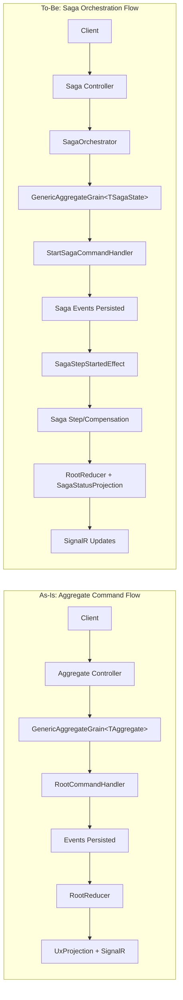

# RFC: Server-Side Saga Orchestration

## Problem

Mississippi lacks first-class server-side saga orchestration for multi-step, long-running transactions across aggregates with built-in compensation and consistent developer experience. Developers must coordinate steps manually and lack standardized observability and tooling.

## Goals

- Provide saga orchestration that reuses existing aggregate infrastructure (sagas are aggregates).
- Enforce immutable record-based state and event-reducer state transitions.
- Use attribute/type-based discovery for steps and compensations; no namespace conventions.
- Generate server, client, and silo boilerplate to match existing aggregate generator patterns.
- Provide real-time saga status updates consistent with current projection patterns.

## Non-Goals

- Introducing parallel/alternative infrastructure that duplicates aggregate patterns.
- Adding non-deterministic behavior or mutable saga state.
- Changing existing aggregate public APIs unless required for saga integration.

## Current State (verified)

- Aggregate endpoints and DTOs are generated using `[GenerateAggregateEndpoints]` and `[GenerateCommand]` with `Commands` namespace discovery in [src/Inlet.Server.Generators/AggregateControllerGenerator.cs](../../src/Inlet.Server.Generators/AggregateControllerGenerator.cs) and [src/Inlet.Server.Generators/CommandServerDtoGenerator.cs](../../src/Inlet.Server.Generators/CommandServerDtoGenerator.cs).
- Aggregate silo registrations are generated by scanning `Handlers`, `Reducers`, and `Effects` namespaces in [src/Inlet.Silo.Generators/AggregateSiloRegistrationGenerator.cs](../../src/Inlet.Silo.Generators/AggregateSiloRegistrationGenerator.cs).
- Aggregate runtime orchestration uses `GenericAggregateGrain<T>` with root command/reducer/effect dispatchers in [src/EventSourcing.Aggregates/GenericAggregateGrain.cs](../../src/EventSourcing.Aggregates/GenericAggregateGrain.cs), [src/EventSourcing.Aggregates/RootCommandHandler.cs](../../src/EventSourcing.Aggregates/RootCommandHandler.cs), and [src/EventSourcing.Aggregates/RootEventEffect.cs](../../src/EventSourcing.Aggregates/RootEventEffect.cs).
- Projections are exposed via `UxProjectionControllerBase` and client SignalR subscriptions in [src/Inlet.Server.Generators/ProjectionEndpointsGenerator.cs](../../src/Inlet.Server.Generators/ProjectionEndpointsGenerator.cs) and [src/Inlet.Client/ActionEffects/InletSignalRActionEffect.cs](../../src/Inlet.Client/ActionEffects/InletSignalRActionEffect.cs).

## Proposed Design (initial)

- Add saga abstractions (state interface, step/compensation base classes, attributes, saga events).
- Add saga runtime (step registry, orchestrator, reducers/effects, DI extensions) in implementation projects.
- Add source generators for server endpoints, client actions/effects/state/reducers, and silo registrations.
- Discovery for steps/compensations uses attributes/types only; never namespace conventions.
- Add a sample saga in samples/Spring to validate end-to-end usage.

## Architecture Diagrams

### As-Is vs To-Be (high level)



### Saga Execution Sequence (critical path)

```mermaid
sequenceDiagram
	participant Client
	participant SagaController
	participant Orchestrator
	participant Grain as GenericAggregateGrain&lt;TSagaState&gt;
	participant RootHandler as RootCommandHandler
	participant RootReducer
	participant StepEffect as SagaStepStartedEffect
	participant Step as SagaStepBase

	Client->>SagaController: POST /api/sagas/{saga}/{sagaId}
	SagaController->>Orchestrator: StartAsync(sagaId, input)
	Orchestrator->>Grain: ExecuteAsync(StartSagaCommand)
	Grain->>RootHandler: Handle(StartSagaCommand)
	RootHandler-->>Grain: SagaStartedEvent + SagaStepStartedEvent
	Grain->>RootReducer: Reduce(events)
	Grain->>StepEffect: Dispatch SagaStepStartedEvent
	StepEffect->>Step: ExecuteAsync(context, state)
	Step-->>StepEffect: StepResult (events or error)
	StepEffect-->>Grain: Persist events / emit failure
	Grain->>RootReducer: Reduce(step events)
```

## Alternatives Considered

- Manual orchestration in application code: rejected due to DX inconsistency and boilerplate.
- Namespace-based discovery: rejected by requirement.

## Security

- Follow existing authz/authn patterns for controllers; do not introduce new security surfaces without reuse.
- Ensure saga orchestration does not log sensitive data (PII/secrets).

## Observability

- Use LoggerExtensions for saga orchestration steps, failures, compensation transitions.
- Reuse projection update mechanisms for status.

## Compatibility / Migrations

- Additive changes only; avoid breaking existing aggregate APIs.
- New abstractions in *.Abstractions projects with implementation in main projects.

## Risks

- Generator divergence from aggregate patterns could increase maintenance.
- Incorrect step discovery or step hash drift detection could cause runtime failures.
- Saga status projections might not align with existing SignalR usage patterns.

## Open Questions

- How saga input is stored and made available to steps (event vs context).
- How saga status projections are keyed for SignalR subscriptions.
- Whether saga effects are auto-registered or opt-in.