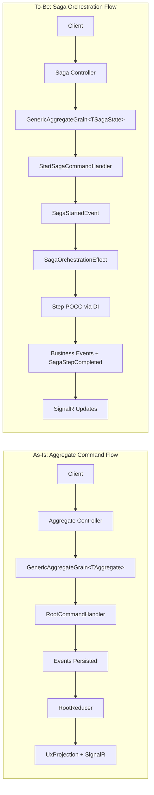

# RFC: Server-Side Saga Orchestration

> **Status:** Updated - This RFC is the authoritative design reference.

## Problem

Mississippi lacks first-class server-side saga orchestration for multi-step, long-running transactions across aggregates with built-in compensation and consistent developer experience. Developers must coordinate steps manually and lack standardized observability and tooling.

## Goals

- Provide saga orchestration that reuses existing aggregate infrastructure (sagas are aggregates).
- Enforce immutable record-based state and event-reducer state transitions.
- Use attribute/type-based discovery for steps; no namespace conventions.
- Generate server, client, and silo boilerplate to match existing aggregate generator patterns.
- Provide real-time saga status updates consistent with current projection patterns.
- **Minimal boilerplate** - Steps are POCOs with attributes, not framework base classes.
- **Simple compensation** - Compensation is an optional method on the step class.

## Non-Goals

- Introducing parallel/alternative infrastructure that duplicates aggregate patterns.
- Adding non-deterministic behavior or mutable saga state.
- Changing existing aggregate public APIs unless required for saga integration.
- Storing system data in saga state (query aggregates/projections instead).

## Current State (verified)

- Aggregate endpoints and DTOs are generated using `[GenerateAggregateEndpoints]` and `[GenerateCommand]` with `Commands` namespace discovery in [src/Inlet.Server.Generators/AggregateControllerGenerator.cs](../../src/Inlet.Server.Generators/AggregateControllerGenerator.cs) and [src/Inlet.Server.Generators/CommandServerDtoGenerator.cs](../../src/Inlet.Server.Generators/CommandServerDtoGenerator.cs).
- Aggregate silo registrations are generated by scanning `Handlers`, `Reducers`, and `Effects` namespaces in [src/Inlet.Silo.Generators/AggregateSiloRegistrationGenerator.cs](../../src/Inlet.Silo.Generators/AggregateSiloRegistrationGenerator.cs).
- Aggregate runtime orchestration uses `GenericAggregateGrain<T>` with root command/reducer/effect dispatchers in [src/EventSourcing.Aggregates/GenericAggregateGrain.cs](../../src/EventSourcing.Aggregates/GenericAggregateGrain.cs), [src/EventSourcing.Aggregates/RootCommandHandler.cs](../../src/EventSourcing.Aggregates/RootCommandHandler.cs), and [src/EventSourcing.Aggregates/RootEventEffect.cs](../../src/EventSourcing.Aggregates/RootEventEffect.cs).
- Projections are exposed via `UxProjectionControllerBase` and client SignalR subscriptions in [src/Inlet.Server.Generators/ProjectionEndpointsGenerator.cs](../../src/Inlet.Server.Generators/ProjectionEndpointsGenerator.cs) and [src/Inlet.Client/ActionEffects/InletSignalRActionEffect.cs](../../src/Inlet.Client/ActionEffects/InletSignalRActionEffect.cs).

## Proposed Design (Revised)

Key decisions:

| Decision | Choice |
|----------|--------|
| Step implementation | POCO with `[SagaStep]` attribute implementing `ISagaStep<TSaga>` |
| Compensation | Optional `ICompensatable<TSaga>` interface on step class |
| Orchestration | Single `SagaOrchestrationEffect<TSaga>` handles all step execution |
| Data passing | IDs only + transient external data; query aggregates for system data |
| State interface | `ISagaState` with properties only, no Apply methods |
| Infrastructure events | `SagaStartedEvent`, `SagaStepCompleted`, `SagaStepFailed`, `SagaCompensating`, `SagaStepCompensated`, `SagaCompleted`, `SagaCompensated`, `SagaFailed` |

### Core Pattern

```csharp
// Step is a POCO - testable, DI-friendly
[SagaStep(Order = 1, Saga = typeof(TransferFundsSagaState))]
public sealed class DebitSourceStep : ISagaStep<TransferFundsSagaState>, ICompensatable<TransferFundsSagaState>
{
    public DebitSourceStep(IAggregateGrainFactory grainFactory) { ... }
    
    public async Task<StepResult> ExecuteAsync(TransferFundsSagaState state, CancellationToken ct)
    {
        // Business logic...
        return StepResult.Succeeded(new SourceDebited { Amount = state.Amount });
    }
    
    public async Task<CompensationResult> CompensateAsync(TransferFundsSagaState state, CancellationToken ct)
    {
        // Undo logic...
        return CompensationResult.Succeeded();
    }
}
```

## Architecture Diagrams

### As-Is vs To-Be (high level)



### Saga Execution Sequence (Revised)

```mermaid
sequenceDiagram
	participant Client
	participant Controller as SagaController
	participant Grain as GenericAggregateGrain&lt;TSagaState&gt;
	participant Handler as StartSagaCommandHandler
	participant Reducer as RootReducer
	participant Effect as SagaOrchestrationEffect
	participant Step as Step POCO (DI)

	Client->>Controller: POST /api/sagas/{saga}/{sagaId}
	Controller->>Grain: ExecuteAsync(StartSagaCommand)
	Grain->>Handler: Handle(StartSagaCommand)
	Handler-->>Grain: SagaStartedEvent
	Grain->>Reducer: Reduce(SagaStartedEvent)
	Note over Reducer: Phase = Running
	Grain->>Effect: Handle SagaStartedEvent
	Effect->>Step: Resolve Step0 from DI
	Effect->>Step: ExecuteAsync(state, ct)
	Step-->>Effect: StepResult([events])
	Effect-->>Grain: Yield [events, SagaStepCompleted(0)]
	Grain->>Reducer: Reduce(events)
	Grain->>Effect: Handle SagaStepCompleted(0)
	Note over Effect: Repeat for next step...
```

## Alternatives Considered

- Manual orchestration in application code: rejected due to DX inconsistency and boilerplate.
- Namespace-based discovery: rejected by requirement.
- Separate compensation classes: rejected in favor of `ICompensatable` interface on step (simpler DX).
- Complex effect chain: rejected in favor of single `SagaOrchestrationEffect` (easier to understand).

## Security

- Follow existing authz/authn patterns for controllers; do not introduce new security surfaces without reuse.
- Ensure saga orchestration does not log sensitive data (PII/secrets).

## Observability

- Use LoggerExtensions for saga orchestration steps, failures, compensation transitions.
- Reuse projection update mechanisms for status.

## Compatibility / Migrations

- Additive changes only; avoid breaking existing aggregate APIs.
- New abstractions in *.Abstractions projects with implementation in main projects.

## Risks

- Generator divergence from aggregate patterns could increase maintenance.
- Incorrect step discovery or step hash drift detection could cause runtime failures.
- Saga status projections might not align with existing SignalR usage patterns.

## Resolved Questions

| Question | Decision |
|----------|----------|
| How saga input is stored | In saga state via `SagaStartedEvent` → reducer |
| Data passing between steps | IDs only + transient external; query aggregates for system data |
| Compensation model | `ICompensatable<TSaga>` interface on step class |
| Step orchestration | Single `SagaOrchestrationEffect<TSaga>` handles all steps |
| ISagaState Apply methods | Removed - pure events → reducers |
| Saga status projection key | `saga/{sagaTypeName}/{sagaId}` |