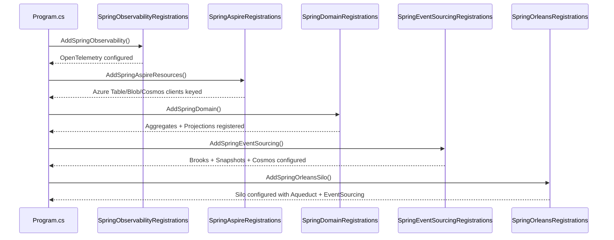
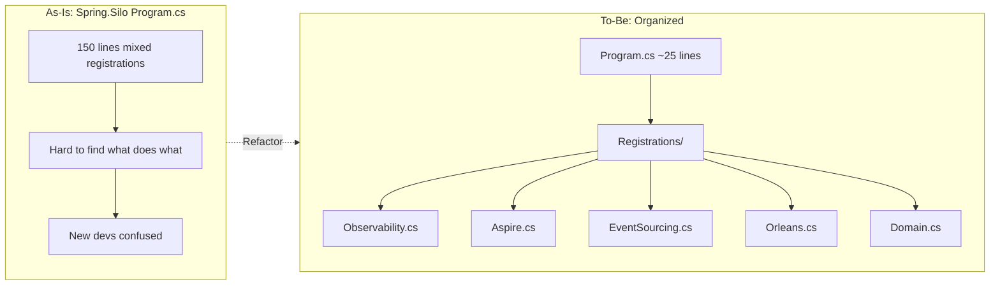

# RFC: Spring Registration Cleanup

## Problem Statement

The `Program.cs` files in `Spring.Silo` and `Spring.Server` are difficult for new developers to understand because:

1. **Mixed concerns** – OpenTelemetry, Aspire wiring, Orleans, domain, and infrastructure registrations are interleaved
2. **No logical grouping** – 150+ lines with flat structure, hard to navigate
3. **Verbose inline configuration** – Lambda expressions and options configuration inline with other registrations
4. **Hidden relationships** – Keyed service forwarding obscures which Mississippi features need which Azure resources

## Goals

1. Group related registrations into cohesive extension method classes
2. Make `Program.cs` read like a high-level recipe: "what" not "how"
3. Keep detailed configuration in purpose-built methods adjacent to their callers
4. Enable new developers to understand the architecture in minutes, not hours

## Non-Goals

1. Changing framework code (only sample refactoring)
2. Changing behavior or adding features
3. Changing generated code output

## Current State

### Spring.Silo Program.cs (~154 lines)

```
WebApplicationBuilder builder = ...
builder.Services.AddHttpClient();
builder.Services.AddSingleton<INotificationService, ...>();
builder.Services.AddBankAccountAggregate();
builder.Services.AddTransactionInvestigationQueueAggregate();
builder.Services.AddBankAccountBalanceProjection();
builder.Services.AddBankAccountLedgerProjection();
builder.Services.AddFlaggedTransactionsProjection();
builder.Services.AddOpenTelemetry()...  // 20 lines of meters
builder.AddKeyedAzureTableServiceClient("clustering");
builder.AddKeyedAzureBlobServiceClient("grainstate");
builder.AddAzureCosmosClient(...);  // with options
builder.AddKeyedAzureBlobServiceClient("blobs");
builder.Services.AddKeyedSingleton(...);  // forwarding
builder.Services.AddKeyedSingleton(...);  // forwarding
builder.Services.AddInletSilo();
builder.Services.ScanProjectionAssemblies(...);
builder.Services.AddJsonSerialization();
builder.Services.AddEventSourcingByService();
builder.Services.AddSnapshotCaching();
builder.Services.AddCosmosBrookStorageProvider(...);  // options
builder.Services.AddCosmosSnapshotStorageProvider(...);  // options
builder.UseOrleans(...);  // complex silo config
```

### Spring.Server Program.cs (~112 lines)

Similar pattern with OpenTelemetry, Orleans client, controllers, OpenAPI, SignalR, Inlet, mappers.

## Proposed Design

### Architecture: Registration Extension Classes

Create focused registration classes in each project that encapsulate related concerns:

```
Spring.Silo/
  Registrations/
    SpringObservabilityRegistrations.cs   -- OpenTelemetry
    SpringAspireRegistrations.cs          -- Aspire Azure wiring
    SpringEventSourcingRegistrations.cs   -- Brooks + Snapshots + Cosmos
    SpringOrleansRegistrations.cs         -- Orleans silo configuration
    SpringDomainRegistrations.cs          -- Aggregate/Projection scanning
  Program.cs                              -- Clean, high-level recipe

Spring.Server/
  Registrations/
    SpringServerObservabilityRegistrations.cs  -- OpenTelemetry (lighter)
    SpringServerOrleansRegistrations.cs        -- Orleans client
    SpringServerApiRegistrations.cs            -- Controllers + OpenAPI
    SpringServerRealtimeRegistrations.cs       -- SignalR + Aqueduct + Inlet
  Program.cs                                   -- Clean, high-level recipe
```

### Target Program.cs (Spring.Silo)

```csharp
WebApplicationBuilder builder = WebApplication.CreateBuilder(args);

// Observability
builder.AddSpringObservability();

// Aspire-managed Azure resources
builder.AddSpringAspireResources();

// Domain (aggregates + projections)
builder.Services.AddSpringDomain();

// Event sourcing infrastructure (Brooks + Snapshots + Cosmos)
builder.Services.AddSpringEventSourcing();

// Orleans silo
builder.AddSpringOrleansSilo();

WebApplication app = builder.Build();
app.MapSpringHealthCheck();
await app.RunAsync();
```

### Target Program.cs (Spring.Server)

```csharp
WebApplicationBuilder builder = WebApplication.CreateBuilder(args);

// Observability
builder.AddSpringServerObservability();

// Orleans client
builder.AddSpringOrleansClient();

// API (controllers + OpenAPI)
builder.Services.AddSpringApi();

// Real-time (SignalR + Aqueduct + Inlet)
builder.Services.AddSpringRealtime();

WebApplication app = builder.Build();
app.UseSpringMiddleware();
app.MapSpringEndpoints();
await app.RunAsync();
```

### Extension Method Pattern

Each registration class follows the framework pattern:

```csharp
namespace Spring.Silo.Registrations;

internal static class SpringObservabilityRegistrations
{
    public static WebApplicationBuilder AddSpringObservability(
        this WebApplicationBuilder builder)
    {
        builder.Services.AddOpenTelemetry()
            .WithTracing(...)
            .WithMetrics(...)
            .WithLogging()
            .UseOtlpExporter();
        return builder;
    }
}
```

## Sequence Diagram: Silo Startup



## As-Is vs To-Be



## Alternatives Considered

### Option A: Comments Only

Add section comments to existing Program.cs. Rejected because:
- Doesn't reduce file size
- Comments can drift from code
- User explicitly asked for extension method pattern

### Option B: Single Registration Class

One `SpringRegistrations.cs` with all methods. Rejected because:
- Still groups unrelated concerns
- Large file problem shifts rather than resolves

## Security Considerations

None – sample code only, no auth/secrets changes.

## Observability Changes

None – existing OpenTelemetry configuration preserved, just moved.

## Compatibility

No breaking changes – internal sample refactoring only.

## Risks and Mitigations

| Risk | Mitigation |
|------|------------|
| Generated code namespace collision | Registration classes use different namespace (`Registrations`) |
| Missed dependency | Build will fail immediately if something forgotten |
| Over-abstraction | Keep methods focused; avoid options objects unless needed |
