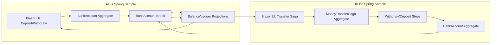
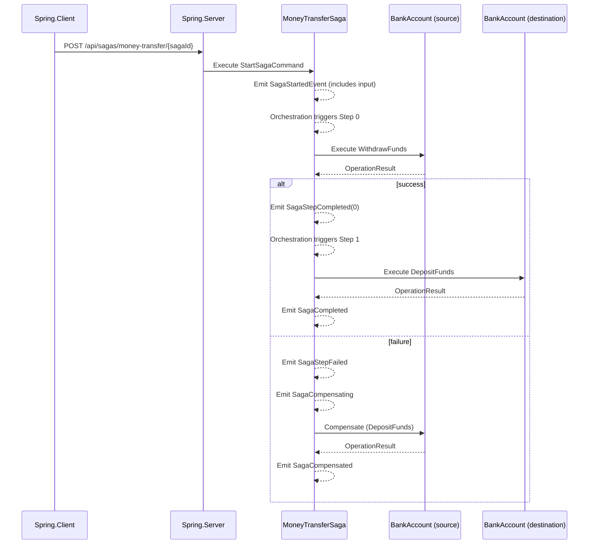

# Implementation Plan

## Summary

Implement a Spring sample saga that transfers money between bank accounts, surface it in the UI, and close coverage gaps to reach 100% unit test coverage across src. This likely requires a saga input persistence enhancement in src so steps can access the transfer input.

## Changes From Initial Draft

- Added explicit framework change to persist saga input via a dedicated input event.
- Updated saga input to use a command type with [GenerateCommand] to mirror aggregate generation patterns.
- Added requirement to update instruction docs when Spring sample patterns change.

## Detailed Plan

### 1) Framework: Persist Saga Input (src)

- Add a new saga infrastructure event (e.g., `SagaInputProvided<TInput>`) to carry the input payload.
- Update StartSagaCommandHandler to emit the input event alongside SagaStartedEvent.
- Add a saga reducer to set `Input` on saga state when the property exists and is assignable to `TInput`.
- Add `TrySetProperty` on SagaStatePropertyMap to avoid throwing when optional input fields are not defined.
- Add/extend L0 tests in tests/EventSourcing.Sagas.L0Tests to cover:
	- StartSagaCommandHandler emits the input event
	- Input reducer sets Input on saga state when present
	- Input reducer remains safe when saga state lacks Input

### 2) Spring.Domain: Money Transfer Saga Types

- Add a new saga state record under samples/Spring/Spring.Domain (e.g., Aggregates/MoneyTransferSaga/):
	- Implement ISagaState and include an `Input` property of a new command type (e.g., StartMoneyTransferCommand).
	- Apply `[GenerateSagaEndpoints(InputType = typeof(StartMoneyTransferCommand))]`, `[BrookName]`, `[SnapshotStorageName]`, `[GenerateSerializer]`, `[Alias]`.
- Define StartMoneyTransferCommand under the saga aggregate and mark with `[GenerateCommand]` to mirror aggregate command generation patterns.
- Implement saga steps with `[SagaStep]` attributes:
	- Step 0: Withdraw from source account (ICompensatable to deposit back on compensation failure in later steps).
	- Step 1: Deposit to destination account.
- Steps should use IAggregateGrainFactory and IGenericAggregateGrain<BankAccountAggregate> to execute WithdrawFunds and DepositFunds commands.
- Steps should return StepResult.Succeeded/Failed based on OperationResult.

### 3) Spring.Silo and Spring.Server Wiring

- Add generated saga registration call in Spring.Silo Program.cs (e.g., AddMoneyTransferSaga()) alongside existing aggregate registrations.
- Ensure Spring.Server loads saga controller output by referencing Spring.Domain (already) and controllers (already); no extra manual controllers unless required.

### 4) Spring.Client UI and Feature Registration

- Add saga feature registration in Spring.Client Program.cs (AddMoneyTransferSagaFeature).
- Add a new UI section on Index page for transfer:
	- Input fields: destination account ID and amount (source is current selected entity ID).
	- Dispatch generated Start{Saga}SagaAction.
	- Display saga state (phase, last completed step, error message if available).
- Update selectors/state usage to read saga state from Reservoir (use generated saga state/selectors or feature state as produced by generator).

### 5) Tests and Coverage

- Add Spring.Domain.L0Tests for:
	- MoneyTransfer saga step success paths
	- Compensation path when deposit fails
	- Input validation (negative amount, same account, etc.) if applicable
- Add tests in src/test projects to fully cover new saga framework changes.
- Run coverage scripts for affected src projects to ensure 100% coverage for new src changes:
	- Use eng/src/agent-scripts/test-project-quality.ps1 with -SkipMutation during iteration.

### 6) Quality Gates

- Run `pwsh ./clean-up.ps1` after code changes.
- Run `pwsh ./eng/src/agent-scripts/build-sample-solution.ps1` and `build-mississippi-solution.ps1`.
- Run unit tests per instructions (unit-test-mississippi-solution.ps1 and unit-test-sample-solution.ps1).
- Run mutation tests for Mississippi solution if src changes require it.

## Touch List (Expected)

- src/EventSourcing.Sagas.Abstractions/SagaStartedEvent.cs
- src/EventSourcing.Sagas/StartSagaCommandHandler.cs
- src/EventSourcing.Sagas/SagaStartedReducer.cs
- src/EventSourcing.Sagas/SagaStatePropertyMap.cs
- tests/EventSourcing.Sagas.L0Tests/*
- samples/Spring/Spring.Domain/Aggregates/MoneyTransferSaga/*
- samples/Spring/Spring.Silo/Program.cs
- samples/Spring/Spring.Server/Program.cs (if needed)
- samples/Spring/Spring.Client/Program.cs
- samples/Spring/Spring.Client/Pages/Index.razor(.cs)
- samples/Spring/Spring.Domain.L0Tests/*
- .github/instructions/mississippi-framework.instructions.md (update patterns if new saga usage is introduced)

## Rollout / Backout

- Rollout is additive; if issues arise, remove saga registrations and sample UI.
- Backout by reverting saga input changes and sample saga types.

## Validation / Monitoring

- Verify saga logs in Silo for step execution and compensation.
- Confirm client UI reflects saga phase changes via generated state.

## Diagrams

### As-Is vs To-Be Flow (Sample)

### Critical Path Sequence (Saga Transfer)

