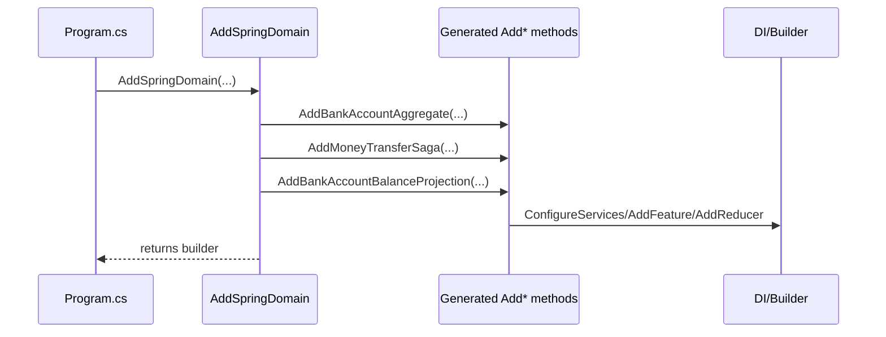

# RFC: Spring Sample Registrations

## Problem
Spring samples should expose a single registration entrypoint per SDK type so consumers do not need
to manually enumerate or understand Inlet-generated registrations.

## Goals
- Provide Spring sample registration entrypoints for client/server/silo SDK types.
- Hide registration details behind a single AddSpringDomain-style method per SDK type.
- Ensure registrations include everything required by Inlet source generation.
- Mark registration classes with the pending source gen attribute.
- Keep the pattern scalable across additional sample domains.

## Non-Goals
- Change runtime behavior beyond registration wiring.
- Introduce new public feature sets outside Spring samples.

## Current State
Spring registration logic lives in Program files and manually lists generated methods for aggregates,
sagas, projections, and mappers across client/server/silo. No AddSpringDomain-style entrypoints exist.
Evidence: samples/Spring/Spring.Client/Program.cs, samples/Spring/Spring.Server/Program.cs,
samples/Spring/Spring.Silo/Program.cs.

## Proposed Design
UNVERIFIED: Add three registration classes (client/server/silo) in Spring sample domain projects.
Each class exposes an AddSpringDomain extension method for its SDK type and is tagged with the
pending source gen attribute so downstream generators can discover and compose registrations.

## As-Is vs To-Be

```mermaid
flowchart LR
	subgraph AsIs[As-Is]
		ClientProgram[Spring.Client Program] --> ClientManual[Manual Add*Feature calls]
		ServerProgram[Spring.Server Program] --> ServerManual[Manual Add*Mapper calls]
		SiloProgram[Spring.Silo Program] --> SiloManual[Manual Add*Aggregate/Projection/Saga calls]
	end
	subgraph ToBe[To-Be]
		ClientProgram2[Spring.Client Program] --> ClientDomain[AddSpringDomain (client)]
		ServerProgram2[Spring.Server Program] --> ServerDomain[AddSpringDomain (server)]
		SiloProgram2[Spring.Silo Program] --> SiloDomain[AddSpringDomain (silo)]
		ClientDomain --> ClientGenerated[Generated Add*Feature + AddProjectionsFeature]
		ServerDomain --> ServerGenerated[Generated Add*AggregateMappers + Add*ProjectionMappers]
		SiloDomain --> SiloGenerated[Generated Add*Aggregate/Projection/Saga]
	end
```

## Runtime Registration Sequence



## Open Decisions
- Confirm whether PendingSourceGenerator can be used in Spring samples despite guidance that it is
  reserved for generator validation only.

## Alternatives
- Keep manual registration in sample startup code (rejected: not scalable).
- Create one monolithic registration type for all SDKs (rejected: unclear separation by SDK type).

## Security
No new authn/authz changes expected.

## Observability
No new logging/metrics required beyond existing registrations.

## Compatibility
Sample-only; no breaking changes to Mississippi framework APIs expected.

## Risks
- Missing a generated registration could lead to runtime failures.
- Source generator attribute usage may differ between SDKs.
- PendingSourceGenerator is documented as a validation aid, not a pattern for new development; tagging
	Spring registrations may conflict with instructions and needs explicit confirmation.
