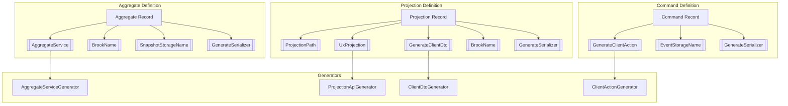

# Attribute Catalog

## Overview

This document catalogs all Mississippi framework attributes related to aggregates
and projections, analyzing their purpose, responsibility, and usage patterns.

## Attribute Inventory

### 1. AggregateServiceAttribute

**Namespace:** `Mississippi.EventSourcing.Aggregates.Abstractions`

**Purpose:** Marks an aggregate type for source generation of services and HTTP APIs.

**Properties:**

| Property | Type | Default | Description |
| -------- | ---- | ------- | ----------- |
| `Route` | `string` | Required | HTTP route segment (e.g., `"users"`) |
| `GenerateApi` | `bool` | `true` | Whether to generate HTTP controller |
| `Authorize` | `string?` | `null` | Authorization policy name for controller |

**Generator Output:**

- `I{Name}Service` — interface with typed method per command
- `{Name}Service` — implementation wrapping `IGenericAggregateGrain<T>`
- `{Name}Controller` — ASP.NET controller (if `GenerateApi=true`)

**Usage Example:**

```csharp
[AggregateService("users")]
[BrookName("CASCADE", "CHAT", "USER")]
[GenerateSerializer]
public sealed record UserAggregate { ... }
```

**Responsibility Analysis:**

✅ Single responsibility — marks aggregate for service generation
✅ Separation of concerns — API generation is opt-out via `GenerateApi`
⚠️ Minor concern — combines route and auth policy in one attribute

### 2. UxProjectionAttribute

**Namespace:** `Mississippi.EventSourcing.UxProjections.Abstractions.Attributes`

**Purpose:** Marks a record as a UX projection exposed via HTTP/SignalR.

**Properties:**

| Property | Type | Default | Description |
| -------- | ---- | ------- | ----------- |
| `Authorize` | `string?` | `null` | Authorization policy name |
| `IsBatchEnabled` | `bool` | `true` | Enable batch fetch endpoint |
| `Tags` | `string[]?` | `null` | OpenAPI grouping tags |

**Generator Output:**

- `{Name}Dto` — DTO record without Orleans attributes
- `{Name}MappingExtensions.ToDto()` — mapper from projection to DTO
- `{Name}Controller` — ASP.NET controller for projection data

**Relationship:**

- **Requires:** `[ProjectionPath]` for routing
- **Optional:** `[BrookName]` for event stream binding

**Usage Example:**

```csharp
[ProjectionPath("cascade/channels")]
[UxProjection]
[BrookName("CASCADE", "CHAT", "CHANNEL")]
[GenerateSerializer]
public sealed record ChannelMessagesProjection { ... }
```

**Responsibility Analysis:**

✅ Single responsibility — marks projection for API generation
⚠️ Coupling — depends on `[ProjectionPath]` for route information

### 3. ProjectionPathAttribute

**Namespace:** `Mississippi.Inlet.Projection.Abstractions`

**Purpose:** Provides unified path-based addressing for projections across server
and client layers.

**Properties:**

| Property | Type | Default | Description |
| -------- | ---- | ------- | ----------- |
| `Path` | `string` | Required | Base path (e.g., `"cascade/channels"`) |

**Usage Contexts:**

1. **Server-side projections** — defines HTTP route and SignalR subscription path
2. **Client-side DTOs** — enables projection discovery via `IProjectionDtoRegistry`
3. **Contracts** — allows WASM client to register DTOs by path

**Responsibility Analysis:**

✅ Single responsibility — defines projection addressing
✅ Shared across layers — same attribute works server and client side
✅ Orleans-free — lives in `Inlet.Projection.Abstractions` (no Orleans deps)

### 4. BrookNameAttribute

**Namespace:** `Mississippi.EventSourcing.Brooks.Abstractions.Attributes`

**Purpose:** Specifies the hierarchical naming convention for an event stream (brook).

**Properties:**

| Property | Type | Default | Description |
| -------- | ---- | ------- | ----------- |
| `AppName` | `string` | Required | Application component (uppercase) |
| `ModuleName` | `string` | Required | Module component (uppercase) |
| `Name` | `string` | Required | Specific name (uppercase) |

**Computed Property:**

- `BrookName` → `{AppName}.{ModuleName}.{Name}` (e.g., `CASCADE.CHAT.USER`)

**Usage Contexts:**

1. **Aggregates** — identifies which brook to write events to
2. **Projections** — identifies which brook(s) to subscribe to for updates

**Responsibility Analysis:**

✅ Single responsibility — defines event stream identity
✅ Validation built-in — enforces uppercase alphanumeric format

### 5. EventStorageNameAttribute

**Namespace:** `Mississippi.EventSourcing.Brooks.Abstractions.Attributes`

**Purpose:** Provides stable string identity for event types that survives refactoring.

**Properties:**

| Property | Type | Default | Description |
| -------- | ---- | ------- | ----------- |
| `AppName` | `string` | Required | Application component |
| `ModuleName` | `string` | Required | Module component |
| `Name` | `string` | Required | Event name |
| `Version` | `int` | `1` | Schema version |

**Computed Property:**

- `StorageName` → `{AppName}.{ModuleName}.{Name}.V{Version}`

**Responsibility Analysis:**

✅ Single responsibility — defines event storage identity
✅ Versioning support — enables event schema evolution

### 6. SnapshotStorageNameAttribute

**Namespace:** `Mississippi.EventSourcing.Brooks.Abstractions.Attributes`

**Purpose:** Provides stable string identity for snapshot types.

**Properties:**

| Property | Type | Default | Description |
| -------- | ---- | ------- | ----------- |
| `AppName` | `string` | Required | Application component |
| `ModuleName` | `string` | Required | Module component |
| `Name` | `string` | Required | Snapshot name |
| `Version` | `int` | `1` | Schema version |

**Computed Property:**

- `StorageName` → `{AppName}.{ModuleName}.{Name}.V{Version}`

**Responsibility Analysis:**

✅ Single responsibility — defines snapshot storage identity
✅ Versioning support — enables snapshot schema evolution

## Attribute Layering

```text
┌─────────────────────────────────────────────────────────────────────────┐
│ Layer 1: Orleans-Free (WASM-safe)                                       │
│ ├── [ProjectionPath] — Inlet.Projection.Abstractions                    │
└─────────────────────────────────────────────────────────────────────────┘
                                    │
                                    ▼
┌─────────────────────────────────────────────────────────────────────────┐
│ Layer 2: Storage Identity (server-side, no Orleans grain deps)          │
│ ├── [BrookName] — Brooks.Abstractions                                   │
│ ├── [EventStorageName] — Brooks.Abstractions                            │
│ └── [SnapshotStorageName] — Brooks.Abstractions                         │
└─────────────────────────────────────────────────────────────────────────┘
                                    │
                                    ▼
┌─────────────────────────────────────────────────────────────────────────┐
│ Layer 3: Generator Triggers (server-side, may ref Orleans)              │
│ ├── [AggregateService] — Aggregates.Abstractions                        │
│ └── [UxProjection] — UxProjections.Abstractions                         │
└─────────────────────────────────────────────────────────────────────────┘
                                    │
                                    ▼
┌─────────────────────────────────────────────────────────────────────────┐
│ Layer 4: Orleans Serialization (Orleans-dependent)                      │
│ ├── [GenerateSerializer] — Orleans.Core                                 │
│ └── [Id(n)] — Orleans.Serialization                                     │
└─────────────────────────────────────────────────────────────────────────┘
```

## Single-Responsibility Assessment

| Attribute | Responsibility | Concerns | Verdict |
| --------- | -------------- | -------- | ------- |
| `[AggregateService]` | Service + API generation | Route + auth mixed | ✅ OK |
| `[UxProjection]` | Projection API generation | Depends on `[ProjectionPath]` | ✅ OK |
| `[ProjectionPath]` | Projection addressing | None | ✅ OK |
| `[BrookName]` | Event stream identity | None | ✅ OK |
| `[EventStorageName]` | Event storage identity | None | ✅ OK |
| `[SnapshotStorageName]` | Snapshot storage identity | None | ✅ OK |

## Proposed New Attributes

### GenerateClientActionAttribute (Proposed)

**Purpose:** Opt-in marker on commands to generate client-side Reservoir actions.

**Namespace:** `Mississippi.EventSourcing.Aggregates.Abstractions` (proposed)

**Properties:**

| Property | Type | Default | Description |
| -------- | ---- | ------- | ----------- |
| `ActionName` | `string?` | `null` | Override action name (default: command name) |

**Generator Output:**

- `{CommandName}Action` — Reservoir action record
- `{CommandName}Effect` — effect that dispatches HTTP call
- `{CommandName}SuccessAction` / `{CommandName}FailureAction` — result actions

**Usage Example:**

```csharp
[GenerateClientAction]
public sealed record CreateChannel
{
    public required string ChannelId { get; init; }
    public required string Name { get; init; }
    public required string CreatedBy { get; init; }
}
```

**Generated Output:**

```csharp
// In Cascade.Client.Generated or Cascade.Contracts.Generated:
public sealed record CreateChannelAction(string EntityId, CreateChannelRequest Request);
public sealed record CreateChannelSuccessAction(string EntityId);
public sealed record CreateChannelFailureAction(string EntityId, string ErrorCode, string ErrorMessage);
```

### GenerateClientDtoAttribute (Proposed)

**Purpose:** Opt-in marker to generate Orleans-free DTO for client consumption.

**Namespace:** `Mississippi.Inlet.Projection.Abstractions` (proposed)

**Properties:**

| Property | Type | Default | Description |
| -------- | ---- | ------- | ----------- |
| `DtoName` | `string?` | `null` | Override DTO name (default: `{Name}Dto`) |

**Usage Example:**

```csharp
[ProjectionPath("cascade/channels")]
[UxProjection]
[GenerateClientDto]  // <-- NEW
[BrookName("CASCADE", "CHAT", "CHANNEL")]
[GenerateSerializer]
public sealed record ChannelMessagesProjection { ... }
```

## Attribute Relationship Diagram



## Recommendations

1. **Keep existing attributes** — they follow SRP well
2. **Add `[GenerateClientAction]`** — opt-in for command actions
3. **Add `[GenerateClientDto]`** — opt-in for projection DTOs
4. **Keep `[ProjectionPath]` in Layer 1** — it's the key for cross-layer addressing
5. **Create new generators** — don't overload existing ones
