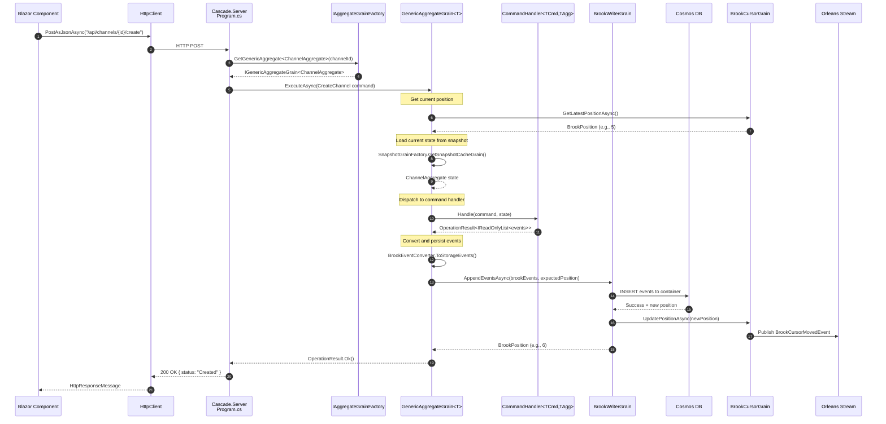
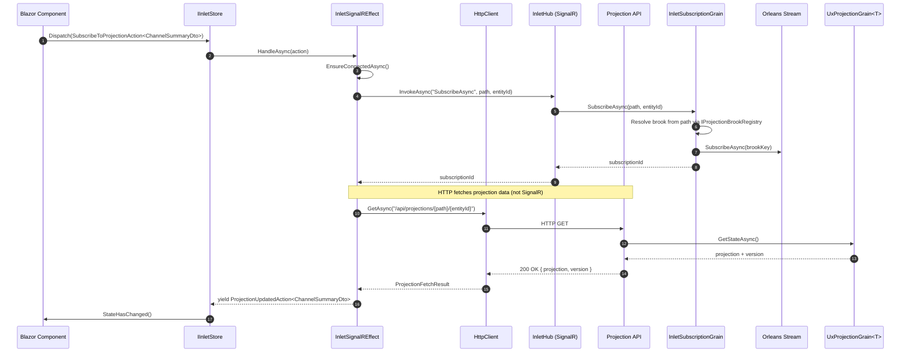
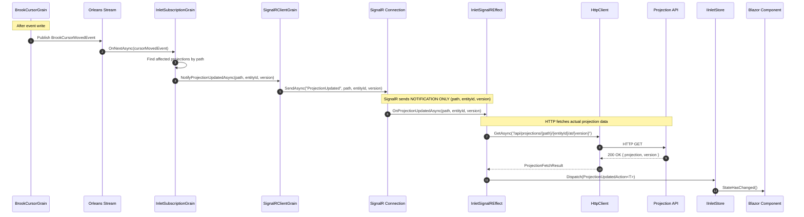
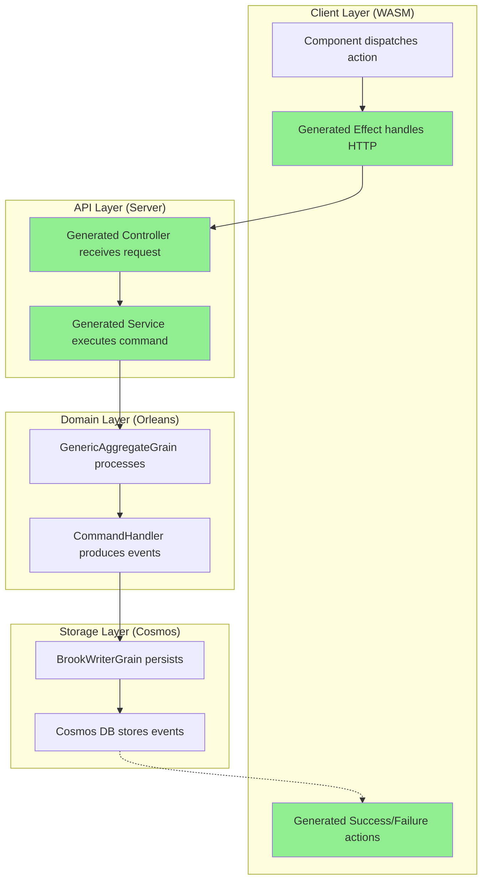

# Call Chain Mapping

## Overview

This document maps the complete request-response flow from client UX action
through to Cosmos storage and back to client-side state updates.

## Three-Layer Architecture

```text
┌─────────────────────────────────────────────────────────────────────────────┐
│ WASM Client (Blazor WebAssembly)                                            │
│ ├── Reservoir (Fluxor-style state management)                               │
│ ├── Inlet.Blazor.WebAssembly (projection subscriptions, SignalR effects)    │
│ ├── IInletStore (projection cache + action dispatch)                        │
│ └── HttpClient (REST calls for commands and projection data)                │
│                                                                             │
│ ⚠️  NO ORLEANS DEPENDENCIES - runs in browser sandbox                       │
└─────────────────────────────────────────────────────────────────────────────┘
                                    │
                      HTTP (commands) │ SignalR (notifications)
                                    ▼
┌─────────────────────────────────────────────────────────────────────────────┐
│ ASP.NET Core Host (Cascade.Server)                                          │
│ ├── Minimal API endpoints (command dispatch)                                │
│ ├── Projection API endpoints (GET /api/projections/{path}/{entityId})       │
│ ├── InletHub (SignalR hub for subscription notifications)                   │
│ └── Orleans Client (calls into silo)                                        │
│                                                                             │
│ ⚠️  ORLEANS CLIENT ONLY - no grain implementations                          │
└─────────────────────────────────────────────────────────────────────────────┘
                                    │
                          Orleans RPC │
                                    ▼
┌─────────────────────────────────────────────────────────────────────────────┐
│ Orleans Silo (Cascade.Silo)                                                 │
│ ├── GenericAggregateGrain<T> (command processing)                           │
│ ├── UxProjectionGrain<T> (projection state)                                 │
│ ├── BrookWriterGrain / BrookCursorGrain (event persistence)                 │
│ ├── SnapshotCacheGrain (snapshot storage)                                   │
│ └── InletSubscriptionGrain (SignalR bridge)                                 │
│                                                                             │
│ ✅ ORLEANS GRAINS - [GenerateSerializer], [Id(n)] attributes here           │
└─────────────────────────────────────────────────────────────────────────────┘
                                    │
                           Cosmos SDK │
                                    ▼
┌─────────────────────────────────────────────────────────────────────────────┐
│ Cosmos DB                                                                   │
│ ├── Events container (partitioned by brookId)                               │
│ ├── Snapshots container (partitioned by streamKey)                          │
│ └── Cursors container (brook positions)                                     │
└─────────────────────────────────────────────────────────────────────────────┘
```

## Key Insight: SignalR vs HTTP

**Critical distinction:**

- **SignalR** is used for **notifications only** (lightweight: path, entityId, newVersion)
- **HTTP** is used for **data fetching** (full projection payload via REST API)

This separation means:

1. SignalR stays lightweight (no large payloads)
2. HTTP responses can be cached (ETag/version-based)
3. Client controls when to fetch (can skip if already current)

## Write Path: Command Execution

### Sequence Diagram



### Code Trace: Write Path

| Step | Component | File | Key Method |
| ---- | --------- | ---- | ---------- |
| 1 | Blazor UI | `ChatApp.razor.cs` | `HandleSendMessageAsync()` |
| 2 | HTTP Call | `ChatApp.razor.cs:305` | `Http.PostAsJsonAsync(...)` |
| 3 | API Endpoint | `Program.cs:306` | `app.MapPost("/api/channels/{channelId}/create")` |
| 4 | Grain Factory | `AggregateGrainFactory.cs:36` | `GetGenericAggregate<T>()` |
| 5 | Grain Execute | `GenericAggregateGrain.cs:107` | `ExecuteAsync(command)` |
| 6 | Get Position | `GenericAggregateGrain.cs:201` | `BrookGrainFactory.GetBrookCursorGrain()` |
| 7 | Load State | `GenericAggregateGrain.cs:231` | `SnapshotGrainFactory.GetSnapshotCacheGrain()` |
| 8 | Handle Command | `RootCommandHandler.cs:108` | `Handle(command, state)` |
| 9 | Convert Events | `GenericAggregateGrain.cs:260` | `BrookEventConverter.ToStorageEvents()` |
| 10 | Write Events | `BrookWriterGrain.cs:72` | `AppendEventsAsync()` |
| 11 | Cosmos Write | `BrookStorageProvider.cs:63` | `EventWriter.AppendEventsAsync()` |
| 12 | Update Cursor | `BrookCursorGrain.cs` | `UpdatePositionAsync()` |
| 13 | Publish Stream | Orleans Streams | `BrookCursorMovedEvent` |

## Read Path: Projection Subscription

### Sequence Diagram

**Key Pattern:** SignalR establishes subscription; HTTP fetches actual data.



### Code Trace: Read Path

| Step | Component | File | Key Method |
| ---- | --------- | ---- | ---------- |
| 1 | Subscribe Action | `ChatApp.razor.cs` | `Dispatch(new SubscribeToProjectionAction<T>())` |
| 2 | Effect Handler | `InletSignalREffect.cs:119` | `HandleAsync(action)` |
| 3 | SignalR Connect | `InletSignalREffect.cs:129` | `EnsureConnectedAsync()` |
| 4 | Hub Subscribe | `InletHub.cs:84` | `SubscribeAsync(path, entityId)` |
| 5 | Grain Subscribe | `InletSubscriptionGrain.cs:233` | `SubscribeAsync()` |
| 6 | Stream Subscribe | `InletSubscriptionGrain.cs:319` | `stream.SubscribeAsync(this)` |
| 7 | HTTP Fetch | `AutoProjectionFetcher.cs:76` | `HttpClient.SendAsync()` |
| 8 | API Endpoint | Projection API | `GET /api/projections/{path}/{entityId}` |
| 9 | Grain GetState | `UxProjectionGrain.cs` | `GetStateAsync()` |
| 10 | Update Store | `InletSignalREffect.cs:252` | `yield ProjectionUpdatedAction` |

## Update Path: Real-Time Projection Updates

### Sequence Diagram



### Code Trace: Update Path

| Step | Component | File | Key Method |
| ---- | --------- | ---- | ---------- |
| 1 | Cursor Moved | `BrookCursorGrain.cs` | Orleans stream publish |
| 2 | Subscription Notified | `InletSubscriptionGrain.cs` | `OnNextAsync()` |
| 3 | Client Notified | `SignalRClientGrain.cs` | `NotifyProjectionUpdatedAsync()` |
| 4 | SignalR Push | SignalR | `ProjectionUpdated(path, entityId, version)` |
| 5 | Effect Callback | `InletSignalREffect.cs:357` | `OnProjectionUpdatedAsync()` |
| 6 | HTTP Fetch | `AutoProjectionFetcher.cs:94` | `FetchAtVersionAsync()` |
| 7 | HTTP Call | `AutoProjectionFetcher.cs:101` | `HttpClient.SendAsync()` |
| 8 | Update Store | `InletSignalREffect.cs:381` | `Dispatch(ProjectionUpdatedAction)` |

## Key Design Insight: Notification vs Data Separation

```text
┌────────────────────────────────────────────────────────────────────────┐
│                        SignalR (Lightweight)                           │
│                                                                        │
│   • Payload: { path: "channel-summary", entityId: "abc", version: 42 } │
│   • Purpose: "Hey, projection X has a new version Y"                   │
│   • Size: ~100 bytes                                                   │
│   • No projection data in payload                                      │
└────────────────────────────────────────────────────────────────────────┘
                                    │
                                    ▼
┌────────────────────────────────────────────────────────────────────────┐
│                        HTTP (Cacheable)                                │
│                                                                        │
│   • URL: GET /api/projections/channel-summary/abc/at/42                │
│   • Purpose: "Give me the actual projection data at version Y"         │
│   • Size: Variable (full projection payload)                           │
│   • Cacheable (ETag, version-based)                                    │
│   • Client controls fetch timing                                       │
└────────────────────────────────────────────────────────────────────────┘
```

**Why this matters for code generation:**

1. **Client DTOs** only need JSON serialization (no Orleans)
2. **HTTP endpoints** only need ASP.NET (no grain activation)
3. **Orleans grains** stay isolated in the silo
4. Generated code naturally falls into the right layer

## Current Client Command Pattern (Manual)

### Example: Create Channel

```csharp
// ChatApp.razor.cs
private async Task HandleCreateChannelAsync(string name)
{
    try
    {
        // Manual URL construction
        string url = $"/api/channels/{Uri.EscapeDataString(newChannelId)}/create" +
                     $"?name={Uri.EscapeDataString(name)}" +
                     $"&createdBy={Uri.EscapeDataString(ChatState.UserDisplayName)}";

        // Manual HTTP call
        using HttpResponseMessage response = await Http.PostAsync(
            new Uri(url, UriKind.Relative),
            null);

        // No type safety, manual error handling
        if (!response.IsSuccessStatusCode)
        {
            // Handle error
        }
    }
    catch (HttpRequestException)
    {
        // Silently fail
    }
}
```

### Problems with Current Pattern

1. **No type safety** — URL and parameters are strings
2. **Manual error handling** — each call site handles errors differently
3. **No loading states** — UI doesn't know when command is in-flight
4. **Boilerplate** — repeated `try/catch`, `Uri.EscapeDataString`, etc.
5. **No retry logic** — transient failures cause silent failures

## Proposed Client Command Pattern (Generated)

### Generated Action + Effect

```csharp
// Generated: CreateChannelAction.g.cs
[GeneratedCode("Mississippi.Aggregates.Generators", "1.0.0")]
public sealed record CreateChannelAction : IAction
{
    public required string EntityId { get; init; }
    public required string Name { get; init; }
    public required string CreatedBy { get; init; }
}

// Generated: CreateChannelSuccessAction.g.cs
[GeneratedCode("Mississippi.Aggregates.Generators", "1.0.0")]
public sealed record CreateChannelSuccessAction : IAction
{
    public required string EntityId { get; init; }
}

// Generated: CreateChannelFailureAction.g.cs
[GeneratedCode("Mississippi.Aggregates.Generators", "1.0.0")]
public sealed record CreateChannelFailureAction : IAction
{
    public required string EntityId { get; init; }
    public required string ErrorCode { get; init; }
    public required string ErrorMessage { get; init; }
}

// Generated: CreateChannelEffect.g.cs
[GeneratedCode("Mississippi.Aggregates.Generators", "1.0.0")]
internal sealed class CreateChannelEffect : IEffect
{
    private HttpClient Http { get; }

    public bool CanHandle(IAction action) => action is CreateChannelAction;

    public async IAsyncEnumerable<IAction> HandleAsync(
        IAction action,
        CancellationToken cancellationToken)
    {
        var cmd = (CreateChannelAction)action;
        yield return new CommandExecutingAction<CreateChannelAction>(cmd.EntityId);

        try
        {
            using var response = await Http.PostAsJsonAsync(
                $"api/channels/{cmd.EntityId}/commands/create",
                new { cmd.Name, cmd.CreatedBy },
                cancellationToken);

            if (response.IsSuccessStatusCode)
            {
                yield return new CreateChannelSuccessAction { EntityId = cmd.EntityId };
            }
            else
            {
                var error = await response.Content.ReadFromJsonAsync<ErrorResponse>();
                yield return new CreateChannelFailureAction
                {
                    EntityId = cmd.EntityId,
                    ErrorCode = error?.ErrorCode ?? "UNKNOWN",
                    ErrorMessage = error?.ErrorMessage ?? "Request failed"
                };
            }
        }
        catch (HttpRequestException ex)
        {
            yield return new CreateChannelFailureAction
            {
                EntityId = cmd.EntityId,
                ErrorCode = "NETWORK_ERROR",
                ErrorMessage = ex.Message
            };
        }
    }
}
```

### Simplified Client Usage

```csharp
// ChatApp.razor.cs - with generated actions
private void HandleCreateChannel(string name)
{
    Dispatch(new CreateChannelAction
    {
        EntityId = Guid.NewGuid().ToString(),
        Name = name,
        CreatedBy = ChatState.UserDisplayName
    });
    // Effect handles HTTP call, errors, success actions
}
```

## Storage Layer Details

### Cosmos DB Structure

```text
Cosmos Account
└── Database: cascade-db
    ├── Container: events
    │   ├── Partition Key: /brookId
    │   └── Documents: { id, brookId, position, eventType, payload, timestamp }
    ├── Container: snapshots
    │   ├── Partition Key: /streamKey
    │   └── Documents: { id, streamKey, version, snapshotType, payload }
    └── Container: cursors
        ├── Partition Key: /id
        └── Documents: { id, position, lastUpdated }
```

### Event Document Example

```json
{
    "id": "CASCADE.CHAT.CHANNEL:channel-123:1",
    "brookId": "CASCADE.CHAT.CHANNEL:channel-123",
    "position": 1,
    "eventType": "CASCADE.CHAT.CHANNELCREATED.V1",
    "payload": {
        "channelId": "channel-123",
        "name": "General",
        "createdBy": "user-456",
        "createdAt": "2026-01-17T10:00:00Z"
    },
    "timestamp": "2026-01-17T10:00:00.123Z"
}
```

## Generator Responsibilities in Call Chain



**Legend:** Green = Can be generated by source generators
