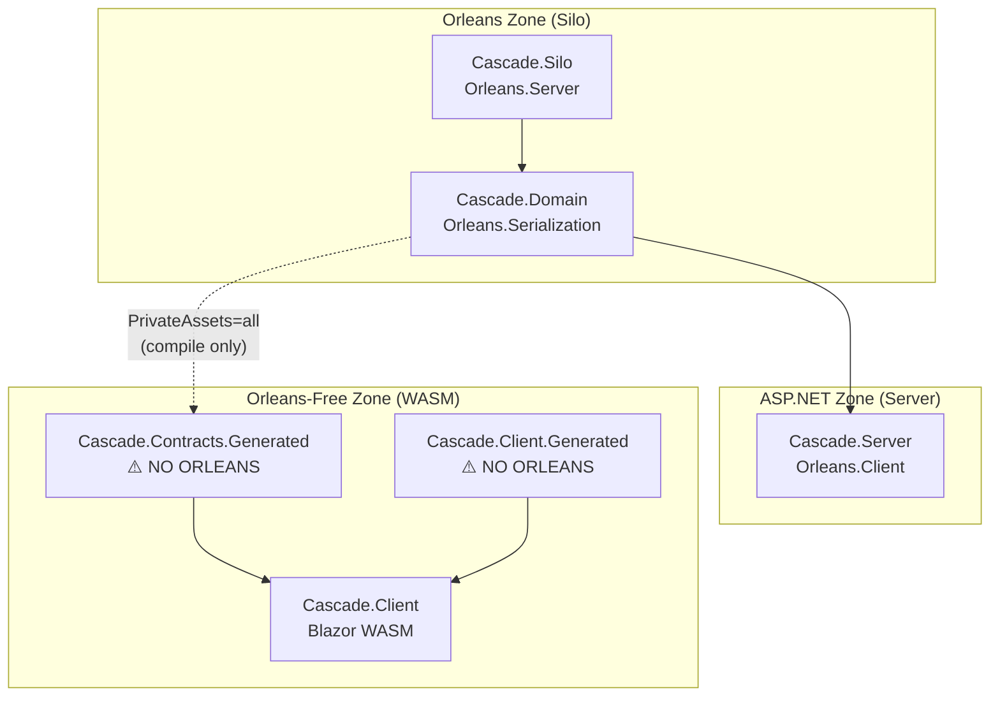
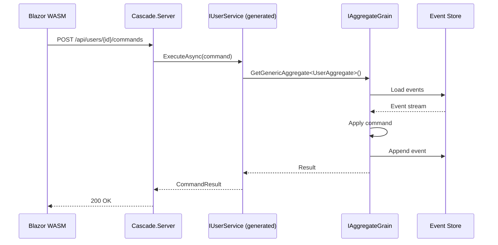
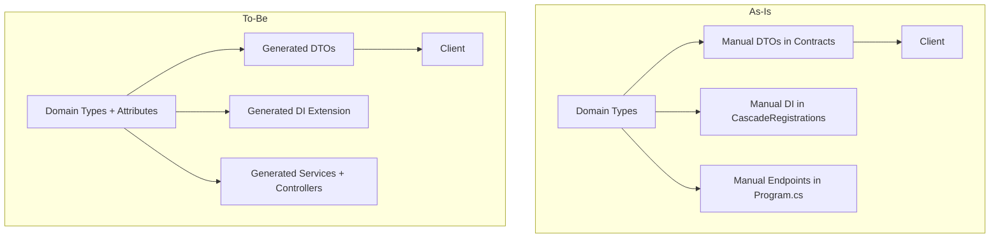

# Implementation Plan

## Overview

This plan enables unified source generation for aggregates and projections in
the Cascade sample, eliminating manual DTO duplication and DI boilerplate.

**User Preference:** Generated project approach (separate output projects).

## Size Classification

**Large** — Five phases touching generators, sample code, and build
configuration. No public API changes.

## Decision Checkpoint

**Yes** — Multiple viable designs exist (Options A, B, C in RFC). Recommend
Option C. User approval required before Phase 3-5 (new generators).

## Generated Project Architecture

To maintain strict Orleans isolation, generated code goes into dedicated
projects that have **no Orleans dependencies**:

```text
samples/Cascade/
├── Cascade.Domain/              # Source definitions (has Orleans)
│   ├── Channel/
│   │   ├── ChannelAggregate.cs     [AggregateService]
│   │   └── ChannelSummary.cs       [UxProjection][GenerateClientDto]
│   └── Commands/
│       └── CreateChannel.cs        [GenerateClientAction]
│
├── Cascade.Contracts.Generated/  # Generated DTOs (NO Orleans)
│   ├── ChannelSummaryDto.g.cs      # Orleans attributes stripped
│   └── UserSummaryDto.g.cs
│
├── Cascade.Client.Generated/     # Generated actions/effects (NO Orleans)
│   ├── CreateChannelAction.g.cs
│   ├── CreateChannelEffect.g.cs
│   └── ...
│
├── Cascade.Contracts/            # Keep: API DTOs, storage types
├── Cascade.Client/               # References .Generated projects
├── Cascade.Server/               # Generated controllers + DI
└── Cascade.Silo/                 # Full Orleans
```

### Project Reference Structure



### Key Isolation Mechanisms

1. **PrivateAssets="all"** — Contracts.Generated references Domain with
   `PrivateAssets="all"`, so Domain types are visible to the generator at
   compile time but Orleans packages do NOT flow transitively to downstream
   consumers.

2. **Attribute Stripping** — Generator removes `[Id(n)]`, `[GenerateSerializer]`,
   `[Immutable]`, `[Alias]` when emitting DTOs.

3. **No Transitive Orleans** — .Generated projects have no Orleans package
   references; build will fail if accidentally introduced.

4. **Dual Generator Coexistence** — Orleans generator and Mississippi generator
   run independently in their respective projects with no conflicts.

## POC Validation: Dual Generator Coexistence

A proof-of-concept in `.scratchpad/poc-orleans-coexist/` validated that:

1. **Orleans generator still works** — Produces serialization code in Domain
2. **Mississippi generator works** — Produces Orleans-free DTOs in Contracts
3. **Both coexist without conflicts** — Each runs in its own project context
4. **Client output is Orleans-free** — Only 2 DLLs, no Orleans packages

### POC Structure

```text
.scratchpad/poc-orleans-coexist/
├── Source.Domain/           # Orleans SDK + [GenerateSerializer] + [GenerateClientDto]
├── Source.Generator/        # Mississippi generator (scans compilation.References)
├── Target.Contracts/        # PrivateAssets="all" ref to Domain
└── Target.Client/           # References only Contracts
```

### POC Project Reference Pattern

```xml
<!-- Target.Contracts.csproj -->
<ItemGroup>
  <!-- Domain reference with PrivateAssets - Orleans won't flow transitively -->
  <ProjectReference Include="..\Source.Domain\Source.Domain.csproj"
                    PrivateAssets="all" />

  <!-- Generator as analyzer -->
  <ProjectReference Include="..\Source.Generator\Source.Generator.csproj"
                    OutputItemType="Analyzer"
                    ReferenceOutputAssembly="false" />
</ItemGroup>
```

### POC Validation Commands

```powershell
# Build all projects
dotnet build poc.sln -c Release

# Run client (uses generated DTO)
dotnet run --project Target.Client -c Release

# Verify client output has no Orleans
Get-ChildItem Target.Client/bin/Release/net9.0/*.dll | Select Name
# Output: Target.Client.dll, Target.Contracts.dll (NO Orleans!)
```

### POC Generated Output

**Orleans generator** (`Source.Domain/obj/.../Source.Domain.orleans.g.cs`):

```csharp
// Orleans serialization code
public sealed class Codec_ChannelProjection : IFieldCodec<ChannelProjection>
{
    // Serialize/Deserialize methods...
}
```

**Mississippi generator** (`Target.Contracts/obj/.../ChannelProjectionDto.g.cs`):

```csharp
// <auto-generated/>
// Generated from: Source.Domain.ChannelProjection
// Orleans attributes stripped - WASM safe!
namespace Target.Contracts;

public sealed record ChannelProjectionDto
{
    public required string EntityId { get; init; }
    public required string Name { get; init; }
    public required string Description { get; init; }
    public required System.DateTime CreatedAt { get; init; }
    public required int MessageCount { get; init; }
}
```

### How the Generator Reads Referenced Assemblies

The Mississippi generator scans `compilation.References` to find types in the
Domain assembly:

```csharp
public void Initialize(IncrementalGeneratorInitializationContext context)
{
    context.RegisterSourceOutput(context.CompilationProvider, Execute);
}

private static void Execute(SourceProductionContext context, Compilation compilation)
{
    // Scan all referenced assemblies (not just source files)
    foreach (var reference in compilation.References)
    {
        if (compilation.GetAssemblyOrModuleSymbol(reference) is not IAssemblySymbol assembly)
            continue;

        // Find types with [GenerateClientDto] marker
        var typesWithMarker = GetTypesWithMarkerAttribute(assembly);

        foreach (var type in typesWithMarker)
        {
            // Emit Orleans-free DTO into Target.Contracts
            var dtoSource = GenerateDto(type);
            context.AddSource($"{type.Name}Dto.g.cs", dtoSource);
        }
    }
}
```

This proves:

- Generators CAN read types from referenced assemblies (not just source)
- `PrivateAssets="all"` allows compile-time access without runtime dependency
- Orleans and Mississippi generators run independently with no conflicts

## Naming and Taxonomy

See [naming-taxonomy.md](naming-taxonomy.md) for the complete attribute and project
naming conventions integrated from `.scratchpad/project-naming/`.

### Attribute Naming Summary

| Category | Pattern | Examples |
|----------|---------|----------|
| Generator triggers | `Generate*` | `[GenerateAggregateService]`, `[GenerateClientDto]` |
| Identity markers | `Define*` | `[DefineProjectionPath]`, `[DefineBrookName]` |

### Project Naming Summary

| Suffix | Purpose | Orleans? |
|--------|---------|----------|
| `.Contracts` | Boundary-safe DTOs | ❌ No |
| `.Orleans.Contracts` | Grain interfaces | ✅ Yes |
| `.Orleans` | Grain implementations | ✅ Yes |
| `.AspNet` | HTTP endpoints/hubs | ❌ No |
| `.Blazor.Wasm` | WASM client | ❌ No |
| `.Generated` | Source-generated output | ❌ No |

## Phases

### Phase 0: Attribute Naming Alignment

**Goal:** Rename attributes to `Generate*`/`Define*` convention (clean rename, no shims).

**Files to Rename:**

1. `AggregateServiceAttribute.cs` → `GenerateAggregateServiceAttribute.cs`

   ```csharp
   /// <summary>
   /// Triggers source generation of aggregate service, interface, and controller.
   /// </summary>
   [AttributeUsage(AttributeTargets.Class, Inherited = false)]
   public sealed class GenerateAggregateServiceAttribute : Attribute
   {
       public GenerateAggregateServiceAttribute(string route) => Route = route;
       public string Route { get; }
   }
   ```

2. `UxProjectionAttribute.cs` → `GenerateProjectionApiAttribute.cs`

   ```csharp
   /// <summary>
   /// Triggers source generation of projection DTO, mapper, and controller.
   /// </summary>
   [AttributeUsage(AttributeTargets.Class, Inherited = false)]
   public sealed class GenerateProjectionApiAttribute : Attribute { }
   ```

3. `ProjectionPathAttribute.cs` → `DefineProjectionPathAttribute.cs`

   ```csharp
   /// <summary>
   /// Assigns the HTTP/SignalR path for a projection.
   /// </summary>
   [AttributeUsage(AttributeTargets.Class, Inherited = false)]
   public sealed class DefineProjectionPathAttribute : Attribute
   {
       public DefineProjectionPathAttribute(string path) => Path = path;
       public string Path { get; }
   }
   ```

**Generator Updates:**

- Update `AggregateServiceGenerator` to look for `GenerateAggregateServiceAttribute`
- Update `ProjectionApiGenerator` to look for `GenerateProjectionApiAttribute`

**Usage Updates:**

- Update all samples to use new attribute names
- Update any Mississippi library usages

**Validation:**

```powershell
dotnet build mississippi.slnx -c Release -warnaserror
dotnet test tests/EventSourcing.Aggregates.Generators.L0Tests/
```

Expect: All tests pass; generators work with both old and new attribute names.

### Phase 1: Enable Existing Generators in Cascade

**Goal:** Add `[GenerateAggregateService]` to all aggregates; wire generated services.

**Files to Modify:**

1. `samples/Cascade/Cascade.Domain/Channel/ChannelAggregate.cs`
   - Add `[GenerateAggregateService("channels")]` attribute

2. `samples/Cascade/Cascade.Domain/Conversation/ConversationAggregate.cs`
   - Add `[GenerateAggregateService("conversations")]` attribute

3. `samples/Cascade/Cascade.Server/Program.cs`
   - Replace manual `IAggregateGrainFactory.GetGenericAggregate<T>()` calls
     with injected `I{Name}Service`
   - Remove 6 manual endpoint registrations

**Validation:**

```powershell
dotnet build samples/Cascade/Cascade.Server/Cascade.Server.csproj -warnaserror
```

Expect: Clean build with generated `IChannelService`, `IConversationService`.

### Phase 2: Verify Projection DTO Generation

**Goal:** Confirm generated DTOs are usable by client.

**Investigation:**

1. Build Domain project and inspect `obj/Debug/net9.0/generated/` for
   `{Name}Dto.g.cs` files.

2. Verify generated DTOs have same properties as manual Contracts DTOs.

3. Test: Temporarily reference generated DTOs from Client; confirm
   serialization round-trip.

**Outcome Decision Point:**

- If generated DTOs are equivalent → proceed to Phase 4 (delete manual DTOs)
- If differences exist → document gaps and decide whether to extend generator

### Phase 3: Create DomainRegistrationsGenerator

**Goal:** Eliminate 80+ manual `Add*` calls in `CascadeRegistrations.cs`.

**New Files:**

1. `src/EventSourcing.Generators/DomainRegistrationsGenerator.cs`
   - Scan for `[Aggregate]`, `[AggregateService]`, `[UxProjection]`
   - Scan for `CommandHandler<,>`, `IReducer<,>`, `IEventType`
   - Emit `AddDomain(this IServiceCollection, ...options)` extension

2. `src/EventSourcing.Generators/DomainRegistrationsGenerator.Syntax.cs`
   - Roslyn incremental pipeline
   - Combine multiple syntax providers

**Attribute Dependencies:**

- Use existing `[AggregateService]`, `[UxProjection]` as markers
- Discover handlers/reducers by base type inspection

**Generated Output Example:**

```csharp
public static class DomainRegistrations
{
    public static IServiceCollection AddDomain(this IServiceCollection services)
    {
        services.AddEventType<ChannelCreatedEvent>();
        services.AddEventType<MessageSentEvent>();
        // ... all event types
        services.AddCommandHandler<CreateChannelHandler>();
        // ... all handlers
        services.AddReducer<ChannelMessagesReducer>();
        // ... all reducers
        return services;
    }
}
```

**Validation:**

```powershell
dotnet build samples/Cascade/Cascade.Domain/Cascade.Domain.csproj -warnaserror
```

Expect: Generated `DomainRegistrations.AddDomain()` method.

### Phase 4: Create ClientDtoGenerator and Migrate Client

**Goal:** Generate WASM-safe DTOs via opt-in `[GenerateClientDto]` attribute.

**New Attribute:**

Create `[GenerateClientDto]` in `EventSourcing.UxProjections.Abstractions`:

```csharp
[AttributeUsage(AttributeTargets.Class, Inherited = false)]
public sealed class GenerateClientDtoAttribute : Attribute
{
    /// <summary>Optional custom DTO name (default: {ProjectionName}Dto).</summary>
    public string? DtoName { get; set; }

    // Reserved for future RBAC (v2)
    // public string[]? RequiredRoles { get; set; }
    // public string[]? RequiredPermissions { get; set; }
    // public string? RequiredPolicy { get; set; }
}
```

**Why opt-in?**

- Not all projections are client-visible (some are internal).
- Future RBAC properties will control who can access which DTOs.
- Keeps generated output minimal and intentional.

**New Generator:**

1. `src/EventSourcing.Generators/ClientDtoGenerator.cs`
   - Scan `[UxProjection]` types that ALSO have `[GenerateClientDto]`
   - Emit `{Name}Dto` records without Orleans attributes
   - Target output: `Cascade.Contracts.Generated` project

**New Projects:**

1. `samples/Cascade/Cascade.Contracts.Generated/`
   - AnalyzerReference to `EventSourcing.Generators`
   - CompileReference to `Cascade.Domain` (for type info only; not runtime dep)

**Migration Steps:**

1. Add `[GenerateClientDto]` to client-visible projections in Domain:

   ```csharp
   [ProjectionPath("cascade/channels")]
   [UxProjection]
   [GenerateClientDto]  // <-- opt-in for client generation
   [GenerateSerializer]
   public sealed record ChannelMessagesProjection { ... }
   ```

2. Create `Cascade.Contracts.Generated.csproj`:

   ```xml
   <Project Sdk="Microsoft.NET.Sdk">
     <PropertyGroup>
       <TargetFramework>net9.0</TargetFramework>
       <ImplicitUsings>enable</ImplicitUsings>
       <Nullable>enable</Nullable>
     </PropertyGroup>
     <ItemGroup>
       <!-- Domain reference for type metadata; PrivateAssets prevents
            Orleans from flowing transitively to downstream projects -->
       <ProjectReference Include="..\Cascade.Domain\Cascade.Domain.csproj"
                         PrivateAssets="all" />

       <!-- Generator runs in this project's context, reads Domain types -->
       <ProjectReference Include="..\..\..\..\src\EventSourcing.Generators\EventSourcing.Generators.csproj"
                         OutputItemType="Analyzer"
                         ReferenceOutputAssembly="false" />
     </ItemGroup>
     <!-- ⚠️ NO Orleans packages allowed; validated via POC -->
   </Project>
   ```

   **Pattern validated via POC** (`.scratchpad/poc-cross-project-gen/`):

   - Generator scans `compilation.References` for Domain assembly
   - Generator finds types with `[GenerateClientDto]` marker
   - Generator emits Orleans-free DTOs into this project
   - Client projects referencing this get **zero Orleans DLLs**

3. Update `Cascade.Client.csproj`:
   - Replace `Cascade.Contracts` reference with `Cascade.Contracts.Generated`

4. Delete manual DTOs:
   - `samples/Cascade/Cascade.Contracts/Projections/*.cs` (9 files)

5. Update `Cascade.Contracts` to contain only:
   - `Api/` request/response DTOs (not projection DTOs)
   - `Storage/` types if needed

**Validation:**

```powershell
dotnet build samples/Cascade/Cascade.Client/Cascade.Client.csproj -warnaserror
dotnet test samples/Cascade/Cascade.Domain.L0Tests/Cascade.Domain.L0Tests.csproj
```

Expect: Clean build and passing tests.

## Rollout Plan

| Step | Action | Validation |
| ---- | ------ | ---------- |
| 1 | Phase 1: Add attributes | Build Cascade.Server |
| 2 | Phase 1: Wire services | Run L0 tests |
| 3 | Phase 2: Verify DTOs | Manual inspection |
| 4 | Phase 3: DI generator | Build Cascade.Domain |
| 5 | Phase 3: Migrate DI | Delete CascadeRegistrations |
| 6 | Phase 4: Client DTOs | Build Cascade.Client |
| 7 | Phase 4: Delete manual | Full test suite |
| 8 | Phase 5: Client actions | Build Cascade.Client |
| 9 | Phase 5: Migrate commands | Full test suite |

## Backout Plan

Each phase is independently revertible:

- **Phase 1**: Remove `[AggregateService]` attributes; restore manual endpoints
- **Phase 2**: No changes to commit; investigation only
- **Phase 3**: Delete generator; restore `CascadeRegistrations.cs`
- **Phase 4**: Delete `Cascade.Contracts.Generated`; restore Contracts DTOs
- **Phase 5**: Delete `[GenerateClientAction]` attributes; restore manual HTTP calls

## Test Plan

### Unit Tests

- Existing `Cascade.Domain.L0Tests` must pass after each phase
- Add generator tests in `EventSourcing.Generators.L0Tests/`

### Integration Tests

- Build and run Cascade.AppHost
- Verify API endpoints return expected DTOs
- Verify Blazor WASM client can fetch projections

### Manual Verification

- Inspect generated files in `obj/` for correctness
- Confirm no Orleans package references in Client

## Files Touched Summary

| Phase | Files Modified | Files Created | Files Deleted |
| ----- | -------------- | ------------- | ------------- |
| 1 | 3 | 0 | 0 |
| 2 | 0 | 0 | 0 |
| 3 | 1 | 2-3 | 1 |
| 4 | 2 | 1 project | 9 DTOs |
| 5 | 5-10 commands | 3-4 generator files | Manual HTTP code |

## Risks and Mitigations

| Risk | Mitigation |
| ---- | ---------- |
| Generated DTOs differ from manual | Phase 2 investigation before delete |
| Build ordering with analyzer refs | Use `OutputItemType="Analyzer"` pattern |
| Generator perf regression | Incremental generators already in use |
| Breaking client serialization | Verify JSON round-trip in Phase 2 |
| Client action naming conflicts | Use namespace scoping and prefix options |

## Phase 5: Create ClientActionGenerator (New)

**Goal:** Generate Fluxor actions and effects for client-side command dispatch.

### New Attribute

Create `[GenerateClientAction]` in `EventSourcing.Aggregates.Abstractions`:

```csharp
[AttributeUsage(AttributeTargets.Class, Inherited = false)]
public sealed class GenerateClientActionAttribute : Attribute
{
    public string? ActionName { get; set; }
}
```

### New Generator

Create `src/EventSourcing.Generators/ClientActionGenerator.cs`:

**Triggers on:** Commands with `[GenerateClientAction]` attribute

**Scans:**

1. Command type name and properties
2. Parent aggregate's `[AggregateService]` route for URL construction

**Generates:**

1. `{CommandName}Action.g.cs` — action record with command properties
2. `{CommandName}SuccessAction.g.cs` — success result action
3. `{CommandName}FailureAction.g.cs` — failure result action
4. `{CommandName}Effect.g.cs` — effect handling HTTP dispatch

### Migration Steps

1. Add `[GenerateClientAction]` to selected commands in `Cascade.Domain`:

   ```csharp
   [GenerateClientAction]
   [GenerateSerializer]
   public sealed record CreateChannel
   {
       [Id(0)] public required string ChannelId { get; init; }
       [Id(1)] public required string Name { get; init; }
       [Id(2)] public required string CreatedBy { get; init; }
   }
   ```

2. Update `Cascade.Client` to reference generated actions.

3. Replace manual HTTP calls in `ChatApp.razor.cs` with action dispatches:

   ```csharp
   // Before
   await Http.PostAsJsonAsync($"/api/channels/{channelId}/create?...", null);

   // After
   Dispatch(new CreateChannelAction { EntityId = channelId, Name = name, CreatedBy = user });
   ```

4. Delete manual command dispatch code.

### Validation

```powershell
dotnet build samples/Cascade/Cascade.Client/Cascade.Client.csproj -warnaserror
dotnet run --project samples/Cascade/Cascade.AppHost/Cascade.AppHost.csproj
```

Manual test: Create channel via UI, verify command executes successfully.

## Sequence Diagram: API Request with Generated Service



## As-Is vs To-Be Architecture


