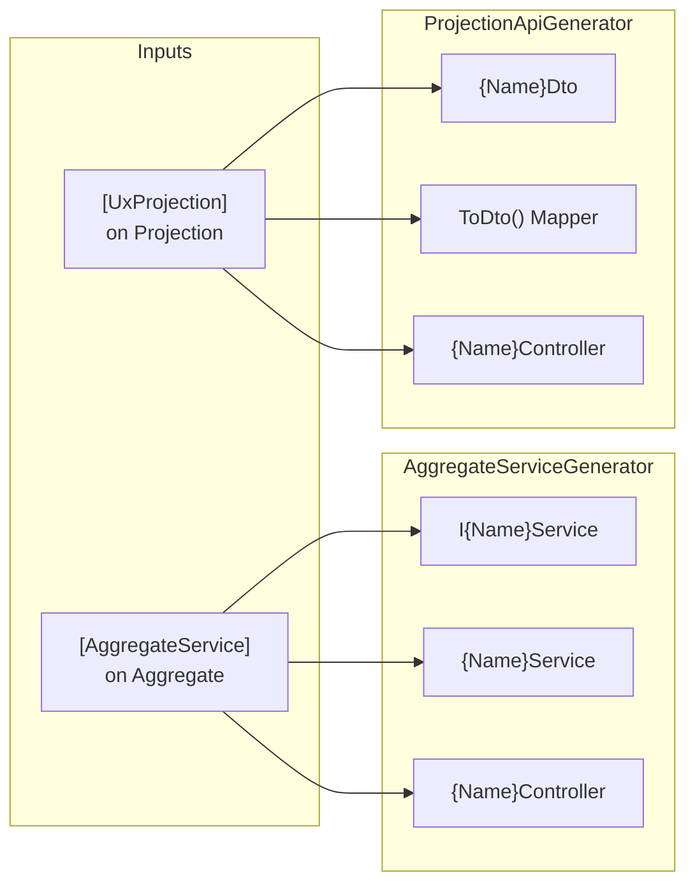
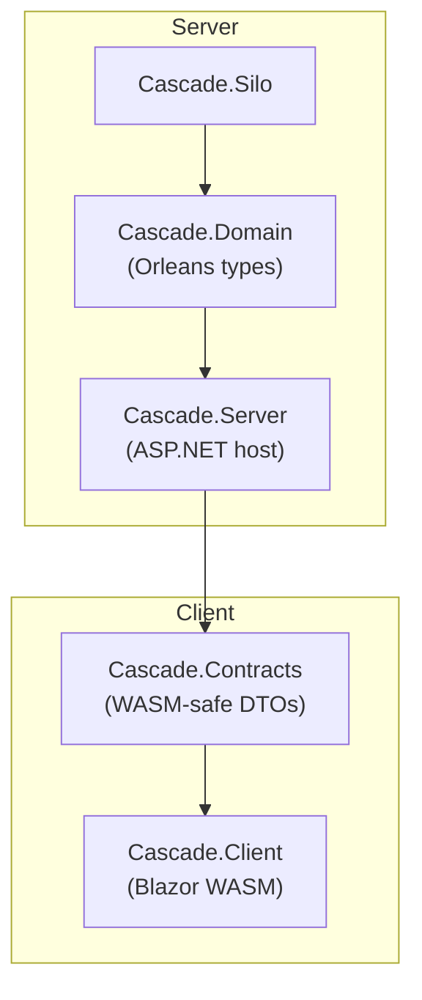

# RFC: Unified Source Generation for Aggregates and Projections

## Status

- **Author**: Planning Agent
- **Created**: 2026-01-17
- **Status**: Draft → **Decisions Made** → Ready for Implementation
- **Tracking**: `spec/unified-codegen-dx/`
- **Naming**: See [naming-taxonomy.md](naming-taxonomy.md) for attribute and project naming conventions

## Decisions (Confirmed)

| Question | Decision | Rationale |
| -------- | -------- | --------- |
| Attribute naming convention? | **`Generate*` / `Define*`** | `Generate*` for source gen triggers (Orleans-aligned); `Define*` for identity/metadata markers. Legacy attributes shimmed with `[Obsolete]`. |
| Unified vs separate attributes? | **Separate** | SRP; aggregates and projections are different concerns. Framework should be pluggable—users may want different projection backends. |
| DI registration approach? | **Compile-time** (source generators) | No runtime reflection cost; compile-time verification; better AOT support. |
| Client action generation? | **Opt-in** via `[GenerateClientAction]` | Explicit control; future RBAC properties will be added to these attributes. |
| Client DTO generation? | **Opt-in** via `[GenerateClientDto]` | Same reasoning; explicit control for what gets exposed to client; RBAC extensibility. |
| Future extensibility? | **RBAC properties** on attributes | Attributes will carry authorization metadata (roles, permissions, policies) for generated endpoints and actions. |

## Problem Statement

Cascade (and similar applications) currently require extensive manual
boilerplate:

1. **DTO Duplication** — 9 projection DTOs in `Cascade.Contracts` manually
   mirror `Cascade.Domain` projections.

2. **Underused Generators** — `AggregateServiceGenerator` generates typed
   services, but only `UserAggregate` has `[AggregateService]`. Generated
   services are ignored; `Program.cs` calls `IAggregateGrainFactory` directly.

3. **Verbose DI Registration** — `CascadeRegistrations.cs` contains 332 lines
   with 80+ manual `AddEventType<>`, `AddCommandHandler<>`, `AddReducer<>`
   calls.

4. **Dependency Boundary Risk** — Domain types carry Orleans attributes (`[Id]`,
   `[GenerateSerializer]`). Sharing them with WASM requires stripping those
   attributes, which the generator does, but clients do not consume generated
   DTOs.

## Goals

1. **Single Source of Truth** — Define aggregate state and projection state in
   one place; generated code handles services, APIs, and client DTOs.

2. **Orleans Isolation** — Generated client DTOs never reference Orleans
   packages. WASM, ASP.NET, and Orleans Silo are three separate deployment
   targets with strict dependency boundaries.

3. **Minimal Boilerplate** — Reduce or eliminate manual DTO mirroring and
   80+ line DI registrations.

4. **Pluggable Architecture** — Keep aggregates and projections as separate
   concerns so users can swap projection backends without affecting aggregates.

5. **RBAC Extensibility** — Design attributes to support future authorization
   properties (roles, permissions, policies).

6. **Cascade Adoption** — Migrate sample to use generators end-to-end.

## Non-Goals

- Change Orleans grain activation or persistence patterns.
- Modify existing public API contracts in Mississippi libraries.
- Support non-HTTP transports (gRPC, GraphQL) in this phase.
- Implement RBAC in this phase (design for it, don't build it).

## Critical Constraint: Three-Layer Isolation

**User's Stated Concern:** "The biggest concern is the Orleans attributes leaking
into client code and HTTP code, as WASM/ASP.NET/Orleans are 3 different things
running in different pods/envs."

### Deployment Boundary Model

```text
┌─────────────────────────────────────────────────────────────────────────────┐
│ Layer 1: WASM Client (Blazor WebAssembly)                                   │
│                                                                             │
│  Allowed Dependencies:                                                      │
│    ✅ System.Text.Json                                                      │
│    ✅ Microsoft.AspNetCore.SignalR.Client                                   │
│    ✅ Reservoir                                                             │
│    ✅ Cascade.Contracts (or .Contracts.Generated)                           │
│                                                                             │
│  Forbidden:                                                                 │
│    ❌ Orleans.Core                                                          │
│    ❌ Orleans.Serialization                                                 │
│    ❌ Any grain interfaces                                                  │
│    ❌ [Id(n)], [GenerateSerializer] attributes                              │
└─────────────────────────────────────────────────────────────────────────────┘
                                    │
                              HTTP / SignalR
                                    │
┌─────────────────────────────────────────────────────────────────────────────┐
│ Layer 2: ASP.NET Host (Cascade.Server)                                      │
│                                                                             │
│  Allowed Dependencies:                                                      │
│    ✅ Microsoft.AspNetCore.*                                                │
│    ✅ Orleans.Client (for grain factory)                                    │
│    ✅ Cascade.Domain (references grain interfaces)                          │
│    ✅ Cascade.Contracts (shared DTOs)                                       │
│                                                                             │
│  Responsibility:                                                            │
│    - HTTP endpoints (Minimal API or Controllers)                            │
│    - SignalR hub (InletHub)                                                 │
│    - Call grain factory to dispatch commands/queries                        │
│                                                                             │
│  Note: Does NOT activate grains; just calls them via Orleans client         │
└─────────────────────────────────────────────────────────────────────────────┘
                                    │
                              Orleans RPC
                                    │
┌─────────────────────────────────────────────────────────────────────────────┐
│ Layer 3: Orleans Silo (Cascade.Silo)                                        │
│                                                                             │
│  Allowed Dependencies:                                                      │
│    ✅ Orleans.Server                                                        │
│    ✅ Orleans.Serialization.* (full serializer stack)                       │
│    ✅ Cascade.Domain (full grain implementations)                           │
│    ✅ Mississippi.* (event sourcing, brooks, projections)                   │
│                                                                             │
│  Responsibility:                                                            │
│    - Grain activation and state management                                  │
│    - Event persistence to Cosmos                                            │
│    - Snapshot management                                                    │
│    - Stream processing                                                      │
└─────────────────────────────────────────────────────────────────────────────┘
```

### How Generators Enforce Isolation

**Problem:** Domain types like `ChannelSummary` carry Orleans attributes:

```csharp
// Cascade.Domain - has Orleans dependencies
[GenerateSerializer]
public sealed record ChannelSummary
{
    [Id(0)] public required string ChannelId { get; init; }
    [Id(1)] public required string Name { get; init; }
    // ...
}
```

**Solution:** `ClientDtoGenerator` produces Orleans-free copies:

```csharp
// Cascade.Contracts.Generated - NO Orleans dependencies
public sealed record ChannelSummaryDto
{
    public required string ChannelId { get; init; }
    public required string Name { get; init; }
    // [Id] attributes stripped
    // [GenerateSerializer] stripped
}
```

**Key Rules for Generation:**

1. **Strip Orleans Attributes** — `[Id(n)]`, `[GenerateSerializer]`,
   `[Immutable]`, `[Alias]` are omitted from client DTOs.

2. **No Grain Interface References** — Generated actions/effects reference
   HTTP endpoints, not `IGrain` interfaces.

3. **JSON-Only Serialization** — Client DTOs use `System.Text.Json` attributes
   only (`[JsonPropertyName]` if needed).

4. **Separate Output Projects** — Generated client code goes to
   `*.Contracts.Generated` or `*.Client.Generated`, which have no Orleans
   package references.

### Build-Time Validation

The `ClientDtoGenerator` will emit a diagnostic if:

- Output project references any Orleans package
- Generated type would reference an Orleans-attributed type
- A type marked `[GenerateClientDto]` contains non-serializable members

## POC Validation: Dual Generator Coexistence

**Concern:** Will Orleans source generator conflict with Mississippi generator?
Both run on types with `[GenerateSerializer]` and `[GenerateClientDto]`.

**Answer:** ✅ **No conflict.** A proof-of-concept validated that both generators
both generators run independently:

| Generator | Runs In | Produces | Conflict? |
|-----------|---------|----------|-----------|
| Orleans `OrleansCodeGen` | `Source.Domain` | `Codec_ChannelProjection` serialization | No |
| Mississippi `ClientDtoGenerator` | `Target.Contracts` | `ChannelProjectionDto` (Orleans-free) | No |

**Why no conflict:**

1. Orleans generator runs in Domain project context (sees source files)
2. Mississippi generator runs in Contracts project context (sees referenced assemblies)
3. Each generator emits to its own project — no file collisions
4. `PrivateAssets="all"` ensures Orleans packages don't flow to client

**Project reference pattern:**

```xml
<!-- Cascade.Contracts.Generated.csproj -->
<ItemGroup>
  <!-- Domain for type metadata; PrivateAssets stops Orleans transitivity -->
  <ProjectReference Include="..\Cascade.Domain\Cascade.Domain.csproj"
                    PrivateAssets="all" />

  <!-- Generator as analyzer -->
  <ProjectReference Include="...\EventSourcing.Generators.csproj"
                    OutputItemType="Analyzer"
                    ReferenceOutputAssembly="false" />
</ItemGroup>
```

**POC output verification:**

```powershell
# Client output DLLs (NO Orleans!)
Get-ChildItem Target.Client/bin/Release/net9.0/*.dll | Select Name
# Target.Client.dll
# Target.Contracts.dll
```

## Current State

### Existing Generators



### Cascade Dependency Flow



## Proposed Design

### Option A: Multi-Output Generator (Single Source, Two Projects)

Extend `ProjectionApiGenerator` to emit a second set of files into a separate
project (e.g., `Cascade.Contracts.Generated`).

**Pros:**

- Minimal new code; extend existing generator.
- Single attribute controls both server and client outputs.

**Cons:**

- Incremental generators cannot emit to external projects directly;
  requires analyzer-linked generation with two compilation references.
- Build ordering complexity.

### Option B: Shared Abstractions with Interface Derivation

Create `IProjectionDto<T>` in `Inlet.Projection.Abstractions`. DTOs implement
this interface; generator verifies consistency.

**Pros:**

- Client DTOs and server DTOs share compile-time contract.
- Tooling can verify property parity.

**Cons:**

- Still requires separate DTO authoring unless auto-generated.
- Interface adds ceremony.

### Option C: Unified Attribute + Analyzer-Linked Generation (Recommended)

1. **Keep Existing Generators** — They already produce server-side services,
   controllers, and mappers.

2. **Add `[GenerateClientDto]` Attribute** — When applied alongside
   `[UxProjection]`, generator also produces `{Name}Dto` into a
   `*.Contracts.Generated` project via analyzer output.

3. **Create `DomainRegistrationsGenerator`** — Scans aggregates, reducers,
   handlers, and event types; emits `AddDomain(this IServiceCollection)`
   extension.

4. **Retire Manual Duplication** — Delete `Cascade.Contracts/Projections/` once
   generated DTOs are consumed.

```mermaid
flowchart TD
    subgraph Domain Project
        Agg["Aggregate\n[AggregateService]"]
        Proj["Projection\n[UxProjection]\n[GenerateClientDto]"]
        Handlers["CommandHandlers"]
        Reducers["Reducers"]
    end
    subgraph Generators
        ASG["AggregateServiceGenerator"]
        PAG["ProjectionApiGenerator"]
        DRG["DomainRegistrationsGenerator"]
        CDG["ClientDtoGenerator"]
    end
    subgraph Server Output (same project)
        Svc["I{Name}Service\n{Name}Service"]
        Ctrl["Controllers"]
        Mapper["ToDto() Mappers"]
    end
    subgraph Client Output (Contracts.Generated)
        DTO["Projection DTOs\n(no Orleans refs)"]
    end
    subgraph DI Output
        DI["AddDomain()\nextension method"]
    end
    Agg --> ASG --> Svc
    Agg --> ASG --> Ctrl
    Proj --> PAG --> Mapper
    Proj --> PAG --> Ctrl
    Proj --> CDG --> DTO
    Handlers --> DRG --> DI
    Reducers --> DRG --> DI
```

**Pros:**

- Incremental; each generator has single responsibility.
- Client DTOs are Orleans-free by construction.
- DI boilerplate disappears.

**Cons:**

- Requires new `ClientDtoGenerator` and `DomainRegistrationsGenerator`.
- Cross-project emit needs careful build ordering.

### Recommendation

**Option C** balances incremental delivery with full automation. Phase 1
enables existing generators; subsequent phases add new generators.

## Client-Side Command Actions (New)

### Problem

Current client command dispatch is manual HTTP calls with no type safety:

```csharp
// Manual pattern in ChatApp.razor.cs
await Http.PostAsJsonAsync(
    $"/api/channels/{Uri.EscapeDataString(channelId)}/create?name=...",
    null);
```

Issues: no loading states, no typed errors, no retry, repeated boilerplate.

### Proposed Solution: `[GenerateClientAction]`

Add opt-in attribute on commands to generate Reservoir actions and effects:

```csharp
[GenerateClientAction]
public sealed record CreateChannel
{
    public required string ChannelId { get; init; }
    public required string Name { get; init; }
    public required string CreatedBy { get; init; }
}
```

**Generated Output:**

1. `CreateChannelAction` — dispatched by UI
2. `CreateChannelSuccessAction` — dispatched on success
3. `CreateChannelFailureAction` — dispatched on failure
4. `CreateChannelEffect` — handles HTTP call, error handling

**Client Usage:**

```csharp
// Simplified: just dispatch the action
Dispatch(new CreateChannelAction
{
    EntityId = newChannelId,
    Name = name,
    CreatedBy = ChatState.UserDisplayName
});
```

### Generator: `ClientActionGenerator`

**Triggers on:** Commands with `[GenerateClientAction]` attribute

**Scans:** `[AggregateService]` to determine route prefix

**Outputs:**

- `{CommandName}Action.g.cs`
- `{CommandName}SuccessAction.g.cs`
- `{CommandName}FailureAction.g.cs`
- `{CommandName}Effect.g.cs`

**Target Project:** `Cascade.Client` (or `*.Client.Generated`)

## Attribute Design: SRP and RBAC Extensibility

### Principle: Separate Concerns

Aggregates and projections are different architectural concerns:

- **Aggregates** — Command handling, state transitions, event emission
- **Projections** — Query optimization, read models, client consumption

Users may want different projection backends (Cosmos, SQL, Redis) without
affecting aggregate infrastructure. Keeping attributes separate enables:

1. **Independent versioning** — Projection attributes can evolve without
   touching aggregate attributes.
2. **Backend swapping** — Switch projection storage without changing aggregates.
3. **Opt-in generation** — Each concern opts into generation independently.

### Attribute Hierarchy (Current → Future)

```text
Current Phase (v1):
┌─────────────────────────────────────────────────────────────────────────────┐
│ [AggregateService(route)]           │ [UxProjection]                        │
│ [GenerateClientAction]              │ [GenerateClientDto]                   │
│                                     │ [ProjectionPath(path)]                │
└─────────────────────────────────────────────────────────────────────────────┘

Future Phase (v2 - RBAC):
┌─────────────────────────────────────────────────────────────────────────────┐
│ [AggregateService(route,            │ [UxProjection]                        │
│   RequiredRoles = ["Admin"],        │ [GenerateClientDto(                   │
│   RequiredPermissions = ["write"])] │   RequiredRoles = ["Reader"],         │
│                                     │   RequiredPermissions = ["read"])]    │
│ [GenerateClientAction(              │ [ProjectionPath(path,                 │
│   RequiredPolicy = "CanCreate")]    │   RequiredPolicy = "CanView")]        │
└─────────────────────────────────────────────────────────────────────────────┘
```

### Opt-In Model

Both client-side generation attributes are **opt-in**:

| Attribute | Purpose | When to Use |
| --------- | ------- | ----------- |
| `[GenerateClientDto]` | Generates WASM-safe DTO | When projection should be exposed to client |
| `[GenerateClientAction]` | Generates Reservoir action/effect | When command should be dispatchable from client |

**Why opt-in?**

1. Not all projections are client-visible (some are internal).
2. Not all commands are client-dispatchable (some are system-only).
3. RBAC metadata will control who can call what—opt-in makes this explicit.
4. Generated code size stays minimal.

### Future RBAC Properties (Design Now, Implement Later)

Reserve these properties for future RBAC implementation:

```csharp
[AttributeUsage(AttributeTargets.Class)]
public sealed class GenerateClientDtoAttribute : Attribute
{
    // Current
    public string? DtoName { get; set; }

    // Future RBAC (reserved, not yet implemented)
    public string[]? RequiredRoles { get; set; }
    public string[]? RequiredPermissions { get; set; }
    public string? RequiredPolicy { get; set; }
}

[AttributeUsage(AttributeTargets.Class)]
public sealed class GenerateClientActionAttribute : Attribute
{
    // Current
    public string? ActionName { get; set; }

    // Future RBAC (reserved, not yet implemented)
    public string[]? RequiredRoles { get; set; }
    public string[]? RequiredPermissions { get; set; }
    public string? RequiredPolicy { get; set; }
}
```

Generators will ignore RBAC properties in v1 but the schema is ready for v2.

## Alternatives Considered

| Alternative | Why Rejected |
| ----------- | ------------ |
| T4 Templates | Not incremental; poor IDE integration |
| Reflection-based DI | Runtime cost; no compile-time verification |
| Manual DTO maintenance | Status quo; high duplication risk |
| Full RPC framework | Over-engineering; HTTP is sufficient |
| Unified attribute for agg+proj | Violates SRP; limits pluggability |

## Security Considerations

- Generated controllers inherit ASP.NET authorization attributes from parent
  types. No new auth surface.
- No secrets or credentials flow through generators.
- Client actions use same HTTP endpoints; no new attack surface.
- Future RBAC properties will generate `[Authorize]` attributes on endpoints.

## Observability

- Generators emit `#nullable enable` and XML doc comments for IntelliSense.
- Build diagnostics (`MSGGEN0001`, etc.) report missing attributes or
  conflicting configurations.
- Generated effects include structured logging for command dispatch.

## Compatibility and Migration

- **Backwards Compatible** — Existing code without attributes remains
  unaffected.
- **Migration Path** — Add attributes incrementally; delete manual code once
  generated equivalents are verified.
- **Breaking Changes** — None to public Mississippi APIs.
- **RBAC Forward Compat** — Attributes reserve properties for RBAC; adding
  them later won't break existing code.

## Risks

| Risk | Likelihood | Impact | Mitigation |
| ---- | ---------- | ------ | ---------- |
| Cross-project emit complexity | Medium | Medium | Start with same-project emit; extract later |
| Build ordering issues | Low | High | Use `InternalsVisibleTo` and analyzer references |
| Generator performance | Low | Low | Incremental generators already in use |
| Client action naming conflicts | Low | Low | Use namespace scoping |
| RBAC property breaking changes | Low | Medium | Reserve properties now with nullable types |
