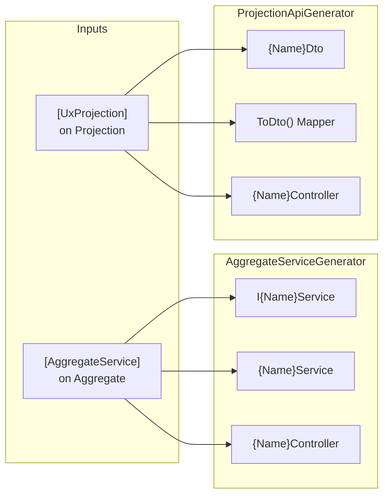
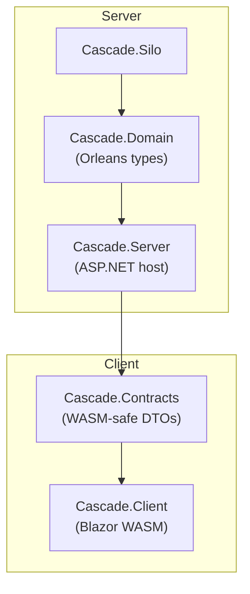

# RFC: Unified Source Generation for Aggregates and Projections

## Status

- **Author**: Planning Agent
- **Created**: 2026-01-17
- **Status**: Draft → Decision Required
- **Tracking**: `spec/unified-codegen-dx/`

## Problem Statement

Cascade (and similar applications) currently require extensive manual
boilerplate:

1. **DTO Duplication** — 9 projection DTOs in `Cascade.Contracts` manually
   mirror `Cascade.Domain` projections.

2. **Underused Generators** — `AggregateServiceGenerator` generates typed
   services, but only `UserAggregate` has `[AggregateService]`. Generated
   services are ignored; `Program.cs` calls `IAggregateGrainFactory` directly.

3. **Verbose DI Registration** — `CascadeRegistrations.cs` contains 332 lines
   with 80+ manual `AddEventType<>`, `AddCommandHandler<>`, `AddReducer<>`
   calls.

4. **Dependency Boundary Risk** — Domain types carry Orleans attributes (`[Id]`,
   `[GenerateSerializer]`). Sharing them with WASM requires stripping those
   attributes, which the generator does, but clients do not consume generated
   DTOs.

## Goals

1. **Single Source of Truth** — Define aggregate state and projection state in
   one place; generated code handles services, APIs, and client DTOs.

2. **Orleans Isolation** — Generated client DTOs never reference Orleans
   packages.

3. **Minimal Boilerplate** — Reduce or eliminate manual DTO mirroring and
   80+ line DI registrations.

4. **Cascade Adoption** — Migrate sample to use generators end-to-end.

## Non-Goals

- Change Orleans grain activation or persistence patterns.
- Modify existing public API contracts in Mississippi libraries.
- Support non-HTTP transports (gRPC, GraphQL) in this phase.

## Current State

### Existing Generators



### Cascade Dependency Flow



## Proposed Design

### Option A: Multi-Output Generator (Single Source, Two Projects)

Extend `ProjectionApiGenerator` to emit a second set of files into a separate
project (e.g., `Cascade.Contracts.Generated`).

**Pros:**

- Minimal new code; extend existing generator.
- Single attribute controls both server and client outputs.

**Cons:**

- Incremental generators cannot emit to external projects directly;
  requires analyzer-linked generation with two compilation references.
- Build ordering complexity.

### Option B: Shared Abstractions with Interface Derivation

Create `IProjectionDto<T>` in `Inlet.Projection.Abstractions`. DTOs implement
this interface; generator verifies consistency.

**Pros:**

- Client DTOs and server DTOs share compile-time contract.
- Tooling can verify property parity.

**Cons:**

- Still requires separate DTO authoring unless auto-generated.
- Interface adds ceremony.

### Option C: Unified Attribute + Analyzer-Linked Generation (Recommended)

1. **Keep Existing Generators** — They already produce server-side services,
   controllers, and mappers.

2. **Add `[GenerateClientDto]` Attribute** — When applied alongside
   `[UxProjection]`, generator also produces `{Name}Dto` into a
   `*.Contracts.Generated` project via analyzer output.

3. **Create `DomainRegistrationsGenerator`** — Scans aggregates, reducers,
   handlers, and event types; emits `AddDomain(this IServiceCollection)`
   extension.

4. **Retire Manual Duplication** — Delete `Cascade.Contracts/Projections/` once
   generated DTOs are consumed.

```mermaid
flowchart TD
    subgraph Domain Project
        Agg["Aggregate\n[AggregateService]"]
        Proj["Projection\n[UxProjection]\n[GenerateClientDto]"]
        Handlers["CommandHandlers"]
        Reducers["Reducers"]
    end
    subgraph Generators
        ASG["AggregateServiceGenerator"]
        PAG["ProjectionApiGenerator"]
        DRG["DomainRegistrationsGenerator"]
        CDG["ClientDtoGenerator"]
    end
    subgraph Server Output (same project)
        Svc["I{Name}Service\n{Name}Service"]
        Ctrl["Controllers"]
        Mapper["ToDto() Mappers"]
    end
    subgraph Client Output (Contracts.Generated)
        DTO["Projection DTOs\n(no Orleans refs)"]
    end
    subgraph DI Output
        DI["AddDomain()\nextension method"]
    end
    Agg --> ASG --> Svc
    Agg --> ASG --> Ctrl
    Proj --> PAG --> Mapper
    Proj --> PAG --> Ctrl
    Proj --> CDG --> DTO
    Handlers --> DRG --> DI
    Reducers --> DRG --> DI
```

**Pros:**

- Incremental; each generator has single responsibility.
- Client DTOs are Orleans-free by construction.
- DI boilerplate disappears.

**Cons:**

- Requires new `ClientDtoGenerator` and `DomainRegistrationsGenerator`.
- Cross-project emit needs careful build ordering.

### Recommendation

**Option C** balances incremental delivery with full automation. Phase 1
enables existing generators; subsequent phases add new generators.

## Client-Side Command Actions (New)

### Problem

Current client command dispatch is manual HTTP calls with no type safety:

```csharp
// Manual pattern in ChatApp.razor.cs
await Http.PostAsJsonAsync(
    $"/api/channels/{Uri.EscapeDataString(channelId)}/create?name=...",
    null);
```

Issues: no loading states, no typed errors, no retry, repeated boilerplate.

### Proposed Solution: `[GenerateClientAction]`

Add opt-in attribute on commands to generate Fluxor actions and effects:

```csharp
[GenerateClientAction]
public sealed record CreateChannel
{
    public required string ChannelId { get; init; }
    public required string Name { get; init; }
    public required string CreatedBy { get; init; }
}
```

**Generated Output:**

1. `CreateChannelAction` — dispatched by UI
2. `CreateChannelSuccessAction` — dispatched on success
3. `CreateChannelFailureAction` — dispatched on failure
4. `CreateChannelEffect` — handles HTTP call, error handling

**Client Usage:**

```csharp
// Simplified: just dispatch the action
Dispatch(new CreateChannelAction
{
    EntityId = newChannelId,
    Name = name,
    CreatedBy = ChatState.UserDisplayName
});
```

### Generator: `ClientActionGenerator`

**Triggers on:** Commands with `[GenerateClientAction]` attribute

**Scans:** `[AggregateService]` to determine route prefix

**Outputs:**

- `{CommandName}Action.g.cs`
- `{CommandName}SuccessAction.g.cs`
- `{CommandName}FailureAction.g.cs`
- `{CommandName}Effect.g.cs`

**Target Project:** `Cascade.Client` (or `*.Client.Generated`)

## Alternatives Considered

| Alternative | Why Rejected |
| ----------- | ------------ |
| T4 Templates | Not incremental; poor IDE integration |
| Reflection-based DI | Runtime cost; no compile-time verification |
| Manual DTO maintenance | Status quo; high duplication risk |
| Full RPC framework | Over-engineering; HTTP is sufficient |

## Security Considerations

- Generated controllers inherit ASP.NET authorization attributes from parent
  types. No new auth surface.
- No secrets or credentials flow through generators.
- Client actions use same HTTP endpoints; no new attack surface.

## Observability

- Generators emit `#nullable enable` and XML doc comments for IntelliSense.
- Build diagnostics (`MSGGEN0001`, etc.) report missing attributes or
  conflicting configurations.
- Generated effects include structured logging for command dispatch.

## Compatibility and Migration

- **Backwards Compatible** — Existing code without attributes remains
  unaffected.
- **Migration Path** — Add attributes incrementally; delete manual code once
  generated equivalents are verified.
- **Breaking Changes** — None to public Mississippi APIs.

## Risks

| Risk | Likelihood | Impact | Mitigation |
| ---- | ---------- | ------ | ---------- |
| Cross-project emit complexity | Medium | Medium | Start with same-project emit; extract later |
| Build ordering issues | Low | High | Use `InternalsVisibleTo` and analyzer references |
| Generator performance | Low | Low | Incremental generators already in use |
| Client action naming conflicts | Low | Low | Use namespace scoping |
